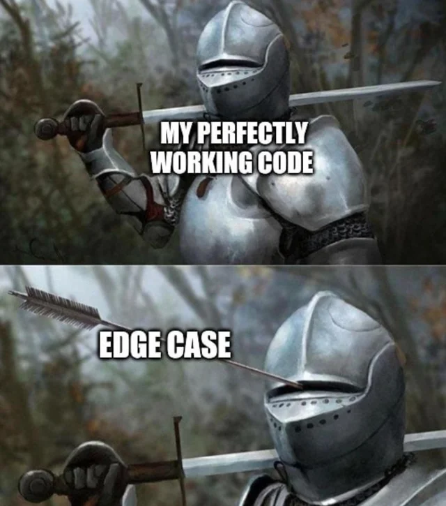

---
sidebar_custom_props:
  id: 03f4d19d-e907-44da-99ce-2da5964a3129
---
# Umgang mit Fehlern

👉 Voraussetzung: Kapitel [Repetition#Fehler](pathname:///24ef/Programmieren/Turtle-Repetition/errors)


Was soll ein Programm tun, wenn er mit unpassenden Daten oder Eingaben konfrontiert wird? Normalerweise: Abstürzen :mdi-emoticon-cry:.

Damit das Programm nicht abstürzt, ist es unerlässlich, die Benutzerabfragen so gut es geht in die richtige Form umzuwandeln und dann auf Richtigkeit zu überprüfen!

Dabei gibt es zwei Ansätze:
1. Das Programm anweisen, die Ausführung einer Sequenz zu **versuchen**. 

    ```mermaid
    graph TD
        A[Fehler?] --> B
        B -->|Ja| C[Eingabe ist schuld!]
        B -->|Nein| D[Eingabe war ok]
    ```

2. Die Eingabe bzgl. Randbedingungen **untersuchen** und überprüfen...


## Try Except

Es gibt in Python eine Möglichkeit dem Interpreter zu sagen: "Es ist okay wenn hier ein Fehler auftaucht, wir erwarten das schon und haben eine Antwort darauf bereit".

Dieses Konstrukt nennt sich ein _Try-Except Block_ und kann folgendermassen aussehen:
```py
eingabe = input('Geben sie eine Zahl ein')
try:
    eingabe = int(eingabe)
except:
    print('das ist keine Zahl')
```

Hier geschieht folgendes: Der code im `try` Segment wird normal der Reihe nach ausgeführt. Falls jetzt innerhalb dieses Segments ein Fehler generiert wird bricht das Programm nicht ab, sondern springt an den Anfang des `except` Segments und führt dieses aus. Danach wird normal unter dem `except` weiter gemacht. 


## Beispiel

Beispiel: Ein Produktcode eingeben...
- muss genau 9 Zeichen enthalten
- die ersten 4 Zeichen müssen Zahlen sein und grösser 1000 sein
- 5. Zeichen muss ein Buchstabe sein
- die letzten 4 Zeichen müssen eine Hexadezimalzahl sein (starten mit '0x' und dann zwei Zeichen mit den aus 0-9 oder A-F).

Beispiel: `1234A0xBC`

:::cards
*** --code

```py live_py slim
def transform_input(raw):
    try:
        zahl = int(raw[:4])
        if zahl < 1000:
            raise 'Zu kleine Zahl'
        kategorie = raw[4]
        hexa = int(raw[5:9], base=16)
        return [zahl, kategorie, hexa]
    except:
        return False

eingabe = input('Geben Sie den Produktcode ein [Form 1234A0xBC]: ')

produkt = transform_input(eingabe)
if produkt:
    print('Produkt', produkt)
else:
    print('Fehlerhafte Eingabe!')

```

*** --code


```py live_py slim
def transform_input(raw):
    raw = raw.upper().strip()
    if len(raw) != 9:
        print('Eingabe zu wenig lang!')
        return False
    if not raw[:4].isnumeric():
        print('Die ersten 4 Ziffern müssen Zahlen sein!')
        return False
    zahl = int(raw[:4])
    if zahl < 1000:
        print('Erste Ziffer muss grösser 0 sein!')
        return False
    kategorie = raw[4]
    if not kategorie.isalpha():
        print('5. Zeichen muss ein Buchstabe sein!')
        return False
    raw_hexa = raw[-4:]
    if raw_hexa[:2] != '0X':
        print('Die letzten vier Zeichen müssen mit 0x beginnen')
        return False
    for h in raw_hexa[-2:]:
        if h not in '0123456789ABCDEF':
            print('Die letzten zwei Zeichen müssen Hexadezimalzahlen sein (0-9, A-F)')
            return False
    hexa = int(raw_hexa, base=16)
    return [zahl, kategorie, hexa]

eingabe = input('Geben Sie den Produktcode ein [Form 1234A0xBC]: ')
produkt = transform_input(eingabe)
if produkt:
    print('Produkt', produkt)
else:
    print('Fehlerhafte Eingabe!')
```

:::

:::aufgabe[Obigen Code analysieren?]
<Answer type="state" webKey="938ae28c-2db0-4a32-945f-5189398216b7" />

Welche Variante ist praktischer für die Programmierer:in?

<Answer type="text" webKey="e543b0b2-c32c-4187-a100-b91d370aebeb" />

Welche Variante ist praktischer für die Benutzer:in?

<Answer type="text" webKey="2b89be5e-f20b-4ffe-a744-35a5cb1b34fa" />


Was wäre ein vernünftiger Mittelweg? Copy-Pasten Sie sich eine vernünftige Variante zusammen!

```py live_py title=io.py id=c07ab12c-b818-4fe7-bc10-50ad051cbcc6
def transform_input(raw):
    ...

eingabe = input('Geben Sie den Produktcode ein [Form 1234A0xBC]: ')
produkt = transform_input(eingabe)
if produkt:
    print('Produkt', produkt)
else:
    print('Fehlerhafte Eingabe!')
```
:::

## Fazit

Benutzereingaben sind mühsam...

:::finding
Es gibt keine klaren Regeln, welche Variante im Umgang mit Fehlern besser ist - entweder vorbeugen durch Sicherheitsabfragen oder Fehlerbehandlung mit `try-except`. Die Wahl ist oft auch einfach durch die Philosophie des Programmierers bedingt. 

Um die Lesbarkeit und Wartbarkeit des Programms zu verbessern, können Gewisse Richtlinien befolgt werden:
- Wenn der Fehler durch eine einfache `if`-Abfrage umgangen werden kann, ist dies meist die bessere Lösung. 
- Wenn die nötige(n) `if` Abfrage(n) um dem Fehler vorzubeugen, sehr lange und unübersichtlich wäre, kann ein `try-except` Block die bessere Wahl sein.
- Ein `try` Block sollte maximal ein par Zeilen beinhalten. Die Idee ist also nicht, ganze Funktionen in ein `try` packen!
:::


... und es muss an jeden Edge-Case gedacht werden...

:::cards



***


:::

:::aufgabe
<Answer type="state" webKey="6f414fd4-1b91-4221-95ad-514d854b0c73" />

Überprüfen Sie im NumTrip Spiel die Benutzereingaben, so dass auch bei fehlerhaften Eingaben das Programm nicht abstürzt.

:::