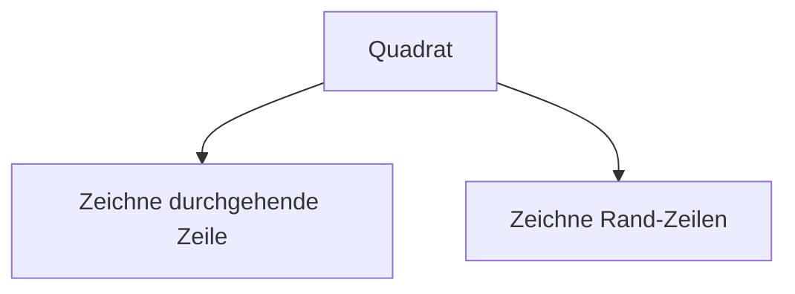

---
sidebar_custom_props:
  id: f3c8ec1e-174f-4b4c-9890-78752e298da1
---
# Übungsprobe

1. [Schriftlich] Ein Programm soll Quadrate erzeugen, wobei die Breite und die Höhe variabel konfigurierbar sein soll. Erstellen Sie einen Top-Down Entwurf des Problems.

<Solution webKey="7b727a90-474e-4c58-9db2-595ab0a79ac6">




</Solution>


Verschiedene Konfigurationen der Ausgabe.

:::cards
__0 x 0__
```
 ::::
 ::::
```
::br
__1 x 1__
```
 ::=::
 || ||
 ::=::
```
::br
__5 x 3__
```
 ::=====::
 ||     ||
 ||     ||
 ::=====::
```
:::


1. [Schriftlich] Geben Sie jeweils die Ausgabe an:

a.)
```py
def f1():
    x = 15
    print(x)
x = 12
f1()
```
<Solution webKey="7b727a90-474e-4c58-9db2-595ab0a79ac6">15</Solution>
<br />

b.)
```py
x = 12
def f1(a):
    print(x + a)

x = 20
f1(2)
```
<Solution webKey="7b727a90-474e-4c58-9db2-595ab0a79ac6">22</Solution>
<br />

c.)
```py
x = 5
def f1():
    global x
    x = 4

def f2(a, b):
    return a + b + x

f1()
total = f2(1, 2)
print(total)
```
<Solution webKey="7b727a90-474e-4c58-9db2-595ab0a79ac6">7</Solution>
<br />

d.)
```py
def f1(list_in):
    list_in.append(9)
    return id(list_in)

nums = [1, 2, 3]

if id(nums) == f1(nums):
    print('Jabba')
else:
    print('Bazinga')
print(nums)
```
<Solution webKey="7b727a90-474e-4c58-9db2-595ab0a79ac6">

```
Jabba
[1, 2, 3, 9]
```

</Solution>
<br />

e.)
```py
def f1(list_in):
    list_in = []

nums = [1, 2, 3]

f1(nums)
nums.pop(0)
print(nums)
```
<Solution webKey="7b727a90-474e-4c58-9db2-595ab0a79ac6">[2, 3]</Solution>
<br />

3. [Schriftlich] Erklären Sie in eigenen Worten, wie in Python eine Liste abgespeichert wird. Gehen Sie auch darauf ein, wie das Hinzufügen oder Entfernen von Listen-Elementen funktioniert.


---


Material
: [👉 Download](assets/Material-Uebungsprobe.zip)

1. [Praktisch]: Schreiben Sie das entsprechende Programm namens __square.py__ zu dem in (1) erzeugten Top-Down Entwurfs.

:::danger[Keine Benutzerinteraktion]
Eine Benutzerinteraktion mit Validierung der Eingaben ist nicht gefragt.
:::

:::::cards
__0 x 0__

```
 ::::
 ::::
```
::br
__1 x 1__

```
 ::=::
 || ||
 ::=::
```
::br
__5 x 3__

```
 ::=====::
 ||     ||
 ||     ||
 ||     ||
 ::=====::
```
:::::

<Solution webKey="7b727a90-474e-4c58-9db2-595ab0a79ac6">

```py live_py slim
def full_line(n):
    print('::' + '=' * n + '::')

def side_line(n):
    print('||' + ' ' * n + '||')

def square(m, n):
    full_line(m)
    for i in range(n):
        side_line(m)
    full_line(m)

print('--- 0x0 ---')
square(0, 0)
print('--- 1x1 ---')
square(1, 1)
print('--- 5x2 ---')
square(5, 2)
```

</Solution>

1. Code Umschreiben

    Das Programm __zahlen_raten.py__  ist in sog. Spaghetti-Code geschrieben - es werden überall globale Variablen gebraucht.
    a. Was macht das Programm?
    b. Bauen Sie den Code so um, dass statt der globalen Variablen Funktionsparameter und Rückgabewerte verwendet werden, ohne dabei die Funktionalität des Programms zu verändern.


<Solution webKey="7b727a90-474e-4c58-9db2-595ab0a79ac6">

```py live_py slim
from browser import alert
_print = print
def print(*vals):
    alert(', '.join([str(item) for item in vals]))
### PRE

from random import randint

def to_int(value):
    try:
        return int(value)
    except:
        return -1


def is_valid(value):
    if value < 0 or value > 100:
        return False
    return True
    

def abfrage(runde):
    valid = False
    while not valid:
        antwort_raw = input(f'{runde}. Versuch: Gib eine ganze Zahl zwischen 0 und 100 ein: ')
        zahl = to_int(antwort_raw)
        valid = is_valid(zahl)
    return zahl

def play():
    gesucht = randint(0, 100)
    runde = 1
    geraten = -1
    while geraten != gesucht:
        geraten = abfrage(runde)
        runde = runde + 1
        if geraten > gesucht:
            print('Die eingegebene Zahl ist zu gross')
        elif geraten < gesucht:
            print('Die eingegebene Zahl ist zu klein')
    print(f'Bravo, du hast in {runde} Runden die gesuchte Zahl {gesucht} gefunden.')

play()
```
</Solution>
