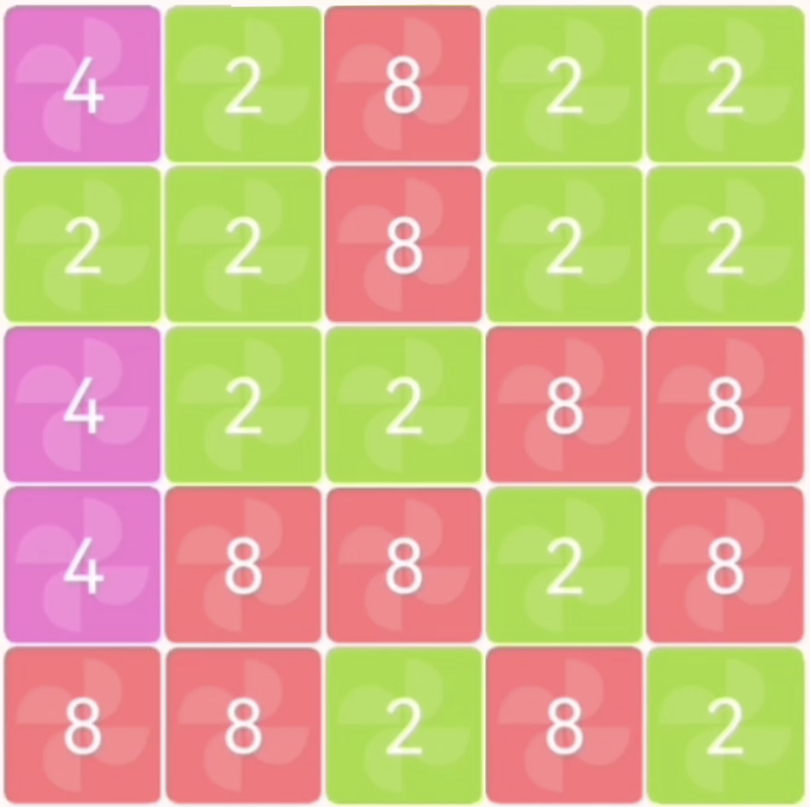

# Jetzt gehts los!



:::aufgabe `numtrip.py`
<Answer type="state" webKey="b160c683-c0de-405c-a847-cb3f3ab1aaf2" />

Dateiname
: __EF-Informatik/numtrip/game.py__

Programmieren Sie die Datenstruktur für das Spielfeld, so wie Sie diese in der vorhergehenden Aufgabe entworfen haben.

Initialisieren Sie das Spielfeld für den Moment so, dass es einen fortgeschrittenen Spielstand eines Spiels repräsentiert (daher mind. eine zweistellige Zahl vorweist - welche Zahlen kommen in Frage??).

Damit man auch etwas sieht, wenn Sie das Programm ausführen, programmieren Sie noch die nötigen Anweisungen, welche das Spielfeld auf der Konsole anzeigt.

Überlegen Sie sich dazu, wie Sie das Spielfeld nur mit Zeichen dargestellt werden kann und dass alle Zellen immer gleich gross sind.

Wenn alles zu Ihrer Zufriedenheit funktioniert, machen Sie einen Commit, pushen die Änderungen und markieren diese Aufgabe als erledigt.

:::danger Noch keine Spieler:inneninteraktion
Es ist in diesem Schritt noch keine Interaktion mit Spielenden oder ein Spielfluss zu programmieren - nur das Anzeigen des Spielfelds...
:::

:::aufgabe Auftrag auf Freitag, 21.10.2022
<Answer type="state" webKey="0696dee1-6f7e-40a6-b891-298abbf1dc63" />

Am Freitag werden wir mit dem Spielfeld weiterarbeiten. Damit alle eine gute Ausgangslage haben, gibt es den folgenden Kurz-Auftrag:

1. (Für alle): Das Spielfeld soll wie im Beispiel unten mit einer verschachtelten Liste beschrieben werden. Die Zahlen können Sie selber wählen.
2. (Wer das eigene Spielfeld noch nicht fertig hat): Den untenstehenden Code übernehmen und Zeile für Zeile analysieren und kommentieren. Insbesondere sollte Ihnen wieder klar werden, was folgende Syntax bezweckt:
     - Was macht `f'|{zelle}'` ?
     - was macht das `end=''`?
3. :mdi-git: Commiten und Pushen


```py
board = [
    [2, 4, 1, 8, 8],
    [4, 2, 8, 2, 1],
    [4, 4, 8, 4, 2],
    [2, 8, 1, 4, 1],
    [2, 4, 4, 4, 4]
]

for zeile in board:
    for zelle in zeile:
        print(' -', end='')
    print(' ')
    for zelle in zeile:
        print(f'|{zelle}', end='')
    print('|')

for zelle in board[0]:
    print(' -', end='')
print(' ')
```

:::
:::


## Refactoring: Funktionen verwenden
:::aufgabe

<Answer type="state" webKey="fe39745d-896d-4802-968f-f2d8dc8a7e40" />
- Packen Sie zunächst die Anweisungen, welche das Spielfeld auf der Konsole anzeigen aus obiger Aufgabe in eine Funktion.
- Ergänzen Sie sodann diese Funktion mit den nötigen Anweisungen so, dass am Anfang jeder Zeile die Zeilennummer steht.
- Schreiben Sie schliesslich eine weitere Funktion, welche die Spaltennummern ausgibt und rufen Sie die beiden Funktionen im Hauptprogramm auf. Die Ausgabe auf der Konsole könnte dann wie folgt aussehen:

```
   1 2 3 4 5
  -----------
1 |2|4|1|8|8|
  -----------
2 |4|2|8|2|1|
  -----------
3 |4|4|8|4|2|
  -----------
4 |2|8|1|4|1|
  -----------
5 |2|4|4|4|4|
  -----------
```

Wenn alles zu Ihrer Zufriedenheit funktioniert, machen Sie ein commit und push und markieren Sie die Aufgabe als erledigt.
:::


### ⭐️ Spielfeld Farben

Konsolen-Ausgaben können auch koloriert werden - dazu verwendet man am besten eine Bibliothek, welche das Einfärben weitgehend übernimmt. Bspw. 👉 https://pypi.org/project/colorama/
