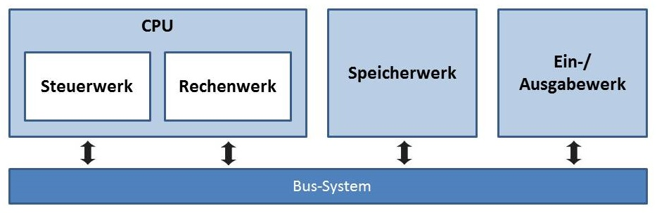
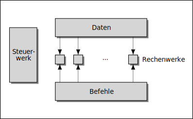
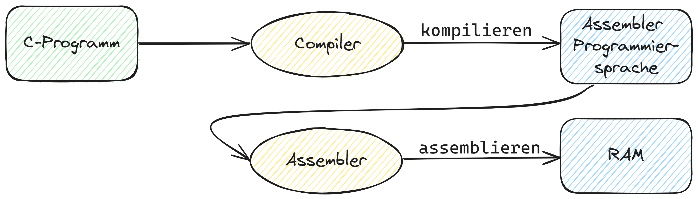
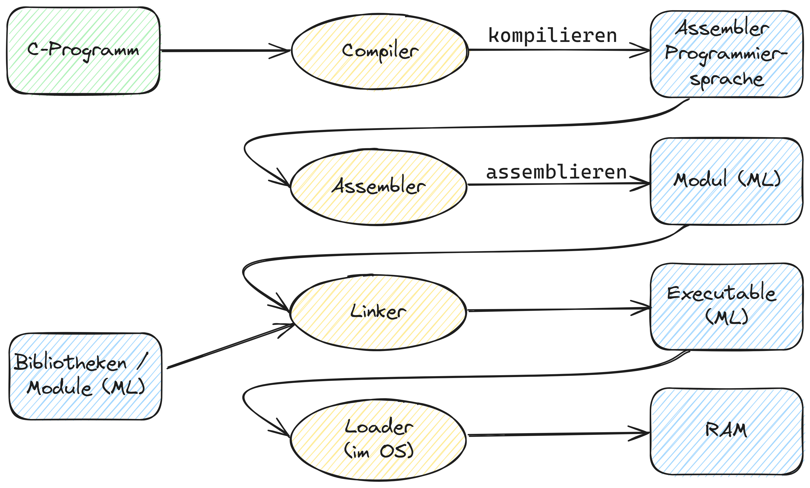

---
sidebar_custom_props:
  id: 21b31d7f-2fc1-45ad-bdb5-31b4b99387d9
---
# Rechnerarchitektur
Heutige Computer basieren auf der von John von-Neumann entwickelten Architektur. Aufgrund der günstigeren Bauweise hat sie sich zu Beginn gegenüber der performanteren Harvard-Architektur durchgesetzt - mittlerweilen verwenden jedoch viele moderne Prozessoren eine Mischform aus HArvard- und Von-Neumann Architektur. Auch zahlreiche weitere Optimierungen sind in heutigen Prozessoren zu finden - die Grundkomponenten sind aber die gleichen.

## Von-Neumann-Architektur
1945 beschrieb John von-Neumann sein Konzept erstmals. Das Konzept war damals revolutionär, da zuvor entwickelte Rechner an ein festes Programm gebunden waren. Die meisten der heute gebräuchlichen Computer basieren auf dem Grundprinzip der Von-Neumann-Architektur.

Ein Von-Neumann-Rechner beruht auf folgenden Komponenten, die bis heute in Computern verwendet werden:

Rechenwerk
: führt Rechenoperationen und logische Verknüpfungen durch
Steuerwerk
: interpretiert die Anweisungen eines Programms und regelt die Befehlsabfolge
Bus System
: dient zur Kommunikation zwischen den einzelnen Komponenten
Speicherwerk
: speichert sowohl Programme als auch Daten, welche für das Rechenwerk zugänglich sind
Ein-/Ausgabewerk
: steuert die Ein- und Ausgabe von Daten, zum Anwender (Tastatur, Bildschirm) oder zu anderen Systemen (Schnittstellen)

### Bus-System
Man unterscheidet drei verschiedene Busse: **Adressbus**, **Datenbus** und **Steuerbus**

Adressbus
: überträgt Speicheradressen
: Busbreite bestimmt den adressierbaren Speicher
Datenbus
: überträgt Daten
: Busbreite bestimmte maximale Datenmenge die pro Schritt verarbeitet werden kann
Steuerbus
: steuert Bus-Vorgänge wie z.B. Lesen oder Schreiben

#### Beispiel: Lesevorgang
Die CPU soll Daten aus dem Speicher lesen: Die CPU ...

- gibt die Adresse der "Speichereinheit" und der Speicherzelle auf den Adressbus.
- aktiviert die Steuerleitung `READ`, wobei die adressierte Speicherzelle ihren Inhalt auf den Datenbus gibt.
- übernimmt die Daten vom Datenbus und deaktiviert die Steuerleitung `READ`. Der Lesevorgang ist damit beendet.

#### Beispiel: Ausgabe
Die CPU soll Daten in die Funktionsbaugruppe der "Ausgabe" schreiben: Die CPU ...
- gibt die Adresse der Ausgabe-Einheit auf den Adressbus.
- gibt die Daten auf den Datenbus.
- aktiviert die Steuerleitung `WRITE`, wodurch die Ausgabe-Einheit die Daten vom Datenbus aufnimmt.
- deaktiviert die Steuerleitung `WRITE`. Der Schreibvorgang ist damit beendet.

### Von-Neumann-Zyklus

Wie das bei der [Maschinennahen Programmierung](../Assembler/index.md) besprochene Konzep *Fetch-Decode-Execute* beschreibt auch der Von-Neumann-Zyklus die Abarbeitung von Programmen. Der Von-Neumann-Zyklus beschreibt 5 sich-wiederholende Schritte, wobei die 3 letzten Schritte nicht bei jedem Befehl ausgeführt werden müssen.

Fetch
: Befehlsabruf – Aus dem Speicher wird der nächste zu bearbeitende Befehl entsprechend der Adresse im Befehlszähler in das Befehlsregister geladen und der Befehlszähler wird um die Länge des Befehls erhöht.
Decode
: Dekodierung – Der Befehl wird durch das Steuerwerk in Schaltinstruktionen für das Rechenwerk aufgelöst.
Fetch Operands
: Operandenabruf – Aus dem Speicher werden nun die Operanden geholt. Das sind die Werte, die durch den Befehl verändert werden sollen oder die als Parameter verwendet werden.
Execute
: Befehlsausführung – Eine arithmetische oder logische Operation wird vom Rechenwerk ausgeführt. Bei Sprungbefehlen und erfüllter Sprungbedingung wird an dieser Stelle der Befehlszähler verändert.
Write Back
: Rückschreiben des Resultats – Sofern notwendig, wird das Ergebnis der Berechnung in den Speicher zurückgeschrieben.

## Harvard Architektur[^1]
Die Harvard-Architektur bezeichnet in der Informatik ein Schaltungskonzept, bei dem der Befehlsspeicher logisch und physisch vom Datenspeicher getrennt ist. Die physische Trennung ist mit zwei getrennten Speichern realisiert (einer für die Befehle, der andere für die Datenspeicherung), die direkt über einen separaten Bus mit dem Rechenwerk verbunden sind.

Daraus ergibt sich der grosse Vorteil, dass Befehle und Daten gleichzeitig geladen bzw. geschrieben werden können. Bei einer klassischen Von-Neumann-Architektur sind hierzu mindestens zwei aufeinander folgende Buszyklen notwendig.

Die Anwendung der Harvard-Architektur findet man vor allem in Bereichen, die eine hohe Leistungsfähigkeit und Effizienz des Rechners erfordern. Zum Beispiel wird die Harvard-Architektur oft in digitalen Signalprozessoren verwendet, die kontinuierlich große Mengen an Daten verarbeiten müssen, wie z. B. Audio- oder Videosignale. Die Harvard-Architektur ermöglicht es, die Signalverarbeitung in Echtzeit durchzuführen, indem sie die parallele Ausführung von Befehlen und Datenzugriffen optimiert.

:::info[ANC-Kopfhörer]
Beim Noise-Cancelling müssen die Mikrofonsignale in Echtzeit verarbeitet werden, um die Störgeräusche durch Veränderung der Musikquelle zu eliminieren. Hierfür werden oft digitale Signalprozessoren verwendet, die eine Harvard-Architektur aufweisen.

[👉 Möglicher Aufbau einer Harvard-Basierten ANC-Architektur](https://www.mouser.ch/applications/audio_noise_cancellation/)
:::

:::info[Für künstliche Intelligenz optimierte Prozessoren]
Aufgrund der parallelisierbaren Struktur der Harvard-Architektur eignet sie sich besonders gut für die Verarbeitung von neuronalen Netzen oder fürs maschinelle Lernen. So haben viele Prozessoren, die für künstliche Intelligenz optimiert sind, eine Harvard-Architektur.
:::

## Von der Hochsprache zum Maschinencode

Menschenlesbarer Code ist nicht direkt zur Ausführung auf einem Computer geeignet. Deshalb muss er in einem ersten Schritt in eine für den Computer verständliche Form gebracht werden.

### Compiler

:::warning[🚧 Auftrag]
🚧🚧🚧

Rechercheauftrag - auf [outline.gbsl.website](https://outline.gbsl.website)

🚧🚧🚧
:::

### Übersicht der Schritte

Im LMC wird der assemblierte Code direkt in den Arbeitsspeicher geladen und kann ausgeführt werden. Auf einem Computer muss der Maschinencode jedoch zusätzlich in eine für das Betriebssystem verständliche Form gebracht werden. Dieser Schritt wird von einem sogenannten **Linker** durchgeführt.

[^1]: Quelle [Wikipedia/Harvar-Architektur](https://de.wikipedia.org/wiki/Harvard-Architektur)
