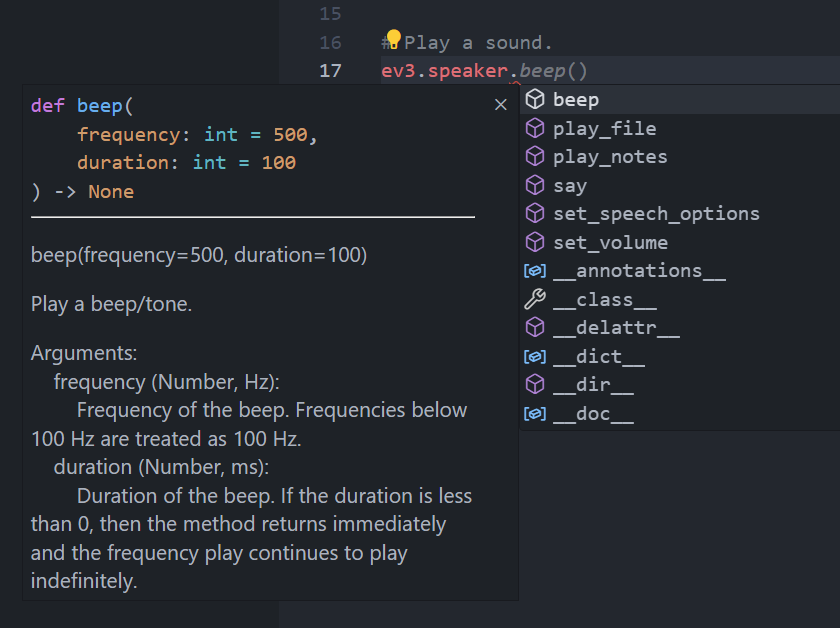

import OsTabs from '@site/src/components/OsTabs';

# VS Code Autocompletion

Da auf Ihrem Laptop keine physischen Motoren und Sensoren angeschlossen sind, lassen sich die Programme nicht direkt auf Ihrem Computer ausführen. Die Bibliothek `pybrichs` kann entsprechend nicht installiert werden und VS Code kann somit auch keine Autovervollständigung für die Klassen der Motoren und Sensoren anbieten. Aus diesem Grund wird die Autovervollständigung standardmässig für EV3-Projekte **deaktiviert**.

Mit einem Trick kann man dennoch die Autovervollständigung hinzufügen.

1. Installation der Typ-Definitionen der `pybricks`-Bibliothek
    <OsTabs>
    <TabItem value="win">

    ```bash
    pip install git+https://github.com/pybricks/pybricks-api@master
    ```

    </TabItem>
    <TabItem value="mac">

    ```bash
    pip3 install git+https://github.com/pybricks/pybricks-api@master
    ```

    </TabItem>
    </OsTabs>


2. In den Einstellungen von VS Code __:mdi-cog: Settings > :mdi-magnify:__ suchen Sie nach `python.languageServer` und wählen dort `PyLance` oder `Default` aus.
   
   


Nach einem neu-öffnen von `main.py` sollte die Autovervollständigung nun funktionieren:




