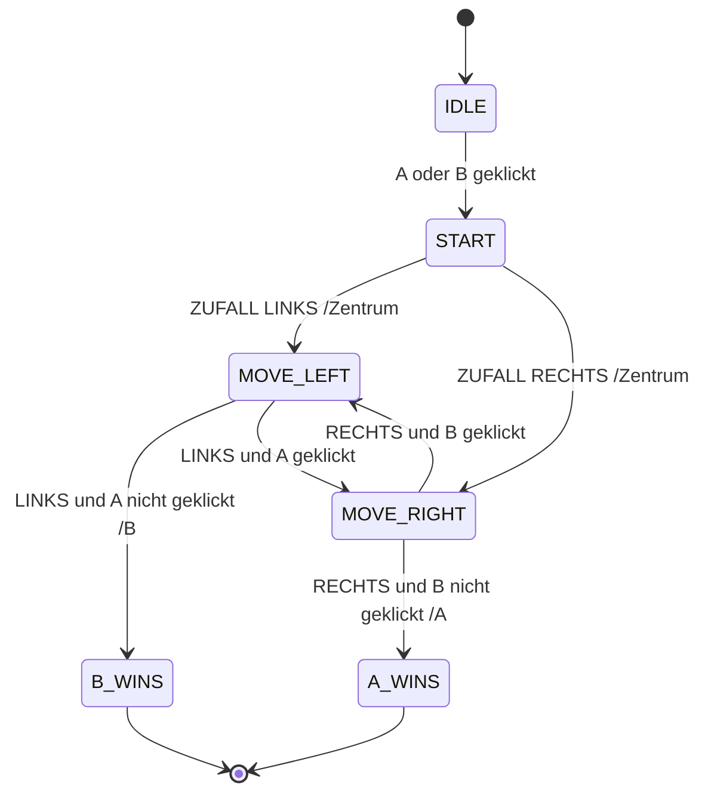

---
sidebar_custom_props:
  id: 12a87fba-7a86-441a-892c-377f33f2c19a
---
# 1. Pong

## Präsentation

<iframe src="/slides/robotik-fsm.html" style={{border:'0px',width:'100%',height:'500px'}} allowFullScreen="true" webkitallowfullscreen="true" mozallowfullscreen="true" />

## Zustandsdiagramm



## Event-State Tabelle

| <span style={{float: 'right'}}>Zustand :mdi-arrow-right:</span><br />Ereignis :mdi-arrow-down: | __IDLE__       | __BL:MOVE_LEFT__               | __MOVE_LEFT__             | __BR:MOVE_RIGHT__              | __MOVE_RIGHT__             | __A_WINS__ | __B_WINS__ |
|:-----------------------------------------------------------------------------------------------|:---------------|:-------------------------------|:--------------------------|:-------------------------------|:---------------------------|:-----------|:-----------|
| **Button A**                                                                                   | __MOVE_LEFT__  | __MOVE_RIGHT__                 |                           |                                |                            |            |            |
| **Kein Button A**                                                                              |                | B :mdi-arrow-right: __B_WINS__ |                           |                                |                            |            |            |
| **Button B**                                                                                   | __MOVE_RIGHT__ |                                |                           | __MOVE_LEFT__                  |                            |            |            |
| **Kein Button B**                                                                              |                |                                |                           | A :mdi-arrow-right: __A_WINS__ |                            |            |            |
| **500ms timer**                                                                                | / Happy        |                                | Ball nach links /Position |                                | Ball nach rechts /Position | __IDLE__   | __IDLE__   |

:::aufgabe Ausprobieren auf Micro:Bit
<Answer type="state" webKey="e732ec1e-72a5-4763-9fea-5ae614cee0a1" />

Material
: Micro:Bit
: mit USB-Kabel an den Computer angeschlossen
Editor
: Online-Editor [👉 python.microbit.org](https://python.microbit.org/)

```py
from microbit import *

state = 'IDLE'

def current_pos():
    for i in range(5):
        if display.get_pixel(i, 2) == 9:
            return i
    return 2

def set_ball(pos):
    display.clear()
    display.set_pixel(pos, 2, 9)

while True:
    btn_a = button_a.was_pressed()
    btn_b = button_b.was_pressed()
    pos = current_pos()

    if state == 'IDLE':
        display.show(Image.HAPPY)
        if btn_a:
            set_ball(2)
            state = 'MOVE_LEFT'
        elif btn_b:
            set_ball(2)
            state = 'MOVE_RIGHT'
    elif state == 'MOVE_LEFT':
        if pos == 0:
            if btn_a:
                state = 'MOVE_RIGHT'
            else:
                state = 'B_WINS'
        else:
            pos = pos - 1
            set_ball(pos)
    elif state == 'MOVE_RIGHT':
        if pos == 4:
            if btn_b:
                state = 'MOVE_LEFT'
            else:
                state = 'A_WINS'
        else:
            pos = pos + 1
            set_ball(pos)
    elif state == 'A_WINS':
        display.show('A')
        sleep(1500)
        state = 'IDLE'
    elif state == 'B_WINS':
        display.show('B')
        sleep(1500)
        state = 'IDLE'
    sleep(500)
```
:::