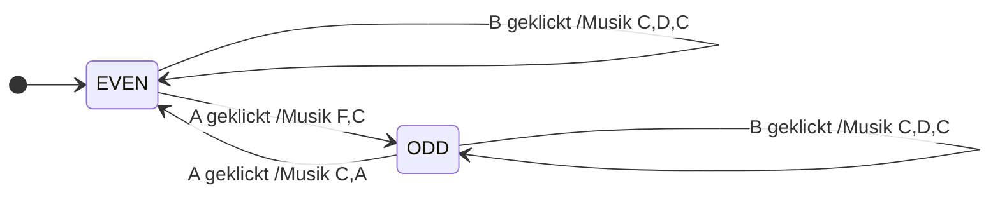

---
sidebar_custom_props:
  id: 59815221-768e-4e0e-902b-641afb268e87
---
# 2. Code für MicroBit

Material
: Micro\:Bit
: mit USB-Kabel an den Computer angeschlossen
Editor
: Online-Editor [👉 python.microbit.org](https://python.microbit.org/)

```py
from microbit import *
import music

FULL_SCREEN = Image('99999:99999:99999:99999:99999')

state = 'EVEN'
music.set_tempo(bpm=420)

while True:
    current = state
    if button_a.was_pressed():
        if state == 'EVEN':
            music.play(['f', 'c'])
            state = 'ODD'
        elif state == 'ODD':
            music.play(['c', 'a'])
            state = 'EVEN'
    elif button_b.was_pressed():
        display.show(FULL_SCREEN)
        music.play(['c', 'd', 'c'])
    elif state == 'EVEN':
        display.show(Image.HAPPY)
    elif state == 'ODD':
        display.show(Image.ANGRY)
```

:::aufgabe
<Answer type="state" webKey="6a5de7d0-90cf-406a-a269-c3413e24c95c" />

Beschreiben Sie in eigenen Worten, was das Programm macht. Probieren Sie das Programm anschliessend auf dem Micro\:Bit aus und überprüfen Sie Ihre Vermutung.

<Answer type="text" webKey="36b195ab-12da-4fb0-8b9d-50152f3995ae" />

<Solution webKey="6bf8ab78-782a-4b23-973a-7815c626e946">

Es wird angezeigt, ob die gesamte Anzahl von Tasteneingaben eine gerade Anzahl an Tasteneingaben __A__ enthält. Ist die Anzahl Tastendrücke __A__ gerade: Happy, sonst Angry.

Diese Zustandsmaschine kann bspw. beim Empfangen von Binärzahlen mit einem Paritätsbit zur Fehlerkontrolle verwendet werden. Mit einem Paritätsbit wird immer ein zusätzliches bit hinzugefügt (das natürlich nach dem Empfang wieder entfernt wird), und zwar so, dass die Anzahl der Nullen in der Binärzahl eine gerade Anzahl aufweisen. Ist die Anzahl der Einsen in der Binärzahl ungerade, so wurde ein Fehler übertragen.

</Solution>
:::

:::aufgabe[Zustandsdiagramm]
<Answer type="state" webKey="bdd1d61d-46f9-441b-97a5-0ed78f21231c" />

Überführen Sie das Programm in ein Zustandsdiagramm und halten Sie Ihre Lösung unten fest. Achten Sie darauf, dass Sie die Transitionen mit ihren Ereignissen und Aktionen korrekt benennen.

<Answer type="text" webKey="39ec39f2-671d-4d55-9ced-8d07f0a8e674" />
<Solution webKey="6bf8ab78-782a-4b23-973a-7815c626e946">



</Solution>
:::

:::aufgabe[Event-State Tabelle]
<Answer type="state" webKey="49cefe33-f72e-41af-b838-2e890083573c" />

Überführen Sie das Programm in eine Event-State Tabelle und halten Sie Ihre Lösung unten fest.

<Answer type="text" webKey="ac030e31-1af2-4ee7-a29e-8559f0159834" />
<Solution webKey="6bf8ab78-782a-4b23-973a-7815c626e946">


| <span style={{float: 'right'}}>Zustand :mdi[arrow-right]</span><br />Ereignis :mdi[arrow-down] | EVEN | ODD |
|:-----------------------------------------------------------------------------------------------|:-----|:----|
| **Button A**                                                                                   | :mdi[music] *f,c* :mdi[arrow-right] __ODD__     | :mdi[music] *c,a*:mdi[arrow-right] __EVEN__    |
| **Button B**                                                                                   | :mdi[music] *c,d,c* :mdi[arrow-right] __EVEN__     | :mdi[music] *c,d,c* :mdi[arrow-right] __ODD__    |
| **Timer**                                                                                      | HAPPY :mdi[arrow-right] __EVEN__     | ANGRY :mdi[arrow-right] __ODD__    |

</Solution>
:::