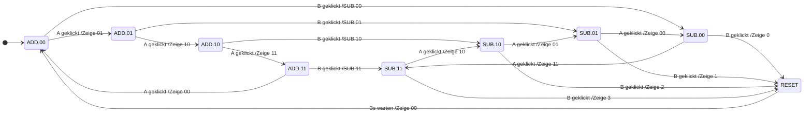

---
sidebar_custom_props:
  id: 09b52e70-bacc-407b-bb1c-482abc896c63
---
# 3. Event-State Tabelle

Studieren Sie folgende Event-State Tabelle

| <span style={{float: 'right'}}>Zustand :mdi[arrow-right]</span><br />Ereignis :mdi[arrow-down] | __ADD:00__                            | __ADD:01__                            | __ADD:10__                            | __ADD:11__                            | __SUB:00__                            | __SUB:01__                            | __SUB:10__                            | __SUB:11__                            | __RESET__                                       |
|:-----------------------------------------------------------------------------------------------|:--------------------------------------|:--------------------------------------|:--------------------------------------|:--------------------------------------|:--------------------------------------|:--------------------------------------|:--------------------------------------|:--------------------------------------|:------------------------------------------------|
| **:mdi[gesture-tap-button] A**                                                                 | Zeige 01 :mdi[arrow-right] __ADD:01__ | Zeige 10 :mdi[arrow-right] __ADD:10__ | Zeige 11 :mdi[arrow-right] __ADD:11__ | Zeige 00 :mdi[arrow-right] __ADD:00__ | Zeige 11 :mdi[arrow-right] __SUB:11__ | Zeige 00 :mdi[arrow-right] __SUB:00__ | Zeige 01 :mdi[arrow-right] __SUB:01__ | Zeige 10 :mdi[arrow-right] __SUB:10__ |                                                 |
| **:mdi[gesture-tap-button] B**                                                                 | __SUB:00__                            | __SUB:01__                            | __SUB:10__                            | __SUB:11__                            | Zeige 0 :mdi[arrow-right] __RESET__   | Zeige 1 :mdi[arrow-right] __RESET__   | Zeige 2 :mdi[arrow-right] __RESET__   | Zeige 3 :mdi[arrow-right] __RESET__   |                                                 |
| **Timer**                                                                                      |                                       |                                       |                                       |                                       |                                       |                                       |                                       |                                       | warte 3s, zeige 00 :mdi[arrow-right] __ADD:00__ |


:::aufgabe 
<Answer type="state" webKey="0fff7b52-7809-46f6-8bdd-1975b9b355b4" />

Was macht diese Zustandsmaschine? Beschreiben Sie den Ablauf in Worten.

<Answer type="text" webKey="f0ee7de2-e4a7-4249-ae49-053766fcb584" />
<Solution webKey="6bf8ab78-782a-4b23-973a-7815c626e946">

Subtrahiert die Anzahl Tastendrücke auf __A__ voneinander. Die Taste __B__ ist der Minus-Operator und die Gleichheitstaste. 

Zuerst zählt wird gezählt, wie oft die Taste __A__ gedrückt wurde (max. 4). Betätigung von __B__ stellt in den Subtraktionsmodus um - so oft wie __A__ gedrückt wird, wird Eins abgezogen. Erneutes Betätigen von __B__ zeigt das Ergebnis als Dezimalzahl an.
</Solution>
:::

:::aufgabe[Zustands-Diagramm]
<Answer type="state" webKey="dfb35ba3-f2aa-485e-b878-3a5555134abd" />
Überführen Sie die Tabelle in ein Zustands-Diagramm und halten Sie Ihre Lösung unten fest.

<Answer type="text" webKey="b9c862f9-831c-460f-a0b1-991b2e0e9d3b" />
<Solution webKey="6bf8ab78-782a-4b23-973a-7815c626e946">
<div onClick={() => {
    document.getElementById('mermaid-zoom')?.querySelector('svg')?.requestFullscreen()
}} id="mermaid-zoom" className="white-svg" style={{cursor: 'pointer'}}>


</div>
</Solution>
:::

::::aufgabe[Micro\:Bit]
<Answer type="state" webKey="c5f52e62-2fad-4186-a37c-8c074f4ef762" />

Material
: Micro\:Bit
: mit USB-Kabel an den Computer angeschlossen
Editor
: Online-Editor [👉 python.microbit.org](https://python.microbit.org/)

Programmieren Sie die Zustandsmaschine auf dem Micro\:Bit. Verwenden Sie dazu die folgende Vorlage:

```py
from microbit import *

IMAGES = {
    '00': Image('40000:00000:00000:00000:00000'),
    '01': Image('40009:00009:00009:00009:00000'),
    '10': Image('40900:00900:00900:00900:00000'),
    '11': Image('40909:00909:00909:00909:00000')
}

state = 'ADD:00'

while True:
    if state=='ADD:00':
        if button_a.was_pressed():
            display.show(IMAGES['01'])
            state = 'ADD:01'
        elif button_b.was_pressed():
            state = 'SUB:00'
    elif state=='ADD:01':
        pass
    elif state=='ADD:10':
        pass
    elif state=='ADD:11':
        pass
    elif state=='SUB:00':
        pass
    elif state=='SUB:01':
        pass
    elif state=='SUB:10':
        pass
    elif state=='SUB:11':
        pass
    elif state=='RESET':
        sleep(3000)
        state = 'ADD:00'
```

...und halten Sie Ihre Lösung unten fest.

```mpy live_py id=4189f779-1995-4402-8fce-850149ff9e70 title=2bit.mpy

```

<Solution webKey="6bf8ab78-782a-4b23-973a-7815c626e946">

Es gibt mehrere vernünftige Lösungen.

Wird das Zustandsdiagramm 1:1 umgesetzt, so wird der Code sehr lang, da die Zahlenanzeige mehrfach aufgerufen wird:

```py
from microbit import *

IMAGES = {
    '00': Image('00000:00000:00000:00000:99999'),
    '01': Image('00009:00009:00009:00009:99999'),
    '10': Image('00900:00900:00900:00900:99999'),
    '11': Image('00909:00909:00909:00909:99999'),
    'FULL_SCREEN': Image('99999:99999:99999:99999:99999')
}
state = 'ADD:00'


while True:
    btn_a = button_a.was_pressed()
    btn_b = button_b.was_pressed()

    if state=='ADD:00':
        if btn_ADD:
            display.show(IMAGES['01'])
            state = 'ADD:01'
        elif btn_SUB:
            display.show(IMAGES['00'])
            state = 'SUB:00'
    elif state=='ADD:01':
        if btn_ADD:
            display.show(IMAGES['10'])
            state = 'ADD:10'
        elif btn_SUB:
            display.show(IMAGES['01'])
            state = 'SUB:01'
    elif state=='ADD:10':
        if btn_ADD:
            display.show(IMAGES['11'])
            state = 'ADD:11'
        elif btn_SUB:
            display.show(IMAGES['10'])
            state = 'SUB:10'
    elif state=='ADD:11':
        if btn_ADD:
            display.show(IMAGES['00'])
            state = 'ADD:00'
        elif btn_SUB:
            display.show(IMAGES['11'])
            state = 'SUB:11'
    elif state=='SUB:00':
        if btn_ADD:
            display.show(IMAGES['11'])
            state = 'SUB:11'
        elif btn_SUB:
            display.show(0)
            state = 'RESET'
    elif state=='SUB:01':
        if btn_ADD:
            display.show(IMAGES['00'])
            state = 'SUB:00'
        elif btn_SUB:
            display.show(1)
            state = 'RESET'
    elif state=='SUB:10':
        if btn_ADD:
            display.show(IMAGES['01'])
            state = 'SUB:01'
        elif btn_SUB:
            display.show(2)
            state = 'RESET'
    elif state=='SUB:11':
        if btn_ADD:
            display.show(IMAGES['10'])
            state = 'SUB:10'
        elif btn_SUB:
            display.show(3)
            state = 'RESET'
    elif state=='RESET':
        sleep(3000)
        state = 'ADD:00'
        display.show(IMAGES['00'])
```

Aus Programmier-Sicht ist folgende Lösung etwas schlanker - welchen Nachteil gibt es dabei allenfalls?

```py
from microbit import *

IMAGES = {
    '00': Image('00000:00000:00000:00000:99999'),
    '01': Image('00009:00009:00009:00009:99999'),
    '10': Image('00900:00900:00900:00900:99999'),
    '11': Image('00909:00909:00909:00909:99999'),
    'FULL_SCREEN': Image('99999:99999:99999:99999:99999')
}
state = 'ADD:00'

while True:
    btn_a = button_a.was_pressed()
    btn_b = button_b.was_pressed()

    if state=='ADD:00':
        display.show(IMAGES['00'])
        if btn_ADD:
            state = 'ADD:01'
        elif btn_SUB:
            state = 'SUB:00'
    elif state=='ADD:01':
        display.show(IMAGES['01'])
        if btn_ADD:
            state = 'ADD:10'
        elif btn_SUB:
            state = 'SUB:01'
    elif state=='ADD:10':
        display.show(IMAGES['10'])
        if btn_ADD:
            state = 'ADD:11'
        elif btn_SUB:
            state = 'SUB:10'
    elif state=='ADD:11':
        display.show(IMAGES['11'])
        if btn_ADD:
            state = 'ADD:00'
        elif btn_SUB:
            state = 'SUB:11'
    elif state=='SUB:00':
        display.show(IMAGES['00'])
        if btn_ADD:
            state = 'SUB:11'
        elif btn_SUB:
            display.show(0)
            state = 'RESET'
    elif state=='SUB:01':
        display.show(IMAGES['01'])
        if btn_ADD:
            state = 'SUB:00'
        elif btn_SUB:
            display.show(1)
            state = 'RESET'
    elif state=='SUB:10':
        display.show(IMAGES['10'])
        if btn_ADD:
            state = 'SUB:01'
        elif btn_SUB:
            display.show(2)
            state = 'RESET'
    elif state=='SUB:11':
        display.show(IMAGES['11'])
        if btn_ADD:
            state = 'SUB:10'
        elif btn_SUB:
            display.show(3)
            state = 'RESET'
    elif state=='RESET':
        sleep(3000)
        state = 'ADD:00'
```


</Solution>
::::


:::aufgabe[⭐ Erweiterung bis 3 bit]
<Answer type="state" webKey="e3d1bf4d-b861-4495-a0f5-07cb72e3f904" />

Erweitern Sie die Aufgabe auf eine 3 bit Addition.

```mpy live_py id=7a7c6792-4782-4282-ba52-4f45b3f014b7 title=3bit.mpy
```
:::