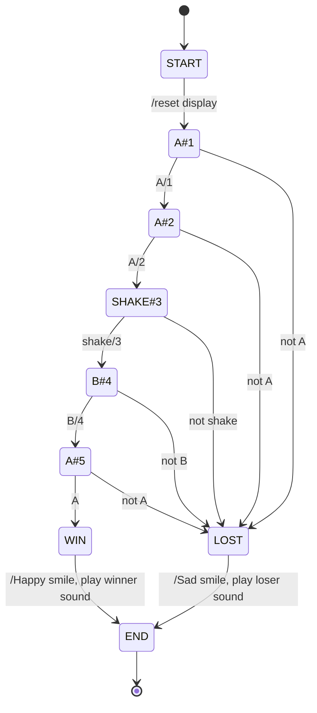

---
sidebar_custom_props:
  id: 09b52e70-bacc-407b-bb1c-482abc896c63
---
# 3. Zustandsdiagramm



:::aufgabe
<Answer type="state" webKey="ad01684f-a9b2-4f69-9938-d1093625abc8" />

Oben ist ein Zustandsdiagramm für ein Spiel. Beschreiben Sie den Ablauf in eigenen Worten.

<Answer type="text" webKey="2a627285-08ed-4a7d-aae5-de72ed174597" />
:::

:::aufgabe Event-State Tabelle
<Answer type="state" webKey="aaafd952-3053-40ca-a8bc-24098702716f" />

Übersetzen Sie das Zustandsiagramm in eine Event-State Tabelle und halten Sie Ihre Lösung unten fest.

<Answer type="text" webKey="07a94c07-3902-444c-9133-497e3ba0f97a" />
:::

:::aufgabe
<Answer type="state" webKey="c237f407-e5e3-4363-99fe-681138a07ba7" />

Material
: Micro:Bit
: mit USB-Kabel an den Computer angeschlossen
Editor
: Online-Editor [👉 python.microbit.org](https://python.microbit.org/)

Programmieren Sie die Zustandsmaschine auf dem Micro:Bit. Verwenden Sie dazu ein neues Projekt im Online-Editor und halten Sie Ihre Lösung unten fest.

```mpy live_py id=b478b867-6ac9-46cc-a11a-a611db9b0b8f title=riddle.mpy

```
:::

