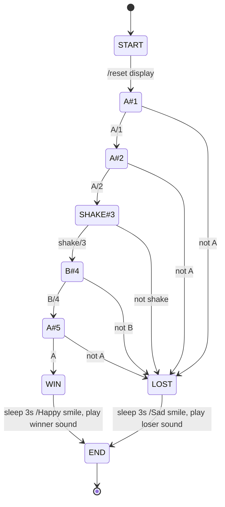

---
sidebar_custom_props:
  id: 09b52e70-bacc-407b-bb1c-482abc896c63
---
# 4. Zustandsdiagramm



:::aufgabe
<Answer type="state" webKey="ad01684f-a9b2-4f69-9938-d1093625abc8" />

Oben ist ein Zustandsdiagramm für ein Spiel. Beschreiben Sie den Ablauf in eigenen Worten.

<Answer type="text" webKey="2a627285-08ed-4a7d-aae5-de72ed174597" />
<Solution webKey="6bf8ab78-782a-4b23-973a-7815c626e946">

Es ist ein Ratespiel - man muss in der richtigen Reihenfolge die richtigen Eingaben tätigen, damit man gewinnt.
</Solution>
:::

:::aufgabe[Event-State Tabelle]
<Answer type="state" webKey="aaafd952-3053-40ca-a8bc-24098702716f" />

Übersetzen Sie das Zustandsiagramm in eine Event-State Tabelle und halten Sie Ihre Lösung unten fest.

<Answer type="text" webKey="07a94c07-3902-444c-9133-497e3ba0f97a" />
<Solution webKey="6bf8ab78-782a-4b23-973a-7815c626e946">

| <span style={{float: 'right'}}>Zustand :mdi[arrow-right]</span><br />Ereignis :mdi[arrow-down] | __START__                               | __A#1__                              | __A#2__                                  | __SHAKE#3__                          | __B#4__                               | __A#5__                              | __WIN__                                             | __LOST__                                          | __END__ |
|:-----------------------------------------------------------------------------------------------|:----------------------------------------|:-------------------------------------|:-----------------------------------------|:-------------------------------------|:--------------------------------------|:-------------------------------------|:----------------------------------------------------|:--------------------------------------------------|:--------|
| **Button A**                                                                                   |                                         | 1 anzeigen :mdi[arrow-right] __A#2__ | 2 anzeigen :mdi[arrow-right] __SHAKE#3__ | :mdi[arrow-right] __LOST__           | :mdi[arrow-right] __LOST__            | 5 anzeigen :mdi[arrow-right] __WIN__ |                                                     |                                                   |         |
| **Button B**                                                                                   |                                         | :mdi[arrow-right] __LOST__           | :mdi[arrow-right] __LOST__               | :mdi[arrow-right] __LOST__           | 4 anzeigen  :mdi[arrow-right] __A#5__ | :mdi[arrow-right] __LOST__           |                                                     |                                                   |         |
| **Shake**                                                                                      |                                         | :mdi[arrow-right] __LOST__           | :mdi[arrow-right] __LOST__               | 3 anzeigen :mdi[arrow-right] __B#4__ | :mdi[arrow-right] __LOST__            | :mdi[arrow-right] __LOST__           |                                                     |                                                   |         |
| **Timer**                                                                                      | reset display :mdi[arrow-right] __A#1__ |                                      |                                          |                                      |                                       |                                      | 3s warten, SMILE anzeigen :mdi[arrow-right] __END__ | 3s warten, SAD anzeigen :mdi[arrow-right] __END__ |         |
</Solution>
:::

:::aufgabe
<Answer type="state" webKey="c237f407-e5e3-4363-99fe-681138a07ba7" />

Material
: Micro\:Bit
: mit USB-Kabel an den Computer angeschlossen
Editor
: Online-Editor [👉 python.microbit.org](https://python.microbit.org/)

Programmieren Sie die Zustandsmaschine auf dem Micro\:Bit. Verwenden Sie dazu ein neues Projekt im Online-Editor und halten Sie Ihre Lösung unten fest.

```mpy live_py id=b478b867-6ac9-46cc-a11a-a611db9b0b8f title=riddle.mpy

```
<Solution webKey="6bf8ab78-782a-4b23-973a-7815c626e946">

```py
from microbit import *
import sys

state = 'START'

display.clear()
while True:
    btn_a = button_a.was_pressed()
    btn_b = button_b.was_pressed()
    is_shake = accelerometer.was_gesture('shake')
    has_input = btn_a or btn_b or is_shake
    
    if state == 'START':
        display.clear()
        state = 'SEEK_A#1'
    elif state == 'SEEK_A#1':
        if btn_a:
            display.show(1)
            state = 'SEEK_A#2'
        elif has_input:
            state = 'LOST'
    elif state == 'SEEK_A#2':
        if btn_a:
            display.show(2)
            state = 'SEEK_SHAKE#3'
        elif has_input:
            state = 'LOST'
    elif state == 'SEEK_SHAKE#3':
        if is_shake:
            display.show(3)
            state = 'SEEK_B#4'
        elif has_input:
            state = 'LOST'
    elif state == 'SEEK_B#4':
        if btn_b:
            display.show(4)
            state = 'SEEK_A#5'
        elif has_input:
            state = 'LOST'
    elif state == 'SEEK_A#5':
        if btn_a:
            state = 'WIN'
        elif has_input:
            state = 'LOST'
    elif state == 'WIN':
        display.show(Image.HAPPY)
        audio.play(Sound.HAPPY)
        audio.play(Sound.HAPPY)
        sleep(3000)
        state = 'END'
    elif state == 'LOST':
        display.show(Image.SAD)
        audio.play(Sound.SAD)
        sleep(3000)
        state = 'END'
    elif state == 'END':
        # oder alternativ: zurück zum Start: display.clear(); state = 'START'
        sys.exit(0)
```

</Solution>
:::

