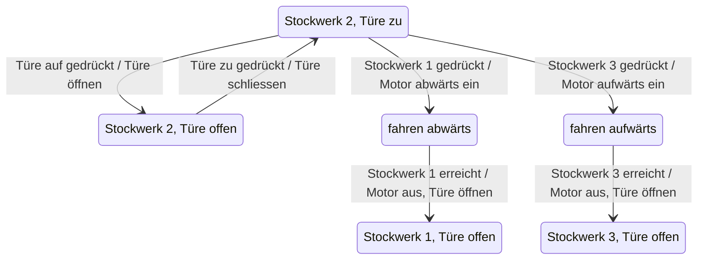

# Zustandsmaschinen

## Einleitung
Roboter sind Maschinen, welche **autonom** eine bestimmte Aufgabe lösen. Roboter verfügen über **Sensoren**, um ihre Umgebung zu erfassen und über **Aktoren** um zu handeln. In der Mitte sitzt ein **Embedded System**, ein eingebettes Computersystem, welches den Roboter steuert. Es muss die Signale der Sensoren verarbeiten und daraus Steuersignale für die Aktoren erzeugen. Man spricht auch vom **Kontroller**.


Roboter können ganz unterschiedliche Grade von **Intelligenz** aufweisen. Das geht vom Schweissroboter in der Automobilherstellung, welcher immer genau die gleichen Abläufe durchführt, dies aber mit grosser Geschwindigkeit und Präzision, bis zum autonomen Roboter, welcher in einem Trümmerhaufen nach Verletzten suchen kann.

Ein enstcheidender Faktor für den Grad der Intelligenz ist die **Software** im Kontroller. Diese kann von einfachen **Steuerprogrammen** bis zu lernfähigen Systemen mittels **neuronalen Netzen** und Deep-Learning gehen.

Eine klassische Form von Steuerprogrammen beruht auf sogenannten **Zustandsmaschinen**, oder endlichen Automaten. Sie sind gut für Aufgaben geeignet, wo eine **endliche** Zahl von **Ereignissen** verarbeitet werden muss und wo die **Aktion**, welche auf ein bestimmtes Ereignis erfolgt, **zustandsabhängig** ist.

Ein gutes Beispiel ist die **Steuerung eines Liftes**. Die Sensoren umfassen die verschiedenen Knöpfe, um den Lift zu bestellen, Schalter, welche feststellen, ob die Türen offen oder geschlossen sind, oder ob sich eine Person im Lift befindet, oder wo sich der Lift gerade befindet. Die Aktoren sind die verschiedenen Motoren für die Kabine und die Türen. Die Zustandsmaschine muss nun sicherstellen, dass beispielsweise die Türen nur dann geöffnet werden können, wenn der Lift bei einer Türe still steht, usw.

## Zustände und Ereignisse
Beim Entwurf einer Zustandsmaschine muss man sich überlegen, welche **Ereignisse** im System vorkommen und in welchen **unterscheidbaren Zuständen** das System sein kann. Das ist nicht immer ganz einfach.

### Ereignisse
Ereignisse beruhen auf den **Signalen**, welche die Sensoren liefern. Diese Signale können sowohl zeitlich, wie auch wertemässig **kontinuierlich** anfallen. Zum Beispiel misst ein Beschleunigungssensor die Beschleunigung andauernd und liefert fein aufgelöste Werte im Bereich der Messgenauigkeit des Sensors.

Für eine Zustandsmaschine brauchen wir aber klar definiert Ereignisse. D.h. die Sensorwerte müssen laufend verarbeitet und daraus dann die interessierenden Ereignisse erzeugt werden. Im einfachsten Fall könnte man überprüfen, ob der gemessene Wert einen **Schwellwert** übersteigt oder unterschreitet, zum Beispiel, ob die Beschleunigung grösser oder kleiner als 1g ist.

### Zustände
Zustände lassen sich am einfachsten finden, wenn man sich überlegt, auf welche Ereignisse das Sytem in einem bestimmten Zustand **reagieren** muss. Zum Beispiel muss ein Lift im Zustand `fahren` nicht auf Tastendrucke auf die Türknöpfe reagieren. Dafür muss er aber anhalten, wenn der Stockwerksensor das richtige Stockwerk meldet, oder wenn die Nothalttaste gedrückt wird. Wichtig ist, dass Zustände immer über eine bestimmt Zeit andauern, bis die Zustandsmaschine auf Grund eines Ereignisses in einen anderen Zustand wechselt. Diese Übergang nennt man **Transition**.

## State-Event-Tabellen
Wenn man die Ereignisse und die Zustände einer Zustandsmaschine kennt so kann man diese in einer Tabelle eintragen, der sogenannten **State-Event-Tabelle**. In den einzelnen Zellen der Tabelle trägt man ein, was im betreffenden Zustand beim entsprechenden Ereignis passieren muss und welches der nachfolgende Zustand ist.

| <span style={{float: 'right'}}>Momentaner Zustand :mdi-arrow-right:</span><br />Ereignis :mdi-arrow-down: | __Zustand A__ | __Zustand B__ | __Zustand C__ | … |
|:----------------------------------------------------------------------------------------------------------|:--------------|:--------------|:--------------|:--|
| **Ereignis 1**                                                                                            | …             | …             | …             | … |
| **Ereignis 2**                                                                                            | …             | Aktion :mdi-arrow-right: __Zustand C__ | …             | … |
| **Ereignis 3**                                                                                            | …             | …             | …             | … |

Unvollständiges Beispiel für einen Lift (Zustände horizontal, Ereignise vertikal):

| <span>Zustand :mdi-arrow-right:</span><br />Ereignis :mdi-arrow-down: | __Stockwerk 2, Türe offen__                                | __Stockwerk 2, Türe zu__                                  | __fahren aufwärts__                                                | __fahren abwärts__                                                 | ... |
|:----------------------------------------------------------------------|:-----------------------------------------------------------|:----------------------------------------------------------|:-------------------------------------------------------------------|:-------------------------------------------------------------------|:----|
| **Türe auf gedrückt**    |            | Türe öffnen :mdi-arrow-right: __Stockwerk 2, Türe offen__ |                       |             |     |
| **Türe zu gedrückt**     | Türe schliessen :mdi-arrow-right: __Stockwerk 2, Türe zu__    |        |                       |             |     |
| **Stockwerk 1 gedrückt** |            | Motor abwärts ein :mdi-arrow-right: __fahren abwärts__    |                       |             |     |
| **Stockwerk 3 gedrückt** |            | Motor aufwärts ein :mdi-arrow-right: __fahren aufwärts__  |                       |             |     |
| **Stockwerk 1 erreicht** |            |              |             | Motor aus, Türe öffnen :mdi-arrow-right: __Stockwerk 1, Türe auf__ |     |
| **Stockwerk 3 erreicht** |            |              | Motor aus, Türe öffnen :mdi-arrow-right: __Stockwerk 3, Türe auf__ |             |     |
| **...**                  |            |              |             |                                                                      |     |

Dieses Beispiel zeigt, dass in bestimmten Zuständen gewisse Ereignisse ignoriert werden. Die entsprechenden Zellen sind dann leer. Es könte auch vorkommen, dass die Zustandsmaschine bei einem bestimmten Ereignis zwar eine Aktion durchführt, den Zustand aber nicht wechselt. Die Zelle wäre dann nicht leer, aber der Folgezustand wäre derselbe.

## Zustandsdiagramme
Schliesslich treffen wir einen alten Bekannten an. Zustandsmaschinen können auch durch **Zustandsdiagramme** dargestellt werden. Obiges Lift-Beispiel würde als Zustandsdiagramm so aussehen:



## Umsetzung im Programm
Die Implementation von Zustandsmaschinen sieht im Grund immer gleich aus: Eine **zweifache Verschachtellung** von **if-elif-else-Anweisungen** in einer Endlosschleife.

Für das Lift-Beispiel könnte das in Python so aussehen:

```py
floor_states = {
    "floor1": "Stockwerk 1, Türe offen",
    "floor3": "Stockwerk 3, Türe offen"
}

state = "..."
while True:
    if state == "Stockwerk 2, Türe zu":
        if door_open_pressed() == True:
            open_door()
            state = "Stockwerk 2, Türe offen"
        elif floor1_pressed() == True:
            floor = "floor1"
            motor_down_on()
            state = "fahren abwärts"
        elif floor3_pressed() == True:
            floor = "floor3"
            motor_up_on()
            state = "fahren aufwärts"
    elif state == "Stockwerk 2, Türe offen":
        if door_closed_pressed() == True:
            close_door()
            state = "Stockwerk 2, Türe zu"
    elif state == "fahren abwärts":
        if floor_position() == floor:
            motor_off()
            open_door()
            state == floor_state[floor]
    elif state == "fahren aufwärts":
        if floor_position() == floor:
            motor_off()
            open_door()
            state == floor_state[floor]
...
```
Das Beispiel zeigt, dass in der Umsetzung im Programm teilweise **Hilfsvariablen** (`floor`, Zielstockwerk, das angefahren werden soll), **Funktionen** und weitere Python-Elemente, wie **Listen** und **Dictionaries** (`floor_states`, bildet Zielstockwerk auf den Zustand ab, welcher bei Erreichung eingenommen werden muss) benötigt werden.

Man kann daran auch erkennen, dass die State-Event-Tabelle und das Zustandsdiagramm die Situation nicht ganz korrekt (oder zu stark vereinfacht) beschreiben. Zum Beispiel müssten ohne die Hilfsvariable `floor` die Zustände `fahren abwärts` in die Zustände `fahren abwärts zu Stockwerk 1`, `fahren abwärts zu Stockwerk 2`, etc. und analog für `fahren aufwärts` aufgeteilt werden. Das würde aber zu einer Explosion der Zustände führen.
