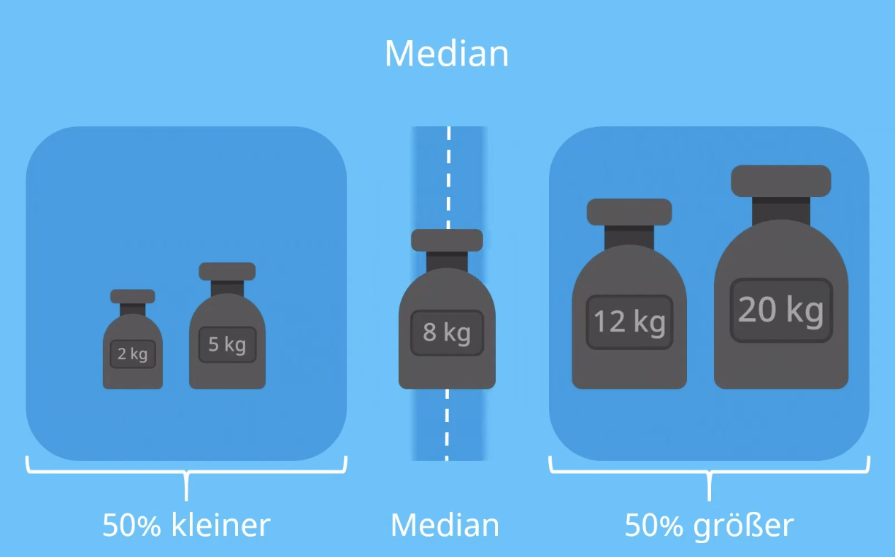

import Answer from '@site/src/components/Answer'
import Finding from '@site/src/components/Finding'

# Statsistische Kenngrössen

Daten können alles Mögliche sein: Messwerte, Ergebnisse von Umfragen, Beobachtungen und Zählungen. Nicht alle diese Daten lassen sich überhaupt mit Hilfe von Zahlen erfassen. Man sollte sich daher klar machen, dass es verschiedene Typen von Daten gibt. Daten sind entweder quan¬titativ (alles, was sich zählen und messen und überhaupt in Zahlen ausdrücken lässt) oder qualitativ (alles, was man zwar beobachten und ordnen, aber nicht in Form von Zahlen angeben kann).

**Lageparameter** beschrieben, wo die Stichprobe liegt, d.h. um welchen Wert sie sich gruppiert.

## Mittelwert

Der Mittelwert ist der 

## Modus
Der Modus   (Modalwert) ist der Wert, der im Datensatz am häufigsten vorkommt. Er ist vor allem dann wichtig, wenn man es nicht mit quantitativen Merkmalen (etwa Körper¬grössen) zu tun hat, sondern mit qualitativen Daten erfassbaren Daten, etwa mit verschiedenen möglichen Antworten auf eine Frage

## Median

Der Median ist der mittlere Wert. Er kommt also zustande, indem alle Werte der Grösse nach geordnet werden, und der Mittlere Wert ausgelesen wird.

Im Bild Oben wäre der Median entsprechend `8 kg`.

Sind in einem Datensatz eine gerade Anzahl Datensätze vorhanden, so berechnet sich der Median als Durchschnitt der beiden mittleren Werte.

### Vorteil gegenüber dem Mittelwert

:::aufgabe Median vs. Mittelwert
Berechnen Sie für die folgenden Gewichte den Mittelwert und den Median:

<Answer type="text" webKey="66a5bc47-d8f1-463a-ac25-692808c31beb" >

Mittelwert =

Median =

**Erkenntnis**:

</Answer>

:::

<Finding title="Erkenntnisse">

Modus und Median sind einfach zu ermitteln und sind im Vergleich zum Mittelwert statistisch robust, d.h. sie reagieren wenig sensibel auf statistische Ausreisser. Die Aussage ist jedoch nicht die gleiche und insbesondere der Modus ist weniger aussagekräftig!

</Finding>

## Streuungsparameter
Streuparameter beschrieben, wie Breit die Stichprobe um den Mittelwert streut, d.h. wie weit sie im Mittel vom Mittelwert entfernt sind.

### Spannweite
Die Spannweite ist der Abstand (die Differenz) zwischen dem kleinsten und dem grössten Wert. Sie ist sehr einfach zu ermitteln, sagt aber wenig aus. **Hauptnachteil**: Die Spannweite ist nicht robust, d.h. statistische Ausreisser (einzelne Werte, die viel tiefer oder höher sind als fast alle übrigen – nicht selten infolge von Messfehlern oder falsch eingegebenen Daten) fallen viel zu stark ins Gewicht.

### Varianz

Die Varianz $s^2$ ist die mittlere quadratische Abweichung der Ergebnisse vom Mittelwert:

$$
s^2 = \frac{(x_1-\bar{x})^2+(x_2-\bar{x})^2+...+(x_n-\bar{x})^2}{n-1}
$$

wobei `n` die Grösse der Stichprobe, $x_1$, $x_2$, $x_n$ die verschiedenen Messwerte und $\bar{x}$ der Mittewlert darstellen.

### Standardabwichung $s$

Die Standardabweichung $s$ ist die Quadratwurzel aus der Varianz:

$$
s=\sqrt{s^2} = \sqrt{\frac{(x_1-\bar{x})^2+(x_2-\bar{x})^2+...+(x_n-\bar{x})^2}{n-1}}
$$

In Excel kann die Standardabweichung mit der Funktion `=STABW.S` berechnet werden. Zum Beispiel  `=STABW.S(A1:A12)` für die Werte der Zellen `A1` bis `A12`.

<Answer type="text" webKey="e9f2584b-ef06-447b-8079-3bc23d924005" />