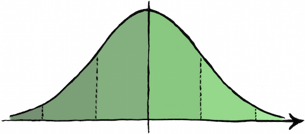
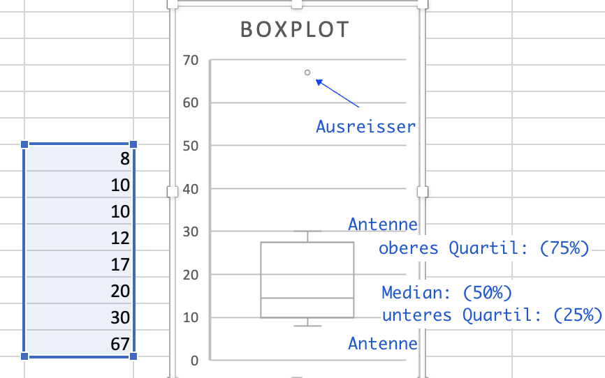

import Finding from '@site/src/components/Finding'

# Statsistische Kenngrössen

**Lageparameter** beschrieben, wo die Stichprobe liegt, d.h. um welchen Wert sie sich gruppiert.

## Mittelwert

Der Mittelwert ist der Durchschnitt aller Werte.

$$
\bar{x} = \frac{x_1+x_2+x_3+...+x_n}{n}
$$

In Excel kann der Mittelwert im Bereich `A1:A12` mit der Funktion `=MITTELWERT(A1:A12)` berechnet werden.

## Modus
Der Modus   (Modalwert) ist der Wert, der im Datensatz **am häufigsten** vorkommt. Er ist vor allem dann wichtig, wenn man es nicht mit quantitativen Merkmalen (etwa Körpergrössen) zu tun hat, sondern mit qualitativen Daten erfassbaren Daten, etwa mit verschiedenen möglichen Antworten auf eine Frage.

## Median

Der Median ist der mittlere Wert. Er kommt also zustande, indem alle Werte der Grösse nach geordnet werden, und der Mittlere Wert ausgelesen wird.

Im Bild Oben wäre der Median entsprechend `8 kg`.

Sind in einem Datensatz eine gerade Anzahl Datensätze vorhanden, so berechnet sich der Median als Durchschnitt der beiden mittleren Werte.

### Vorteil gegenüber dem Mittelwert

:::aufgabe Median vs. Mittelwert
Berechnen Sie für die folgenden Gewichte den Mittelwert und den Median. Welcher Wert beschreibt die Lage des mittleren Gewichts am besten?

<Answer type="text" webKey="66a5bc47-d8f1-463a-ac25-692808c31beb" >

Mittelwert =

Median =

**Erkenntnis**:

</Answer>

:::

<Finding title="Erkenntnisse">

Modus und Median sind einfach zu ermitteln und sind im Vergleich zum Mittelwert statistisch robust, d.h. sie reagieren wenig sensibel auf statistische Ausreisser. Die Aussage ist jedoch nicht die gleiche und insbesondere der Modus ist weniger aussagekräftig!

</Finding>

## Streuungsparameter
Streuparameter beschrieben, wie Breit die Stichprobe um den Mittelwert streut, d.h. wie weit sie im Mittel vom Mittelwert entfernt sind.

### Spannweite
Die Spannweite ist der Abstand (die Differenz) zwischen dem kleinsten und dem grössten Wert. Sie ist sehr einfach zu ermitteln, sagt aber wenig aus. **Hauptnachteil**: Die Spannweite ist nicht robust, d.h. statistische Ausreisser (einzelne Werte, die viel tiefer oder höher sind als fast alle übrigen – nicht selten infolge von Messfehlern oder falsch eingegebenen Daten) fallen viel zu stark ins Gewicht.

### Varianz $s^2$

Die Varianz $s^2$ ist die mittlere quadratische Abweichung der Ergebnisse vom Mittelwert:

$$
s^2 = \frac{(x_1-\bar{x})^2+(x_2-\bar{x})^2+...+(x_n-\bar{x})^2}{n-1}
$$

wobei `n` die Grösse der Stichprobe, $x_1$, $x_2$, $x_n$ die verschiedenen Messwerte und $\bar{x}$ der Mittewlert darstellen.

In Excel kann die Standardabweichung mit der Funktion `=VAR.S` berechnet werden. Zum Beispiel  `=VAR.S(A1:A12)` für die Werte der Zellen `A1` bis `A12`.
### Standardabwichung $s$
Vereinfacht gesagt, ist die Standardabweichung die durchschnittliche Entfernung aller gemessenen Ausprägungen eines Merkmals vom Durchschnitt. Die Standardabweichung besitzt immer die gleiche Masseinheit wie das zu untersuchende Merkmal. Dadurch ist im Vergleich zur Varianz eine Interpretation einfacher. Eine kleinere Standardabweichung gibt in der Regel an, dass die gemessenen Ausprägungen eines Merkmals eher enger um den Mittelwert liegen, eine grössere Standardabweichung gibt eine stärkere Streuung an.

Die Standardabweichung $s$ ist die Quadratwurzel aus der Varianz:

$$
s=\sqrt{s^2} = \sqrt{\frac{(x_1-\bar{x})^2+(x_2-\bar{x})^2+...+(x_n-\bar{x})^2}{n-1}}
$$

In Excel kann die Standardabweichung mit der Funktion `=STABW.S` berechnet werden. Zum Beispiel  `=STABW.S(A1:A12)` für die Werte der Zellen `A1` bis `A12`.

:::note Weitere Aussagekraft
Für **normalverteilte** Merkmale (nur für solche!) gilt die Faustregel, dass innerhalb der Entfernung einer Standardabweichung nach oben und unten vom Mittelwert rund $68$ Prozent aller Datenpunkte liegen. Im Umkreis von zwei Standardabweichungen sind es rund $95$ Prozent aller Werte. Bei grösseren Abweichungen spricht man von Ausreissern.

:::

## Boxplot

Der Boxplot stellt die Lageparameter graphisch dar. Er besteht immer aus einem Rechteck, genannt Box, und zwei Linien, die dieses Rechteck verlängern. Diese Linien werden als „Antenne" bezeichnet und werden durch einen Strich abgeschlossen. Der Strich in der Box repräsentiert den **Median** der Verteilung. Als **Ausreisser** werden Daten bezeichnet, die mehr als das 1.5-fache des Interquartilsabstands (der Abstand vom oberen zum unteren Quartil) vom untern bzw. oberen Quartil entfernt sind. Solche Ausreisser passen nicht zum Rest des Datensatzes und verzerren die statistischen Kenngrössen unnötig. Solche Datenpunkte kommen entweder durch Messfehler oder durch Randerscheinungen zustande. Im obigen Beispiel wird bspw. der Wert `67` als Ausreisser taxiert. 

<Answer type="text" webKey="e9f2584b-ef06-447b-8079-3bc23d924005" />