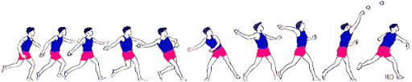

---
sidebar_custom_props:
  id: 965d3c87-0d79-4f64-ba9f-3998d94aeb5a
---

# Wurfweite

:::info Lernziele
Sie brauchen dazu die Funktionen:
- `SIN`
- `COS`
- `SUMME`

Sie lernen, Formeln in Excel abzutippen und dabei Verweise zu verwenden.
:::

:::aufgabe
<Answer type="state" webKey="f384b7ce-edc6-48d0-8e09-f91bc7bf2543" />

Dateiname
: __Informatik/Excel/04-wurfweite.xlsx__

[@pdf 04-wurfweite.pdf](assets/04-wurfweite.pdf)

Erstellen Sie die Wurfweitenberechnung\* und bestimmen Sie (mit Ihrer Körpergrösse), wie weit Sie mit welcher Geschwindigkeit werfen können. Erpröbeln Sie, wie mit welcher Abwurfgeschwindikeit Sie am Sporttag geworfen haben, um die Weite erreicht zu haben. Fixieren Sie den Abwurfwinkel dabei auf einen festen Wert (bspw. 40 Grad). Halten Sie Ihre Erkenntnisse fest.

Die nötigen Informationen zur Berechnung finden Sie im oben angezeigten PDF (laden Sie es herunter um noch mehr zu vergrössern).

Halten Sie hier fest, wie weit Sie 
<Answer type="text" webKey="0af2abf5-2b21-4187-b320-ce32e9f7333d" />

:::

\*die hier berechnete Wurfweite beachtet den Luftwiederstand nicht!
