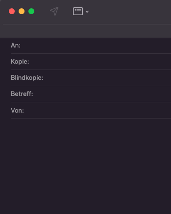

---
sidebar_custom_props:
  id: e2ec495d-e1ae-4eb2-b405-afa32f80df2d
  source:
    name: rothe.io
    ref: https://rothe.io/?page=ict/1-basics/4-e-mail-usage/
---

# E-Mail verwenden

## Eine E-Mail ist ein Brief

Im Gegensatz zu einem Chat gelten bei der E-Mail-Kommunikation die gleichen Regeln wie beim Briefverkehr. Eine E-Mail enthält also eine **Anrede**, einen **höflichen** und **sprachlich korrekten** Text, sowie eine Grussformel.

Bei einer E-Mail wird immer auch ein **Betreff** angegeben. Dieser sollte so gewählt werden, dass er **kurz und prägnant** den Inhalt der E-Mail zusammenfasst.

> Betreff: **Wechsel Schwerpunktfach**
>
> Sehr geehrter Herr Cadetg
>
> In den ersten sechs Monaten hier am Gymnasium habe ich grosse Freude am Italienischunterricht bekommen. Das von mir gewählte Schwerpunktfach entspricht hingegen gar nicht meinen Vorstellungen. Deshalb frage ich Sie, ob es mir möglich wäre, in das Schwerpunktfach Italienisch zu wechseln.
>
> Freundliche Grüsse
>
> Anna Müller

## Anrede

- Die **übliche Andere** ist «Sehr geehrte/r Frau/Herr». Sind **mehrere Personen** angesprochen, schreibt man «Sehr geehrte Damen und Herren». Wenn die angesprochene Person **unbekannt** ist (z.B. bei einer Support-E-Mail-Adresse), so kann man «Guten Tag» schreiben.
- Ist man mit der angeschriebenen Person **vertrauter**, schreibt man «Liebe/r».
- Am Schluss der Anrede steht **kein Satzzeichen**. Es folgt eine Leerzeile, dann der erste Satz.

## Grussformel

Zwischen Text und Grussformel befindet sich eine **Leerzeile**. Die Grussformel lautet «Freundliche Grüsse» ohne Satzzeichen. Ist man vertrauter, schreibt man «Liebe Grüsse».

## Wann antworten? Wann nicht?

Benutzen Sie die Antworten-Funktion nur, wenn Sie wirklich eine Antwort auf eine Mail schreiben. So kann eine längere E-Mail-Konversation vom Mailprogramm sauber dargestellt und nachvollzogen werden.

Wenn Sie jemandem eine neue Nachricht schreiben, sich also nicht auf vorhergehenden E-Mail-Verkehr beziehen, dann sollten Sie die Antworten-Funktion nicht verwenden, sondern einfach eine neue E-Mail schreiben.

## Allen Antworten
Die Funktion *allen Antworten* sollte man normalerweise nicht benutzen.

## Optionen CC und BCC

:::info Kopie/CC

In das An-Feld wird der eigentliche Empfänger geschrieben. Will man gleichzeitig eine Kopie der E-Mail versenden, nutzt man das **Cc-Feld**. Die Abkürzung Cc steht für *Carbon copy* und bedeutet so viel wie Kohlepapierdurchschlag. Es ist üblich, dass die Personen, die in Cc stehen, die E-Mail lediglich zur Kenntnis bekommen. **Die Empfänger in den Feldern An und Cc können die E-Mail-Adressen der anderen lesen und wissen somit, wer die E-Mail noch bekommen hat.** Und hier lauert die Gefahr! Denn diese Art der Versendung sollte man nur wählen, wenn es sich um eine geschlossene Nutzergruppe, wie z.B. innerhalb einer Organisation handelt.[^1]
:::

:::info Blindkopie/BCC

Möchte man dagegen eine E-Mail an mehrere Empfänger versenden, die sich **untereinander nicht kennen**, sollte man auf jeden Fall das **Bcc-Feld** nutzen. Bcc steht für *Blind carbon copy* und wird mit „unsichtbarer Durchschlag“ übersetzt. Der Name sagt es schon: Die Empfänger in diesem Feld werden weder von den anderen Empfängern gesehen, noch können sie selbst andere Adressen sehen. Lediglich das An-Feld ist für alle Teilnehmer sichtbar.[^1]
:::

[^1]: Quelle: [An-Cc-Bcc: scope-and-focus.com](https://www.scope-and-focus.com/datenschutzberatung/faq/datenschutz-fachaufsaetze-bdsg/an-cc-bcc-an-wen-geht-die-e-mail/)
