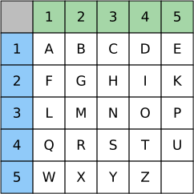

# Polybios-Chiffre [^1]

Die Polybios-Chiffre wurde vom griechischen Geschichtsschreiber Polybios (200 v.Chr. bis 120 v.Chr.) entwickelt.

Bei der Polybios-Verschlüsselung wird zunächst ein Quadrat mit den Buchstaben des Alphabets gefüllt. Die Anordnung der Buchstaben kann grundsätzlich beliebig gewählt werden. Polybios hat das griechische Alphabet mit 24 Buchstaben verwendet. Übertragen auf das lateinische Alphabet sieht dies folgendermassen aus:



Die beiden Buchstaben `J` und `V` finden keinen Platz in der Tabelle. `J` wird mit `I` zusammengefasst, `V` mit `U`.

Die Zeilen und Spalten im Quadrat werden durchnummeriert. Nun kann ein Buchstabe verschlüsselt werden, indem seine Zeilen- und Spaltennummer aufgeschrieben wird.

So wird der Klartext `HALLO` zum Geheimtext `23 11 31 31 34`.


## Polybios ausprobieren

```py live_py title=to__polybios.py id=7de16f01-3830-43dc-9ce6-6cf0b0161e9a
QUADRAT = [
    'A', 'B', 'C', 'D', 'E',
    'F', 'G', 'H', 'I', 'K',
    'L', 'M', 'N', 'O', 'P',
    'Q', 'R', 'S', 'T', 'U',
    'E', 'X', 'Y', 'Z'
]
klartext = '''\
Hallo'''

klartext = klartext.upper().replace('J', 'I').replace('V', 'U')
verschlüsselt = ''
for buchstabe in klartext:
    index = QUADRAT.index(buchstabe)
    spalte = index % 5 # berechnet den ganzzahligen Rest bei einer Division durch 5
    zeile = index // 5 # berechnet die ganzzahlige Division durch 5
    verschlüsselt = verschlüsselt + f'{zeile + 1}{spalte + 1} '

print(verschlüsselt.strip()) # strip entfernt Leerzeichen an den Rändern
```

:::aufgabe
Lesen Sie das Programm durch und versuchen Sie, jede Zeile zu verstehen.

Flicken Sie den Code, so dass der verschlüsselte Text lesbar wird. 

```py live_py title=from__polybios.py id=2a72f129-612f-45f5-9972-ac82561bc97e
QUADRAT = [
    'A', 'B', 'C', 'D', 'E',
    'F', 'G', 'H', 'I', 'K',
    'L', 'M', 'N', 'O', 'P',
    'Q', 'R', 'S', 'T', 'U',
    'E', 'X', 'Y', 'Z'
]

verschlüsselt = '35 34 31 53 12 24 34 43'
klartext = ''
zahlen = verschlüsselt.split(' ')
for zahl in zahlen:
    zeile = int(zahl[0])
    spalte = int(zahl[1])
    index = 0
    klartext = klartext + QUADRAT[index]

print(klartext)
```
:::

---
[^1]: Quelle: [rothe.io](https://rothe.io/?b=crypto&p=423844)