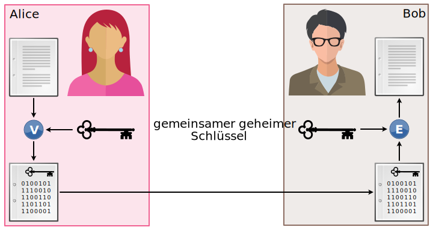

# Krypto-Familie

:::cards --cols=3  --minWidth=10em --gap=2em

Alice und Bob kommunizieren häufig miteinander – dies natürlich verschlüsselt.
***

Anstelle von «Person A» und «Person B» spricht man von Alice und Bob.
***

Wird eine dritte Person benötigt, kommt Charlie ins Spiel.
***

Eve wird meist dann eingesetzt, wenn Verbindungen abgehört (engl. eavesdropping) werden. Sie ist also eine passive Zuhörerin.
***

Mallory ist ein bösartiger, aktiver Angreifer (engl. **mal**icious).
***

Wird eine vertrauenswürdige dritte Stelle verwendet, wird Trent (engl. für **tr**usted **ent**ity) eingesetzt.
:::

## Symmetrische Verschlüsselung
Bei sämtlichen bisher betrachteten Verfahren handelte es sich um symmetrische Verfahren, d.h. zum Verschlüsseln und Entschlüsseln wird derselbe Schlüssel verwendet:

[^1]: Quelle: [rothe.io](https://rothe.io/?b=crypto&p=932192)