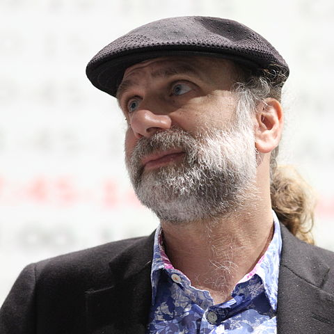

import Answer from '@site/src/components/Answer'

# Kerckhoffs' Prinzip

In der Kryptologie ist der wichtigste Punkt stets die Sicherheit. Dabei ist es wichtig, Sicherheit von Schein-Sicherheit zu unterscheiden.

## Das Prinzip von Kerckhoffs
Eines der wichtigsten Prinzipien in der Kryptologie stammt von August Kerckhoffs:

:::flex --justify=space-between --gap=3em
> «Die Sicherheit eines Kryptosystems darf nicht von der Geheimhaltung des Algorithmus abhängen.
>
> Die Sicherheit gründet sich nur auf die Geheimhaltung des Schlüssels.»
> – Auguste Kerckhoffs (1835 - 1903)
***--no-flex

:::

## Formulierung von Claude Shannon
:::flex --justify=space-between --gap=3em
Claude Shannon hat dasselbe kurz und prägnant ausgedrückt:
> «The enemy knows the system!»
> 
> – Claude Shannon (1916 - 2001)
***--no-flex

:::

## Erklärung von Bruce Schneier
Der renommierte Kryptologe Bruce Schneier erklärt das Prinzip von Kerckhoffs' mit einer kurzen Geschichte [^2]:
:::flex --justify=space-between --gap=3em
> «Man unterscheidet zwei Arten von Verschlüsselung: Verschlüsselung, die deine kleine Schwester daran hindert, deine Dateien zu lesen, und die Verschlüsselung, die bedeutende Regierungen daran hindert, sie zu lesen.»
>
> – Bruce Schneier

> «Wenn ich einen Brief in einen Safe einschliesse, diesen irgendwo in New York verstecke und dir dann sage, du sollst den Brief lesen, hat dies nichts mit Sicherheit zu tun.
>
> Das ist **Verschleierung**.
>
> Angenommen, ich schliesse einen Brief in einen Safe ein, übergebe dir den Safe mitsamt Bauplan, hundert weiteren, identischen Safes und deren geheimer Kombination, so dass du und die besten Codeknacker den Schliessmechanismus studieren können.
>
> Wenn du den Brief trotzdem nicht lesen kannst, **dann spricht man von Sicherheit**.»
>
> – Bruce Schneier
***--no-flex

:::

<Answer type="text" web_key="8db592e4-1a5c-44eb-8974-cccda9dd2af1" placeholder="Notizen..." />

[^1]: Quelle: [rothe.io](https://rothe.io/?b=crypto&p=188012)
[^2]: Quelle: [Applied Cryptography](https://www.schneier.com/books/applied-cryptography-2preface/), Bruce Schneier, Vorwort