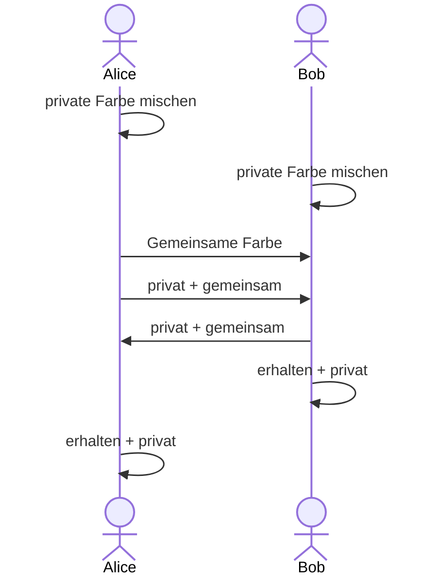

---
sidebar_custom_props:
  id: 035b0ee7-407c-4047-90de-10ae0ff2bcff
  source:
    name: rothe.io
    ref: https://rothe.io/?b=crypto&p=242355
---

import ColorExchange from "@site/src/components/VisualizationTools/ColorExchange";

# Geheime Farbe

Alice und Bob arbeiten an einem neuen Kunstwerk, auf das die Öffentlichkeit gespannt wartet. Die beiden möchten dafür **eine** ganz besondere Farbe verwenden. Diese Farbe soll aber unbedingt bis zur Vernissage **geheim bleiben**. Alice und Bob wohnen weit auseinander und können sich nicht treffen, um die geheime Farbe gemeinsam herzustellen, sie können sich lediglich Farbkübel per Post zusenden.

## Alice und Bob
Sie haben eine Idee und gehen wie folgt vor:

:::flex{minWidth=300px}

Private Farbe
: **Schritt 1**: Alice und Bob mischen sich je in einem Farbkübel eine persönliche, geheime Farbe, die sie niemandem mitteilen (private Farbe genannt).
Öffentliche Farbe
: **Schritt 2** Alice wählt nun zusätzlich eine Farbe, die nicht geheim gehalten wird. Sie füllt zwei grosse Farbkübel mit dieser Farbe, einen behält sie für sich selbst, den anderen schickt sie per Post an Bob (öffentliche Farbe genannt).
Zwischenfarbe
: **Schritt 3**: Im nächsten Schritt mischen sich Alice und Bob je in einem leeren Farbkübel eine neue Farbe: Sie nehmen dazu genau dieselbe Menge der eigenen privaten Farbe und der gemeinsamen Farbe. Diese neue Farbe schicken sie sich wieder gegenseitig zu.
Zielfarbe
: **Schritt 4**: Im letzten Schritt erzeugen Sie die Zielfarbe fürs Kunstwerk. Dazu nehmen sie zwei Einheiten der soeben erhaltenen Farbe und eine Einheit der privaten Farbe und erhalten die gemeinsame private Farbe, mit der sie die Teile des neuen Kunstwerks bemalen.
::br

:::

## Eve
Die neugierige Journalistin Eve möchte unbedingt wissen, was Alice und Bob aushecken, um noch vor der Vernissage einen exklusiven Zeitungsbericht zu veröffentlichen. Daher versucht sie, an die gemeinsame private Farbe zu gelangen. Sie überwacht die Post und füllt sich von jeder transportierten Farbe ein wenig in eigene Behälter ab.

## Ausprobieren
:::aufgabe[Geheime Farbe herausfinden]
<Answer type="state" webKey="732736d7-f3b8-4829-83be-b9b4e1164791" />

Bestimmen Sie je eine Farbe für Alice und Bob und schauen Sie sich die Ergebnisse an.

Wieso erhalten Alice und Bob schlussendlich dieselbe Farbe?

<Answer type="text" webKey="11388720-93d0-403f-94f0-64b6f1ae4752" />
:::

:::aufgabe[Wieso kennt Eve die geheime Farbe nicht?]
<Answer type="state" webKey="bdfda551-8129-41c2-bc89-8450d9ecade7" />

Überlegen Sie sich: wieso kann Eve aus den verschickten Farben die geheime Farbe nicht herstellen?

<Answer type="text" webKey="a627b60d-54bd-4a3e-a870-510d014364cf" />
:::

<ColorExchange />

 

:::info[⭐️ Digitale Farben ≠ Echte Farben]
Im obigen Modell musste getrickst werden: In der digitalen Welt werden Farben durch die Erzeugung von Lichtwellen unterschiedlicher Wellenlänge erzeugt. Dabei wird bei der Überlagerung aller Frequenzspektren weisses Licht erzeugt. Dies wird auch **additives Farbmodell** genannt. Im **Gegensatz** dazu werden Farben in der realen Welt je nach Oberfläche nur gewisse Wellenlänfen reflektiert und die anderen werden von der Oberfläche "verschluckt". Werden mehrere Farben gemischt, führt dies dazu, dass alle sichtbaren Wellenlängen "verschluckt" werden und daher ein Braun/Schwarz entsteht. Dieses ist das **subtraktive Farbmodell**.

:::

