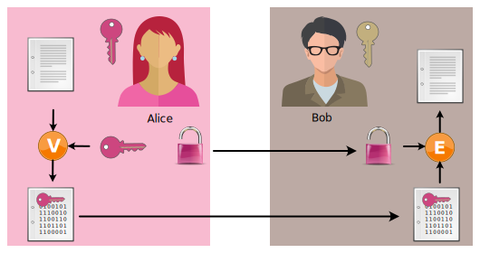
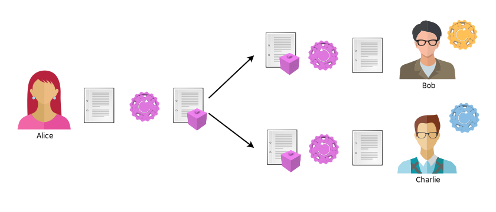

---
sidebar_custom_props:
  id: 1161bd5d-ed3c-4517-9bab-4b13629f07e1
  source:
    name: rothe.io
    ref: https://rothe.io/?b=crypto&p=645224
---

# Asymmetrie umkehren

:::flex --min-width=250px

***

***

:::

:::aufgabe aus dem Unterricht...
<Answer type="state" webKey="41e7d6d6-2425-40f4-9976-f486ec9eb2cf" />

Halten Sie kurz fest, wie die Boxen und ihre Schlüssel funktionieren.

<Answer type="text" webKey="ec68df8d-dc5d-467d-bc36-39cc0daf0357" />

:::

:::aufgabe Aufgabe Bedeutung des Gedankenexperimentes
<Answer type="state" webKey="971ad389-7172-49a2-b8b8-1e47d83a40d4" />

a. Was bedeutet es, wenn jemand einen Text mit seinem eigenen privaten Schlüssel «verschlüsselt», so dass der Geheimtext nur mit dem zugehörigen öffentlichen Schlüssel «entschlüsselt» werden kann?

b. Was sagt die Tatsache, dass man einen solchen Geheimtext mit einem fremden (nicht dem eigenen) öffentlichen Schlüssel entschlüsseln kann, aus?

<Answer type="text" webKey="8a3ee7b6-2cfb-4638-ad4d-064fc920c745">

a.)

b.)

</Answer>

<Solution webKey="7ff60a15-ccaa-4ab4-98f5-a908c6b89c6e">

a. Man erhält die digitale Unterschrift, also die **Signatur** `s` von Alice. Nur Alice kann mit ihrem privaten Schlüssel das Dokument so verschlüsseln, dass es mit ihrem öffentlichen Schlüssel wieder zum Original entschlüsselt werden kann.

b. Dieser Vorgang hat **nichts mit Geheimhaltung zu tun** - es geht ausschliesslich darum, ein Dokument von der Absender:in signieren zu lassen.

</Solution>
:::

## Digitale Signatur
Wir haben soeben das Prinzip der digitalen Signatur entdeckt.

:::finding Digitale Signatur
Wenn Bob die Nachricht mit dem öffentlichen Schlüssel von Alice entschlüsseln kann, dann muss diese Nachricht vorher mit dem privaten Schlüssel von Alice verschlüsselt worden sein. Somit kann sie von niemandem anders stammen als von Alice. D.h. diese Nachricht ist quasi digital signiert.
:::

:::aufgabe Aufgabe mehrere Leute
<Answer type="state" webKey="9a23f76b-2500-459d-8ffc-dc4da5d06a6a" />

Überlegen Sie sich, wie ein signiertes Dokument von mehr als zwei Personen angeschaut und überprüft wird. Welche Schlüssel werden verwendet?

<Answer type="text" webKey="6e6c19e8-7a15-41cc-83b4-ca2987de22d1" />

<Solution webKey="7ff60a15-ccaa-4ab4-98f5-a908c6b89c6e">

</Solution>
:::

## Nachteile
Die bisher kennengelernte Art der digitalen Signatur ist nicht optimal, denn es gibt mehrere Probleme:
- Wegen der «Signatur» ist der Klartext nicht mehr lesbar (er ist ja nun speziell «verschlüsselt»). Dies ist umständlich, denn wenn Sie ein Dokument auf Papier unterschreiben, bleibt dieses trotzdem lesbar.
- Asymmetrische Verfahren sind langsam, d.h. wenn wir ein grosses Dokument (z.B. ein Video) signieren, dauert dieser Vorgang unnötig lange – ebenso das Überprüfen der Signatur (also das Entschlüsseln).

