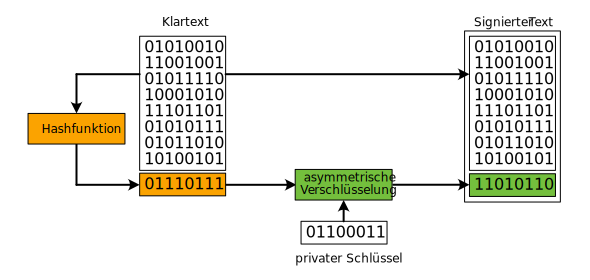

---
sidebar_custom_props:
  id: a234dbad-32da-47ed-9af3-e1c9fc95c9a4
  source:
    name: rothe.io
    ref: https://rothe.io/?b=crypto&p=559733
---

# Verfahren kombinieren

Für uns ist Wichtig:
- Die Dokumente sind stets lesbar und trotzdem vor Manipulationen geschützt.
- Asymmetrische Verfahren sollen eingesetzt werden, aber nicht zum Verschlüsseln des ganzen Dokuments, weil dies langsam ist.

Aus diesem Grund müssen wir – ähnlich wie bei der asymmetrischen Verschlüsselung – auch bei den digitalen Signaturen «nachbessern», wenn es um den konkreten Einsatz im Alltag geht.

## Hashwerte
**Hashwerte** derselben Hashfunktion haben stets **dieselbe Länge**. Sie sind im Vergleich zum eingegebenen Text sehr kurz (wie der Fingerabdruck eines Menschen sehr klein ist im Vergleich zu all dem, was den Menschen mit diesem Fingerabdruck ausmacht).

> Anstelle des gesamten Textes signieren wir nur den Hashwert, was die beiden obengenannten Nachteile beseitigt.

## Digitale Signaturen richtig verwenden
Wir versuchen, mehrere Verfahren zu kombinieren um deren Vorteile zu nutzen. Einerseits berechnen wir den Hashwert eines Dokuments, andererseits «verschlüsseln» wir nur diesen Hashwert asymmetrisch. Somit reduziert sich der Einsatz von asymmetrischer Verschlüsselung wiederum auf ganz kurze Werte. **Zudem bleibt das Dokument intakt und stets lesbar**.

:::aufgabe[Digitale Signaturen überprüfen]
<Answer type="state" webKey="cd131599-9400-4ba6-9ef2-688b4b1ea20a" />

Überlegen Sie sich, wie man eine solche digital signierte Nachricht überprüfen kann. Zeichnen Sie die benötigten Schritte auf.

<Answer type="text" webKey="99cd9f5a-6715-44a8-89cf-c79770c0740b" />

<Solution webKey="5bacd9c8-2222-47c2-bc1d-e90116caf1d0">

</Solution>
:::

