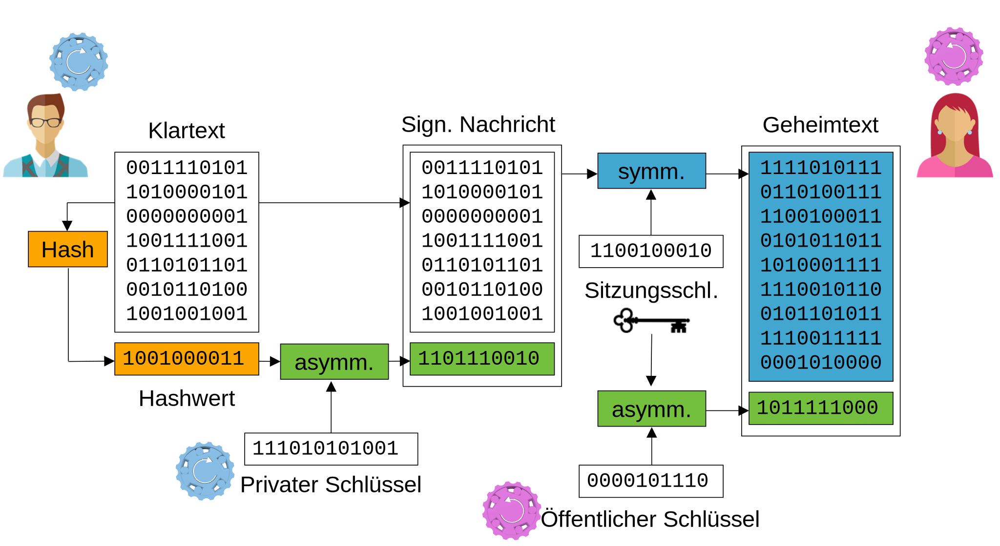

# Zusammenfassung

## Das grosse Ganze

Verschlüsselte, signierte Nachrichten: Verknüpfung aller Verfahren.

:::note Bemerke
- Charlie berechnet den Hashwert der Nachricht.
- Charlie verwendet seinen  privaten Schlüssel um den Hashwert zu signieren.
  - Den signierten Hashwert kann von jeder Empfänger:in mit Charlies **öffentlichem** Schlüssel entschlüsselt werden. Jedoch kann der Hash von niemandem verändert werden, da niemand den privaten Schlüssel von Charlie besitzt.
- Die signierte Nachricht wird mit einem Sitzungsschlüssel **symmetrisch** verschlüsselt.
- Der Sitzungsschlüssel wird mit Alices öffentlichem Schlüssel verschlüsselt.
- Alice kann nun
  - den Sitzungsschlüssel mit ihrem privaten Schlüssel entschlüsseln
  - mit dem Sitzungsschlüssel den Klartext entschlüsseln
  - mit dem öffentlichen Schlüssel von Charlie durch Entschlüsselung der Signatur die **Echtheit bestätigen**
  - mit der entschlüsselten Signatur (=der von Charlie berechneten Hashwert) und dem selbst berechneten Hashwert der erhaltenen Nachricht die **Integrität** der Nachricht verifizieren, wenn die beiden Hashwerte übereinstimmen.
:::