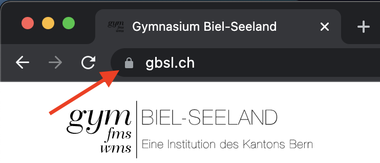

import Answer from '@site/src/components/Answer'

# Browserzertifikate [^1]
Während früher sämtliche Informationen im Internet unverschlüsselt übertragen worden sind, werden die meisten Verbindungen heutzutage mit kryptographischen Mitteln geschützt.

Insbesondere nutzen momentan (*März 2021*) gemäss W3Techs[^2] über 70% aller Webseiten **HTTPS**. HTTPS ist eine Erweiterung des HyperText Transfer Protocols, der Buchstabe «S» steht für Secure.

Damit wird der Datenverkehr in **beiden Richtungen** verschlüsselt:
- alle Daten, die vom Webserver zum Browser übertragen werden (also der Inhalt der Seite wie z.B. Text, Bilder, Videos, heruntergeladene Dateien, ...)
- alle Daten, die vom Browser zu Webserver übertragen werden (also ausgefüllte Formulare wie z.B. Benutzernamen und Passwörter, aber auch alle Texte, die wir eingeben sowie sämtliche hochgeladenen Dateien, ...)

## Symmetrische und asymmetrische Verschlüsselung
Die **Daten werden symmetrisch** verschlüsselt, der **Sitzungsschlüssel asymmetrisch**.

Da die Browser nicht jeden einzelnen öffentlichen Schlüssel der Webseiten (dies sind gemäss internet live stats hunderte Millionen[^3]) kennen können, vertrauen sie ausgewählten **Zertifizierungsstellen**. Der öffentliche Schlüssel einer Webseite wird von einer Zertifizierungsstelle digital signiert. Das so entstandene Zertifikat wird beim Verbindungsaufbau übertragen und kann vom Browser überprüft werden.

Das Schloss vor der URL zeigt die Verwendung von HTTPS (und Webseitenzertifikaten) an.
Beim Klicken auf das Schloss können «Weitere Informationen» zur Verbindung angezeigt werden (unter Firefox):

:::aufgabe Webseitenzertifikat
Was finden Sie alles über die Zertifikate der Webseite des Gymnasiums Biel-Seeland heraus?

<Answer type="text" webKey="e39bd1c8-631e-4b4c-b2de-5569e50937d5" />

:::

:::aufgabe Kryptographische Details
Im Screenshot oben sehen Sie die technische Angabe `TLS_AES_128_GCM_SHA256, 128-Bit Schlüssel, TLS 1.3`. Finden Sie heraus, was die einzelnen Teile aussagen?

<Answer type="text" webKey="ab1dae9c-54af-48bf-a390-fdccd9bd6471" />

:::

:::aufgabe Zertifizierungsstellen
Finden Sie die im Browser gespeicherten «vertrauenswürdigen Zertifizierungsstellen»?

<Answer type="text" webKey="caf647b0-ba95-4cf3-8824-150558348c45" />
:::

:::aufgabe Zertifikatswarnungen
Besuchen Sie die Webseite [BadSSL](https://badssl.com/) und testen Sie mit verschiedenen Browsern verschiedene Konfigurationen. So lernen Sie die mögliche Zertifikatswarnungen kennen.

<Answer type="text" webKey="893cdb6f-75bd-4bfd-8009-0f84ea0360af" />
:::

## Achtung vor falscher Sicherheit
Die Tatsache, dass bei einer bestimmten Webseite das Schloss angezeigt wird, heisst noch lange nicht, dass die Webseite sicher ist. Denn das Wort **sicher** hat mehrere Bedeutungen.

Was genau sagt das Schloss also aus? Worauf können wir vertrauen? Was hingegen kann trotzdem noch schiefgehen?

Was bedeutet **sicher** in diesem Zusammenhang?
1. Die Verbindung ist vertraulich – niemand unterwegs kann mitlesen.
2. Wir können sicher sein, dass wir mit dem genannten Server (resp. mit der angegebenen Webseite) kommunizieren.
3. Die übertragenen Inhalte sind vor Manipulation geschützt.

Wo ist trotzdem Vorsicht geboten?

1. Die URL (also die Webseitenadresse) muss ganz genau kontrolliert werden. Es nützt nichts, wenn die Verbindung verschlüsselt ist und der Server überprüft wurde, wenn wir mit dem falschen Server sprechen, weil wir zu wenig genau auf die URL achten.
   - [www.bekb.com.evil.com/login](#) ist keine gültige Webseite von **BEKB**, sondern eine Unterseite (Subdomain) von [evil.com](#).
   - [www.vaIiant.ch](#www.vaIiant.ch) ist nicht dasselbe wie [www.valiant.ch](#www.valiant.ch) – auch wenn es fast identisch aussieht (achten Sie genau auf das «L»). In einer anderen Schriftart sieht man den Fehler besser: `www.vaIiant.ch`  

    :::tip Absicherung mit Passwortmanager
    Die Plugins von Passwortmanagern erkennen diese kaum sichtbaren details, so dass bei solchen Seiten kein Vorschlag zum automatischen Ausfüllen angezeigt wird.
    :::

2. Die Webseite kann z.B. Malware verbreiten resp. gehackt worden sein. D.h. der «Inhalt» wird nicht überprüft.

[^1]: Quelle: [rothe.io](https://rothe.io/?b=crypto&p=351437)
[^2]: Quelle: [W3Techs](https://w3techs.com/technologies/details/ce-httpsdefault)
[^3]: Quelle: [internet live stats](https://www.internetlivestats.com/total-number-of-websites/)