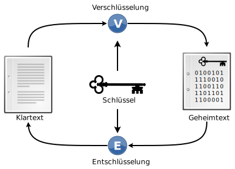

---
sidebar_custom_props:
  id: ec9c4bd3-79be-454f-bfcc-66166bd39a82
---

# Kryptologie

Der Begriff **Kryptologie** setzt sich zusammen aus dem altgriechischen _κρυπτός_ (also _kryptós_), was **verborgen** bedeutet, und _λόγος_ (also _lógos_), was **Lehre**, **Kunde** bedeutet. Kryptologie bezeichnet die Wissenschaft, die sich mit der Ver- und Entschlüsselung von Informationen (also mit **Informationssicherheit**) beschäftigt.

## Kryptographie und Kryptoanalyse

Die Kryptologie kann grob in zwei Teilbereiche unterteilt werden:

- die Kryptographie (_γράφειν_, also _gráphein_, was **schreiben** bedeutet) und
- die **Kryptoanalyse**.

Während sich die Kryptographie mit dem Finden von sicheren Verschlüsselungsverfahren beschäftigt, liegt der Fokus der Kryptoanalyse beim «Brechen» oder «Knacken» solcher Verfahren.

## Klartext, Geheimtext und Schlüssel

| Symbol | deutscher Begriff | englischer Begriff | Bedeutung                                                                                       |
| :----: | :---------------- | :----------------- | :---------------------------------------------------------------------------------------------- |
|  $p$   | **Klartext**      | _plaintext_        | unverschlüsselte Nachricht                                                                      |
|  $c$   | **Geheimtext**    | _ciphertext_       | verschlüsselte Nachricht                                                                        |
|  $k$   | **Schlüssel**     | _key_              | Information, welche benötigt wird, um den Klartext zu ver- bzw. den Geheimtext zu entschlüsseln |

## Verschlüsselungsverfahren
Ein **Verschlüsselungsverfahren** ist ein Algorithmus, welcher einen Klartext unter Verwendung eines Schlüssels in einen Geheimtext überführt oder umgekehrt.

## Schlüsselraum
Der Begriff *Schlüsselraum* bezeichnet die Anzahl möglicher Schlüssel für ein bestimmtes Verschlüsselungsverfahren. Die Sicherheit eines Verschlüsselungsverfahrens hängt stark von der Grösse des Schlüsselraums ab.

Die Grösse des Schlüsselraums wird in bit (d.h. als binärer Logarithmus) angegeben. Bei zwei möglichen Schlüsseln ($=2^1$) spricht man von 1 bit, bei 1024 möglichen Schlüsseln ($=2^{10}$) von 10 bit.

:::aufgabe Schlüsselräume
<Answer type="state" webKey="b2c8e600-fe61-400e-bcd8-cb1dff1b2880" />

Geben Sie die Grösse des Schlüsselraumes für die folgenden Verschlüsselungsverfahren an:

#### Skytale
<Answer  type="text"  webKey="0b1ab3e2-40ff-4209-8451-b53acf3ff24f"></Answer>

#### Caesar
<Answer  type="text"  webKey="fa51f7d3-35fa-4d7f-beb9-b089012eeec2"></Answer>

#### ROT13
<Answer  type="text"  webKey="e10e6d11-13d4-47b3-b940-7bb7860fdaf6"></Answer>

#### Substitution
allgemeine monoalphabetische Substitution
<Answer  type="text"  webKey="87f42c57-7331-42b6-a77c-e7aa23d4cebe"></Answer>

<Solution webKey="2b2b5bad-9f90-4aa2-8cba-71c4e8f2dab0">

- Skytale: ein, zwei Dutzend
- Caesar\*: $26$
- ROT13: $1$
- Monoalphabetische Substitution: $26! > 4 \cdot 10^{26}$
- Polybios: $25! > 1.5 \cdot 10^{25}$

\* auch wenn die Verschiebung `A -> A` auf den ersten Blick keinen Sinn ergibt, werden bei der Angabe des Schlüsselraums immer jegliche, grundsätzlich mögliche Varianten angegeben. Bei der monoalphabetischen Substitution würden anderenfalls viele Möglichkeiten vorweg ausgeschlossen, so dass das Verfahren einfacher zu knacken wäre.
</Solution>
:::

---

[^1]: Quelle: [rothe.io](https://rothe.io/?b=crypto&p=796759)
