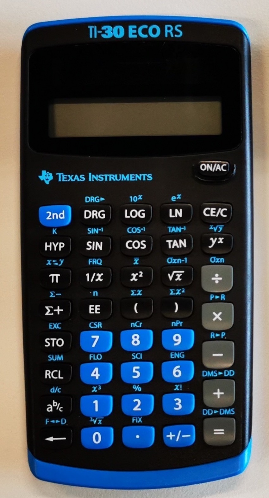

---
sidebar_custom_props:
  id: ad525a57-dcbe-4ecf-a668-37b40c0ab41c
---

# Taschenrechner

import TRTabs from '@site/src/components/TRTabs';

Erlaubte Taschenrechner

:::cards

::br

:::

## Winkel

### Umrechnung mit Minuten/Sekunden

Diese Umrechnung ist gedacht für Winkeleinheiten (Dezimal zu Grad `°`, Minuten `'`, Sekunden `''` und umgekehrt).

`DD` steht für die Dezimaleinheit (Decimal Degree), `DMS` für Grad, Minuten, Sekunden (Degree, Minutes, Seconds).

<TRTabs>
<TabItem value="ti30">

#### `DD►DMS`

Beispiel: $2.66° = 2° 39' 36''$

Eingabe: `2.66` > `2nd` > `DD►DMS`

#### `DMS►DD`

Beispiel: $2° 50' 24'' = 2.84$

Eingabe: `2.5024` > `2nd` > `DMS►DD`

:::danger
Minuten und Sekunden müssen in obiger Schreibweise immer zwei Stellen aufweisen! $3° 8' 9''$  muss also als `3.0809` > `2nd` > `DMS►DD` eingegeben werden. 
:::

</TabItem>
<TabItem value="ti30X">

#### `DD►DMS`

Beispiel: $2.66° = 2° 39' 36''$

Eingabe: `2.66` > `° ' ''` > `►DMS`

#### `DMS►DD`

Beispiel: $2° 50' 24'' = 2.84$

Eingabe: `2` > `°` > `50` > `'` > `24` > `''`

</TabItem>
</TRTabs>
