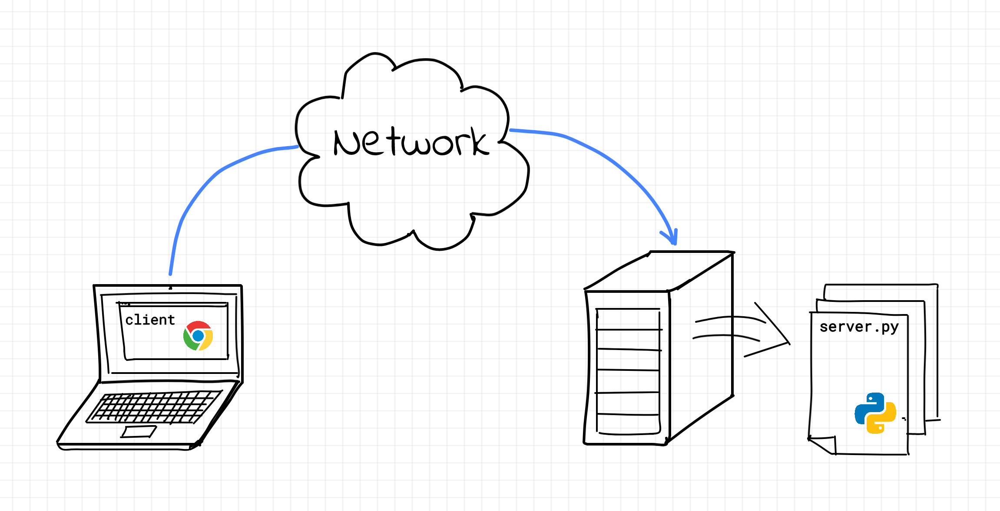

---
sidebar_custom_props:
  id: 7d398c00-664c-4a08-852e-c66dd8d75501
---

# 3. Webseiten verfügbar machen



Damit Sie auf die Webseiten Ihrer Kolleginnen und Kollegen zugreifen können müssen zwei Bedingungen erfüllt sein:
- Das WLAN muss zulassen, dass die mit ihm verbundenen Computer untereinander Nachrichten austauschen können. Das ist im BYOD-WLAN aus Sicherheitsgründen nicht der Fall.
- Sie müssen die IP-Adresse des Computers kennen, auf welchem der Webserver läuft.

:::aufgabe Aufgaben
<Answer type="state" webKey="cb35ef52-f0cb-4f02-bbc2-06b9a5f2719a" />

- Um die erste Bedingung zu erfüllen, müssen Sie Ihr Notebook mit dem WLAN `EFIN` verbinden.
- Öffnen Sie nun auf Ihrem Notebook eine Powershell (Windows) oder ein Terminal (Mac).

<OsTabs>

<TabItem value="win">

```bash
ipconfig
```

</TabItem>
<TabItem value="osx">

```bash
ifconfig
```

</TabItem>

</OsTabs>

- Suchen Sie in der Antwort nach der IP-Adresse für den WLAN-Adapter auf Ihrem Notebook und schreiben Sie diese Adresse an die Tafel.

- Geben Sie nun in Ihrem Browser als URL die IP-Adresse eines Notebooks im Netzwerk `EFIN` ein, gefolgt von der Port-Adresse 8000 ein. Z.B.
http://192.168.0.12:8000
Was sehen Sie?

<Answer type="text" webKey="680d503a-22ce-4467-849e-b20f554004b8" />

- Versuchen Sie nun in Ihrem Browser auf die eigentliche Webseite Ihrer Kollegin / Ihres Kollegen zuzugreifen. Wie lautet die korrekte URL?

<Answer type="text" webKey="77d2c299-be26-4736-8858-ea1f2f5d3794" />

:::
