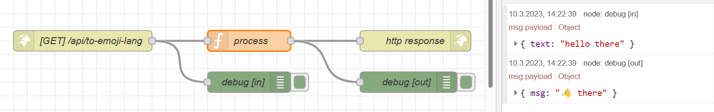
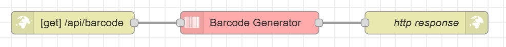

---
sidebar_custom_props:
  id: 4467e49f-ba50-4e7c-b866-4ce4a2526676
---
# API's

:::aufgabe

<Answer type="state" webKey="f298a852-af85-49b5-b03f-8a35a33d48cb" />

Zeit
: 60 Minuten
Grundlage
: **PDF** [👉 download](assets/zappier-apis.pdf)
: **Online** (bessere Qualität) [👉 https://zapier.com/learn/apis/](https://zapier.com/learn/apis/)
Dateiname
: __EF-Info/docs/Netzwerke/apis.md__

**Ziel der Aufgabe**: Sie schreiben ein Cheat-Sheet für die Grundlagen von API's. **Grundlage** dafür sind die **Kapitel 1-4** und **Kapitel 7 bis "Long Polling"** des obigen Buches. Sicherlich sollen im Cheat-Sheet folgende Punkte enthalten sein (nicht unbedingt in dieser Reihenfolge):
- Was ist eine API? 
- JSON Format
- XML Format
- HTTP Request: 
  - URL
  - Methoden
  - Headers
  - Body
- HTTP Status Codes
- Endpunkte
- Polling
:::

## HTTP Netzwerkverkehr untersuchen

Der Netzwerkverkehr kann auf unterschiedliche Weise untersucht werden. Eine Möglichkeit ist die Verwendung eines Web-Browsers. Der Browser zeigt den Netzwerkverkehr an, wenn er eine Webseite lädt. Die Anzeige kann über __Weitere Tools > Entwicklertools > Netzwerk__ (oder [[ctrl]] + [[:mdi-apple-keyboard-shift:]] + [[I]] bzw. [[:mdi-apple-keyboard-option:]] + [[:mdi-apple-keyboard-command:]] + [[J]]) aufgerufen werden (detailierte Anleitung: 👉 https://balsamiq.com/support/faqs/browserconsole).


Hier sieht man nun die einzelnen Netzwerkanfragen, die der Browser beim Laden der Webseite gestellt hat. Die Anzeige zeigt die URL, die Methode (GET, POST, etc.), die Grösse der Antwort, die Zeit, die die Anfrage benötigt hat, und den Statuscode (200 = OK, 404 = nicht gefunden, etc.).


:::aufgabe
<Answer type="state" webKey="ffa8e0c7-0fb2-4988-8781-4203b785fa6f" />

Öffnen Sie die Entwicklertools und darin das Netzwerkpanel. Laden Sie die Seite neu und schauen Sie sich einige der Anfragen an. 

- Finden Sie die Anfrage, welche das obige Bild (vom Netzwerkpanel) geladen hat.
  - Wie lange hat diese Anfrage gedauert?
  - Wie gross war die Antwort?
  - Was stand im Header der Anfrage? Ist der Header bei Ihrer Pultnachbar:in gleich? Was ist unterschiedlich?
  - Was stand im Header der Antwort?
  - Status-Code? Verwendete Methode?
  
  <Answer type="text" webKey="dd6e4d84-5f2f-4b31-a83f-8f72d4ae4afa" />

- Finden Sie heraus, mit welcher Anfrage Ihre Benutzerdaten geladen werden? Welche Informationen werden von der API gesendet? Unter welcher Adresse ist die API erreichbar?

  <Answer type="text" webKey="a5a76fca-32f5-4168-9374-1f0235acbc95" />

- Finden Sie einen POST Request? Was ist enthalten? Durch welche Aktion auf der Webseite können Sie selber einen POST Request auslösen? Stimmt die verwendete HTTP-Methode? Was wäre allenfalls passender?

  <Answer type="text" webKey="3ea9cbc6-99d7-48c4-b4ed-7fd7621ec765" />

:::


## API abfragen

:::aufgabe[Jokes]
<Answer type="state" webKey="e9606896-3d52-413c-b0ed-d8437d6d960e" />

Studieren Sie die Dokumentation der API auf 👉 https://icanhazdadjoke.com/api?ref=apilist.fun.

- Wieso soll bei der Verwendeung dieser API ein individualisierter `User-Agent` verwendet werden?

  <Answer type="text" webKey="ea513d39-b9ab-4f26-a914-bb923ed8e58f" />

- Verwenden Sie Postman (am IoT-Tag installiert, bei Node-RED...) um einen zufälligen Dad-Joke abzufragen. Experimentieren Sie dabei mit den unterschiedlichen `Accept`-Headers. Halten Sie einen Screenshot der Abfrage fest.

  <Answer type="text" webKey="49c2fde6-041e-40da-9874-e572d98e74ff" />

- Können Sie auch Witze mit einem bestimmten Wort suchen? Experimentieren Sie mit verschiedenen Suchbegriffen. Halten Sie einen Screenshot der Abfrage fest.

  <Answer type="text" webKey="019dc887-fddd-4320-96cf-55b5f4da98e2" />

:::


## API erstellen

:::aufgabe[Node-Red]

<Answer type="state" webKey="c0ccd705-a413-4eb7-a44a-406d1db8c020" />

Erstellen Sie eine Node-RED Api, um eingegebenen Text in die Emoji-Sprache zu übersetzen:

- Erstelle Sie einen neuen Flow
  
  

- Erzeugen Sie einen neuen API-Endpunkt für HTTP-GET, bspw. `/api/to-emoji-lang`. Wichtig: Der Endpunkt muss mit einem Slash `/` beginnen - der Hostname muss nicht angegeben werden.
  

- Schicken Sie nun mit Postman einen GET Request an die API. Sie sehen nun, in welchem Format die Daten bei der API ankommen. Überlegen Sie sich, in welchem Format Sie die Anfrage erwarten und halten Sie dies für sich fest. (Im Beispiel: `text` enthält der zu übersetzenden Text.)

  

- Nun müssen wir den empfangenen text noch prozessieren und wieder zurückschicken. Dazu bearbeitet man den Funktions-Node. Achtung: hier wird in JavaScript programmiert, nicht in Python ;)

  ```js
  let emoji = msg.payload.text;

  emoji = emoji.replace(/hello/, '👋');

  msg.payload = {
      msg: emoji
  };

  return msg;
  ```
- Das Resultat bei der erneuten Anfrage mit Postman:

  

- Erweitern Sie Ihr API-Endpunkt so, dass noch mehr Emojis unterstützt werden. (z.B. `hello` -> `👋`, `world` -> `🌍`, `!` -> `❗️`, etc.)


:::


:::aufgabe[⭐ Telegram Anbindung der Emoji-Sprache]
<Answer type="state" webKey="fd93a452-48dd-4ddc-9dd2-111a8d445c31" />

Natürlich kann der Endpunkt der Emoji-Sprache nun auch für Telegram-Nachrichten verwendet werden. Das praktische: Sie können auch die API von einer Kolleg:in verwenden und müssen die Sprache nicht zwingend selber implementieren. Probieren Sie es aus...
:::

:::aufgabe[⭐ Barcodes erstellen]

<Answer type="state" webKey="13dac5de-8bf0-4a8e-b7af-e6a83ce25f63" />

Es lassen sich auch komplexe Datenstrukturen über eine API erzeugen und zurückschicken. Erstellen Sie eine API, welche einen Barcode erstellt.

Versuchen Sie dabei selber herauszufinden, wie der __Barcode__ Node verwendet werden muss (👉 Referenz: https://flows.nodered.org/node/node-red-contrib-image-tools)


:::

:::aufgabe[Blog-Eintrag]
<Answer type="state" webKey="631b73c7-a4fc-415d-ad08-18dc966b0a9f" />

Erstellen Sie einen neuen Blog-Beitrag (min. 300 Wörter) mit Anleitungen, Erklärungen und Erfahrungen zum Erstellen einer API mit Node-RED.
:::


### Login & Cookies

:::aufgabe[Login Seite]

<Answer type="state" webKey="39323467-afef-4670-b6b5-1e99d2d8c39e" />

Dateiname
: __EF-Info/docs/Netzwerke/login-cookies.md__


1. Importieren Sie folgenden Flow in Node-RED: __:mdi-menu: > Import > Einfügen (Neuen Flow)__
   
  :::details[Flow]

  ```json
  [{"id":"ed73c51f6c96ba27","type":"tab","label":"Website","disabled":false,"info":"","env":[]},{"id":"ec50be804c1e6675","type":"http in","z":"ed73c51f6c96ba27","name":"[GET] /home","url":"/home","method":"get","upload":false,"swaggerDoc":"","x":190,"y":280,"wires":[["1b5bb80c993555b9"]]},{"id":"cb111f9c5919c2df","type":"http response","z":"ed73c51f6c96ba27","name":"send","statusCode":"","headers":{},"x":890,"y":300,"wires":[]},{"id":"8e8e47cc5fcb98c5","type":"template","z":"ed73c51f6c96ba27","name":"welcome.html","field":"payload","fieldType":"msg","format":"html","syntax":"mustache","template":"<!DOCTYPE html>\n<html>\n\n<body>\n\n    <h2>Welcome {{payload.cookies.name}}</h2>\n\n    <form action=\"/api/logout\" method=\"post\">\n        <input type=\"submit\" value=\"Logout\">\n    </form>\n</body>\n\n</html>","output":"str","x":680,"y":260,"wires":[["cb111f9c5919c2df"]]},{"id":"ef63f010f75fddab","type":"http in","z":"ed73c51f6c96ba27","name":"","url":"/api/login","method":"post","upload":false,"swaggerDoc":"","x":200,"y":400,"wires":[["b0da1762ade85366"]]},{"id":"c3a17bf91ecd5844","type":"http response","z":"ed73c51f6c96ba27","name":"redirect","statusCode":"302","headers":{"location":"/home"},"x":700,"y":400,"wires":[]},{"id":"b0da1762ade85366","type":"function","z":"ed73c51f6c96ba27","name":"check login & set cookie","func":"msg.cookies = {\n    auth: true,\n    name: msg.payload.name\n}\nreturn msg;","outputs":1,"noerr":0,"initialize":"","finalize":"","libs":[],"x":450,"y":400,"wires":[["c3a17bf91ecd5844"]]},{"id":"1b5bb80c993555b9","type":"function","z":"ed73c51f6c96ba27","name":"file server","func":"if (msg.req.cookies['auth']) {\n    return [msg, undefined]\n} else {\n    return [undefined, msg]\n}\n","outputs":2,"noerr":0,"initialize":"","finalize":"","libs":[],"x":340,"y":280,"wires":[["27605817169cf262"],["78560b7d3955e003"]]},{"id":"78560b7d3955e003","type":"template","z":"ed73c51f6c96ba27","name":"login.html","field":"payload","fieldType":"msg","format":"html","syntax":"mustache","template":"<!DOCTYPE html>\n<html>\n\n<body>\n\n    <h2>Login</h2>\n\n    <form action=\"/api/login\" method=\"post\">\n        <label for=\"user\">Benutzername:</label><br>\n        <input type=\"text\" id=\"user\" name=\"name\" value=\"Johnny\"><br>\n        <label for=\"pw\">Password:</label><br>\n        <input type=\"password\" id=\"pw\" name=\"password\" value=\"SecurePW\"><br><br>\n        <input type=\"submit\" value=\"Login\">\n    </form>\n</body>\n\n</html>","output":"str","x":500,"y":300,"wires":[["cb111f9c5919c2df"]]},{"id":"67469255844ecdb2","type":"http in","z":"ed73c51f6c96ba27","name":"","url":"/api/logout","method":"post","upload":false,"swaggerDoc":"","x":200,"y":500,"wires":[["ec4982c40dbdb73b"]]},{"id":"ec4982c40dbdb73b","type":"function","z":"ed73c51f6c96ba27","name":"clear cookie","func":"msg.cookies = {auth: null, name: null}\nreturn msg;","outputs":1,"noerr":0,"initialize":"","finalize":"","libs":[],"x":410,"y":500,"wires":[["e835b96b55617025"]]},{"id":"e835b96b55617025","type":"http response","z":"ed73c51f6c96ba27","name":"redirect","statusCode":"302","headers":{"location":"/home"},"x":700,"y":500,"wires":[]},{"id":"27605817169cf262","type":"change","z":"ed73c51f6c96ba27","name":"load cookies","rules":[{"t":"set","p":"payload.cookies","pt":"msg","to":"msg.req.cookies","tot":"jsonata"}],"action":"","property":"","from":"","to":"","reg":false,"x":510,"y":260,"wires":[["8e8e47cc5fcb98c5"]]}]
  ```
  :::

2. Navigieren Sie zum `/home` Pfad und überprüfen Sie, ob Sie sich einloggen können.
3. Halten Sie kurz und knapp in Ihrem Repository fest:
   1. Was ist ein Cookie?
   2. Weshalb ist ein Cookie praktisch? Wie funktioniert ein Login damit?
   3. Unser Beispiel benutzt eine einfache Benutzerdatenbank. Was darf **NIE** so gemacht werden, wie wirs gemacht haben? Welche Ansätze gibts zur Verbesserung?


<Solution>

Flow für Node-RED ( __:mdi-menu: > Import > Einfügen (Neuen Flow)__ ):

```json
[{"id":"ed73c51f6c96ba27","type":"tab","label":"Website-Final","disabled":false,"info":"","env":[]},{"id":"ec50be804c1e6675","type":"http in","z":"ed73c51f6c96ba27","name":"[GET] /home","url":"/home","method":"get","upload":false,"swaggerDoc":"","x":190,"y":280,"wires":[["1b5bb80c993555b9"]]},{"id":"cb111f9c5919c2df","type":"http response","z":"ed73c51f6c96ba27","name":"send","statusCode":"","headers":{},"x":890,"y":300,"wires":[]},{"id":"8e8e47cc5fcb98c5","type":"template","z":"ed73c51f6c96ba27","name":"welcome.html","field":"payload","fieldType":"msg","format":"html","syntax":"mustache","template":"<!DOCTYPE html>\n<html>\n\n<body>\n\n    <h2>Welcome {{payload.cookies.name}}</h2>\n\n    <form action=\"/api/logout\" method=\"post\">\n        <input type=\"submit\" value=\"Logout\">\n    </form>\n</body>\n\n</html>","output":"str","x":680,"y":260,"wires":[["cb111f9c5919c2df"]]},{"id":"ef63f010f75fddab","type":"http in","z":"ed73c51f6c96ba27","name":"","url":"/api/login","method":"post","upload":false,"swaggerDoc":"","x":200,"y":400,"wires":[["b0da1762ade85366","07234ee379334a3a"]]},{"id":"c3a17bf91ecd5844","type":"http response","z":"ed73c51f6c96ba27","name":"redirect","statusCode":"302","headers":{"location":"/home"},"x":700,"y":400,"wires":[]},{"id":"b0da1762ade85366","type":"function","z":"ed73c51f6c96ba27","name":"check login & set cookie","func":"const { name, password } = msg.payload;\nconst user = flow.get(name.toLowerCase());\n\nif (user) {\n    if (password == user.pw) {\n        msg.cookies = {\n            auth: true,\n            name: name\n        }\n    }\n}\nreturn msg;","outputs":1,"noerr":0,"initialize":"","finalize":"","libs":[],"x":450,"y":400,"wires":[["c3a17bf91ecd5844"]]},{"id":"1b5bb80c993555b9","type":"function","z":"ed73c51f6c96ba27","name":"file server","func":"if (msg.req.cookies['auth']) {\n    return [msg, undefined]\n} else {\n    return [undefined, msg]\n}\n","outputs":2,"noerr":0,"initialize":"","finalize":"","libs":[],"x":340,"y":280,"wires":[["27605817169cf262"],["78560b7d3955e003"]]},{"id":"78560b7d3955e003","type":"template","z":"ed73c51f6c96ba27","name":"login.html","field":"payload","fieldType":"msg","format":"html","syntax":"mustache","template":"<!DOCTYPE html>\n<html>\n\n<body>\n\n    <h2>Login in mein super cooles Wasauchimmer-System</h2>\n\n    <form action=\"/api/login\" method=\"post\">\n        <label for=\"user\">Benutzername:</label><br>\n        <input type=\"text\" id=\"user\" name=\"name\" value=\"Johnny\"><br>\n        <label for=\"frage\">Geburtstag?</label><br>\n        <input type=\"date\" id=\"frage\" name=\"geburtstag\" value=\"2000-06-28\"><br>\n        <label for=\"pw\">Password:</label><br>\n        <input type=\"password\" id=\"pw\" name=\"password\" value=\"asdf\"><br><br>\n        <input type=\"submit\" value=\"Login\">\n    </form>\n</body>\n\n</html>","output":"str","x":500,"y":300,"wires":[["cb111f9c5919c2df"]]},{"id":"67469255844ecdb2","type":"http in","z":"ed73c51f6c96ba27","name":"","url":"/api/logout","method":"post","upload":false,"swaggerDoc":"","x":200,"y":500,"wires":[["ec4982c40dbdb73b"]]},{"id":"ec4982c40dbdb73b","type":"function","z":"ed73c51f6c96ba27","name":"clear cookie","func":"msg.cookies = {secret: null, name: null}\nreturn msg;","outputs":1,"noerr":0,"initialize":"","finalize":"","libs":[],"x":410,"y":500,"wires":[["e835b96b55617025"]]},{"id":"e835b96b55617025","type":"http response","z":"ed73c51f6c96ba27","name":"redirect","statusCode":"302","headers":{"location":"/home"},"x":700,"y":500,"wires":[]},{"id":"27605817169cf262","type":"change","z":"ed73c51f6c96ba27","name":"load cookies","rules":[{"t":"set","p":"payload.cookies","pt":"msg","to":"msg.req.cookies","tot":"jsonata"}],"action":"","property":"","from":"","to":"","reg":false,"x":510,"y":260,"wires":[["8e8e47cc5fcb98c5"]]},{"id":"07234ee379334a3a","type":"debug","z":"ed73c51f6c96ba27","name":"debug 3","active":true,"tosidebar":true,"console":false,"tostatus":false,"complete":"false","statusVal":"","statusType":"auto","x":400,"y":360,"wires":[]},{"id":"e8a81f863d5375e5","type":"inject","z":"ed73c51f6c96ba27","name":"Init","props":[{"p":"payload"},{"p":"topic","vt":"str"}],"repeat":"","crontab":"","once":true,"onceDelay":0.1,"topic":"","payload":"","payloadType":"date","x":170,"y":160,"wires":[["3a334314d61a60e8"]]},{"id":"3a334314d61a60e8","type":"function","z":"ed73c51f6c96ba27","name":"Memory DB","func":"flow.set(\n    'johnny',\n    {\n        pw: 'asdf'\n    }\n)\n\nflow.set(\n    'maria',\n    {\n        pw: '1234'\n    }\n)\nreturn msg;","outputs":1,"noerr":0,"initialize":"","finalize":"","libs":[],"x":370,"y":160,"wires":[[]]}]
```

</Solution>
:::