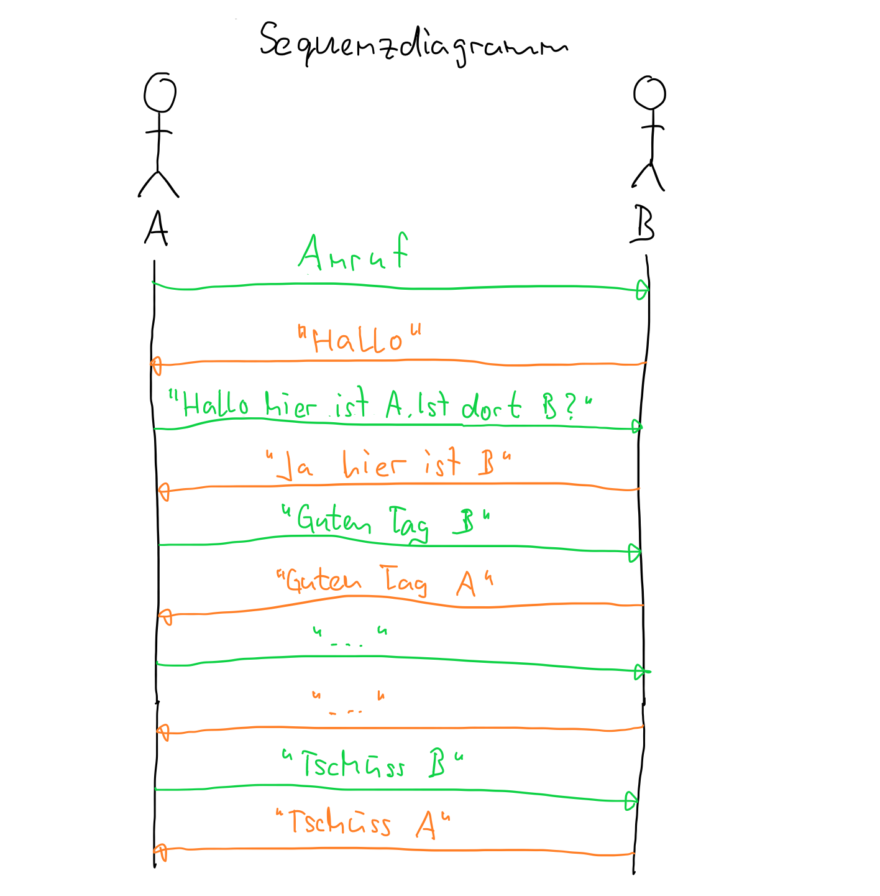

---
sidebar_custom_props:
  id: 616c6b51-3cf1-44ae-a98b-605ed97d9ded
---
# Aufgabe

:::aufgabe
<Answer type="state" webKey="2acd3a18-6e33-44a0-9a6f-73c27a28069c" />

Dateiname
: __EF-Info/docs/Netzwerke/protokolle.md__

Entwerfen Sie ein **Protokoll** für den nötigen Dialog zwischen einer Person A und einer Person B zur **Eröffnung** und den **Abschluss** eines Telefongesprächs.
Skizzieren Sie dazu auf ein Papier den Nachrichtenaustausch in Form eines **Sequenzdiagramms** und zeichnen Sie das **Zustandsdiagramm** für die Person B (angerufene Person).

Machen Sie anschliessend eine Foto und laden Sie diese mit einer kurzen Beschreibung des Ablaufs auf Ihre Webseite hoch.

<Solution webKey="7d4d84ff-90a1-4135-97c2-d99bed1777dd">

</Solution>
:::
