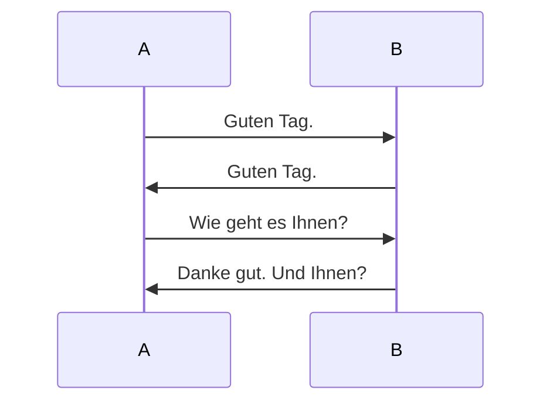
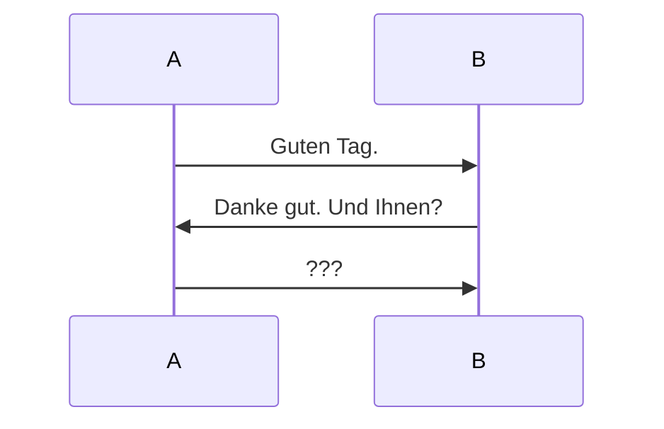
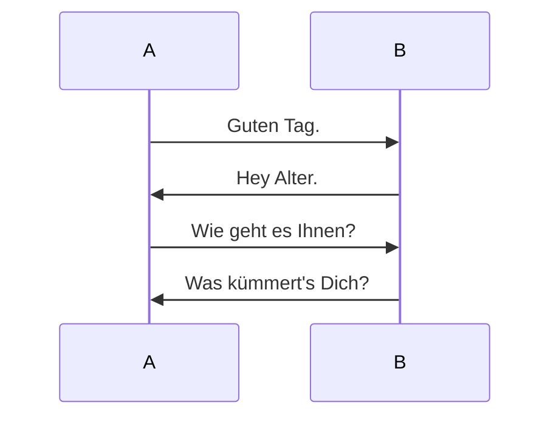
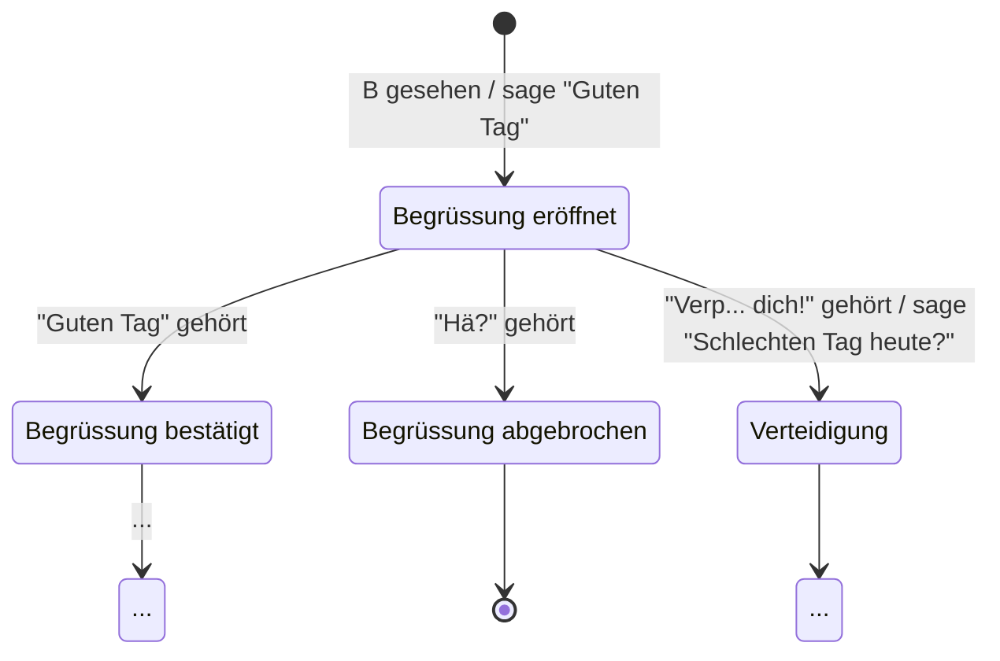

---
sidebar_custom_props:
  id: 345d37cf-5668-4484-8b1d-7c26264a809d
  source:
    name: sdg
    ref: https://gitlab.gbsl.website/gymbefin23/material/-/wikis/Netzwerke/Protokolle
---

# 2. Protokolle

<Answer type="state" webKey="f85a0abb-6385-4267-b36f-906450b4ba76">Gelesen?</Answer>

## Grundlagen

Ein **Protokoll** definiert, wie zwei Einheiten miteinander kommunizieren. Nur wenn beide Einheiten sich an das vereinbarte Protokoll halten, kann ein sinnvoller Informationsaustausch stattfinden. Dies gilt unabhängig davon, ob es sich bei den beteiligten Einheiten um einzelne Menschen, ganze Staaten, oder Maschinen handelt. An Stelle von Einheiten spricht man oft auch von den **Parteien**, welche miteinander kommunizieren.

Ein Protokoll besteht aus einer Menge von möglichen **Nachrichten** und aus einem Satz von **Regeln**, welche die möglichen **Abfolgen** der Nachrichten festlegen.

Beispiel aus dem Alltag, Begrüssung zwischen zwei Menschen:

```
A: "Guten Tag."
B: "Guten Tag."
A: "Wie geht es Ihnen?"
B: "Danke gut."
```
Solche Abläufe werden oft in **Sequenzdiagrammen** dargestellt:



Die vom Protokoll vorgegebene Abfolge muss eingehalten werden. Hält sich eine Partei nicht daran, so entsteht Verwirrung:



Genau so wichtig, wie die Abfolge, ist ein korrekter Inhalt der Nachrichten:



Während zwei Menschen im obigen Dialog noch knapp einen Sinn erkennen können, ist das für Maschinen anders. Diese sind darauf angewiesen, dass die Nachrichtinhalte bis auf's letzte Bit korrekt sind.
Nachrichten von Netzwerkprotokollen müssen deshalb eindeutig und unmissverständlich definiert sein.

## Nachrichtenformat

Eine Nachricht ist zunächst einfach ein **Abfolge von Bytes**. Üblicherweise werden diese Bytes in drei Teile aufgeteilt:

Header
: Der Header enthält Informationen, welche für das Protokoll von Bedeutung sind, z.B. Absenderadresse und Zieladresse einer Nachricht.
Payload
: Die Payload umfasst den Teil einer Nachricht, welcher für das Protokoll zu welchem die Nachricht gehört, nicht relevant ist. Die Payload bietet die Möglichkeit, Informationen zu transportieren, welche dann auf einer höheren Ebene von Bedeutung sind.
Trailer
: Der Trailer ist wiederum Teil des Protokolls, zu welchem die Nachricht gehört. Er enthält zum Beispiel Informationen, zur Überprüfung, ob die Nachricht vollständig und korrekt übertragen wurde (z.B. Quersummen über alle Bytes der Nachricht).

Man kann sich das wie ein Brief vorstellen:


In manchen Nachrichten können Payload und Trailer auch fehlen. Das hängt ganz vom Protokoll ab.

Innerhalb des Headers und des Trailers bilden mehrere aufeinander folgende Bytes sogenannte **Informationselemente**. Zum Beispiel besteht eine IP-Adresse aus vier aufeinander folgenden Bytes.

## Nachrichtenabfolge
Um die Regeln für die Nachrichtenabfolge zu definieren wird oft eine **Zustandsmaschine**, auch **endlicher Automat** genannt, verwendet. Dies ist ein **Modell** für das **Verhalten** der kommunizierenden Parteien.

Eine Partei befindet sich immer in einem bestimmten **Zustand**. In diesem ist sie bereit nur ganz bestimmte Nachrichten zu empfangen. Alle anderen Nachrichten ignoriert sie. Wenn eine gültige Nachricht empfangen wird, so wechselt die Partei in einen anderen Zustand und kann gleichzeitig eine Nachricht zurücksenden. Ein solcher Zustandswechsel wird als **Transition** bezeichnet. Am Anfang befindet sich die Partei in einem **Startzustand** :mdi-circle:.

Man kann solche Zustandsmaschinen durch **Zustandsdiagramme** darstellen.

Beispiel für die Kommunikation zwischen Menschen, Zustandsdiagramm für Partei A:



Startzustand
: Der schwarze Punkt :mdi-circle:
Endzustand
: Der weisse Punkt :mdi-record-circle-outline:.
: In diesem ist keine weitere Kommunikation möglich. Die Zustandsmaschine müsste dazu neu gestartet werden.
Zwischenzustände
: Die Kästchen entsprechen
Transitionen
: Die Pfeile sind die möglichen **Transitionen**, wobei jeweils steht, durch welche empfangene Nachricht die Transition ausgelöst wird und, nach dem /, welche Nachricht allenfalls als Antwort gesendet wird.

:::caution Vollständigkeit
Das Diagramm ist nicht vollständig. Die mit __...__ markierten Zwischenzustände sollen dies andeuten.
:::
