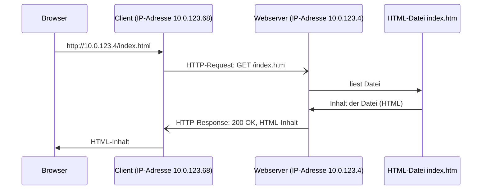

---
sidebar_custom_props:
  id: 7813f7c9-f867-4cc8-a5f1-0e7d244e8cf2
  source:
    name: sdg
    ref: https://gitlab.gbsl.website/gymbefin23/material/-/snippets/20
---
# Server, Client, Nachrichten, Prokolle - Die Grundlagen

Ein Webserver ist Computer, der darauf wartet, dass über das Netzwerk Anfragen für Webseiten eintreffen, welche auf dem Webserver gespeichert sind. Der Webserver sendet dann die angefragten Seiten als Antwort zurück an den Computer, von welchem die Anfrage stammt. 

Ein Computer, welcher eine Anfrage an einen **Server** sendet, wird als **Client** bezeichnet. Die Anfrage wird als **Request** und die Antwort als **Response** bezeichnet. Man spricht bei Request und Response auch von **Nachrichten**, welche zweichen Client und Server ausgetauscht werden.

Sowohl auf dem Client, wie auf dem Server braucht es Programme, welche die ausgetauschten Nachrichten verarbeiten können. Im Fall  vom Web sind das der **Browser** auf der Clientseite und das **Webserver-Programm** auf der Serverseite.

Webseiten sind Dateien, deren Inhalt in der Sprache **HTML** (Hypertext Markup Language) geschrieben ist. HTML dient dabei dazu die Darstellung der Webseite festzulegen (Überschriften, Abschnitte Tabellen, Links auf andere Seiten, etc.).

Damit sich Client und Server gegenseitig verstehen, müssen die Nachrichten in einer genau festgelegten Reihenfolge und mit genau definiertem Inhalt ausgetauscht werden. Diese Vorschriften nennt man ein **Protokoll** (siehe auch [Wiki / Netzwerke / Protokolle](https://gitlab.com/gymbefin23/material/-/wikis/Netzwerke/Protokolle)). Im Falle des Webs heisst das Protokoll **HTTP** (Hypertext Transfer Protocol).

Das folgende Bild verdeutlicht diese Zusammenhänge. Es zeigt die Reihenfolge der ausgetauschten Nachrichten für die Abfrage einer Webseite aus dem Browser heraus. Beachten Sie das der Browser nur ein Programm ist, welches auf dem Client-Computer läuft. Das entsprechende Programm auf der Serverseite ist nicht separat dargestellt. Statt dessen ist die Datei dargestellt, welche auf dem Server gespeichert ist und deren Inhalt zum Client zurückgesendet wird.



# Snippet `SimpleWebServer.py` und `hello.htm`
Python stellt eine Library zur Verfügung, mit welcher man ein einfaches Webserver-Programm erstellen kann. Ein solches ist im Snippet enthalten. Dieses Programm empfängt Requests für HTML-Dateien und sendet den Inhalt dieser Dateien zurück. Im Moment ist die Seite `hello.htm` die einzige Seite, welche vom Webserver zurückgeschickt werden kann.

Da auf einem Server gleichzeitig verschiedene **Dienste** angeboten werden können (z.B. könnte auch noch ein E-Mail-Server laufen), muss man für jeden Dienst eine **Port-Adresse** festlegen, unter welcher der Dienst auf ankommende Anfragen horcht. Für unseren einfachen Webserver wird im Snippet der Port mit der Nummer `8000` festgelegt.

Um von einem Browser aus die Seite `hello.htm` anzeigen zu lassen, muss man im Browser folgende **URL** (Universal Resource Locator) eingeben:

```
http://IP-Adresse des Servers:8000/Pfad/hello.htm
```
- Die IP-Adresse des Servers könnte zum Beispiel `10.0.123.4` sein.
- Der Pfad entspricht der Ordnerreihenfolge, ausgehend vom Workspace in VSC, in dem die Datei `hello.htm` gespeichert ist, z.B. `2258084`.


```py title=SimpleWebServer.py
import http.server
import socketserver

PORT = 8000

handler = http.server.SimpleHTTPRequestHandler

with socketserver.TCPServer(("", PORT), handler) as http_service:
    print("serving at port", PORT)
    http_service.serve_forever()
```

```html title=hello.html
<!DOCTYPE html>
<meta charset="UTF-8">
<header>
    <title>Simply hello</title>
</header>
<body>
    <h1>Hello</h1>
    <p>Wenn Sie dies sehen, so haben Sie eine erfolgreiche Abfrage auf den <b>SimlpeWebServer</b>
    getätigt.</p>
    
</body>
```