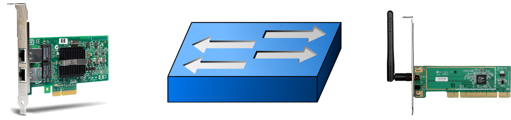
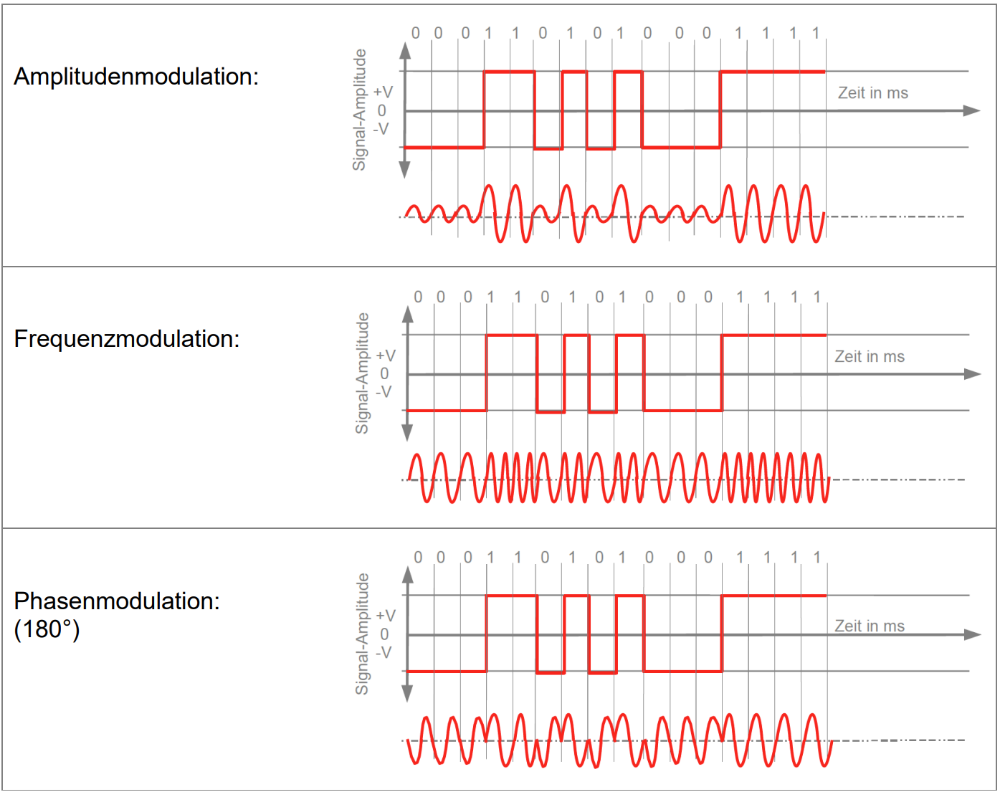
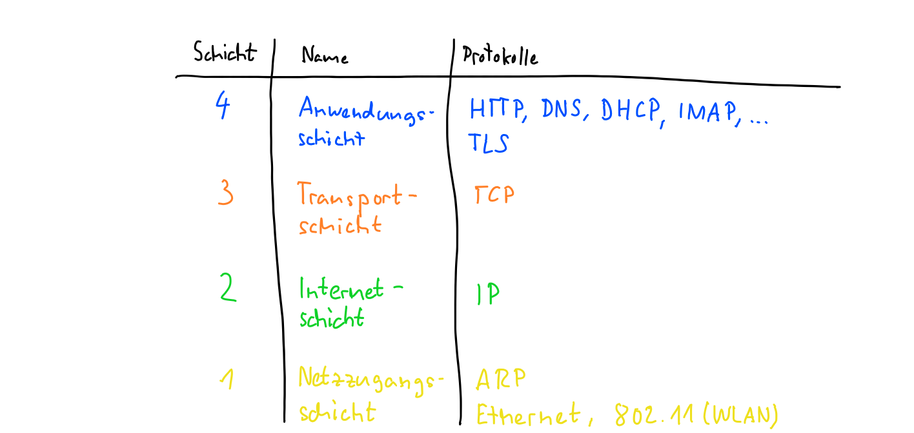

---
sidebar_custom_props:
  id: 4c51ef27-7b77-4931-9618-1d90ccdbf6c2
  source:
    name: sdg
    ref: https://gitlab.gbsl.website/gymbefin23/material/-/wikis/Netzwerke/Protokollstapel
---

import Stack from '@site/src/components/VisualizationTools/TCP_IP_Stack'

# 5. Schichtenmodell

<Answer type="state" webKey="8ced2205-1254-4c67-bc97-fb75cb8c27b9" label="Bearbeitet?" />

Um eine Nachricht über das Internet zu übertragen müssen die beteiligten Netzwerke eine ganze Reihe von **Aufgaben** erfülllen:

- Es braucht ein **Übertragungsmedium**. Dies können Kupferkabel, Glasfasern, oder Funkwellen sein.

   

- Die einzelnen Bits einer Nachricht müssen in **Signale** umgewandelt werden, welche über das gewählte Medium, übertagen werden können. Bei einem Kupferkabel können dies z.B. verschiedenen Spannungsniveaus sein, welche dann eine 1 oder eine 0 bedeuten.

   

:::details[Bitcodierungen]

### Modulationsverfahren

:::

- Da bei der Übertragung von Signalen über ein Medium immer Fehler auftreten können, welche dazu führen, dass ein Empfänger statt der gesendeten 1 eine 0 empfängt (oder umgekehrt), muss eine **Fehlererkennung und -korrektur** vorgesehen werden. Das kann man z.B. tun, indem man mit jeder Nachricht Zusatzinformationen, wie Prüfsummen, oder Paritätsbits, sendet, mit welcher der Empfänger dann überprüfen kann, ob die empfangene Nachricht korrekt ist.
- Wenn an einem Medium mehrere Sende- und Empfangsstationen angeschlossen sind (z.B. in einem WLAN), braucht es eine Möglichkeit, die Nachrichten an eine bestimmte Station zu senden. Dazu werden **Adressen** verwendet.   
- Werden schliesslich verschiedene **lokale Netzwerke** (kabelbasiert LANs und funkbasierte WLANs) zu einem grossen Netzwerk, wie dem **Internet** zusammengeschlossen, so müssen Nachrichten durch dieses übergeordnete Netzwerk **vermittelt** (man sagt geroutet) werden. Dazu braucht es eine von den darunterligenden Netzwerken unabhängige **Adressierungsart** für die Nachrichten.

   

- In einem Netzwerk von Netzwerken, wie dem Internet können auch ganze Nachrichten **verloren** gehen oder fehlgeleitet werden. Damit trotzdem eine sichere **Kommunikationsverbindung** zwischen zwei **Endpunkten** gewährleistet werden kann, müssen Nachrichten innerhalb einer Verbindung **durchnnummeriert** werden. Im Verlustfall kann dann eine **Wiederholung** einer Nachricht angefordert werden.
- Nachrichten müssen an den Endpunkten **unterschiedlichen Diensten** zugewiesen werden können. Dazu braucht es wieder eine Unterscheidungsmöglichkeit in Form einer **dritten Addressierungsebene**.

:::flex

***
Zu jedem gegebenen Zeitpunkt könnte auf dem Computer eines Benutzers ein Internetbrowser geöffnet sein, während Musik gestreamt wird und eine Messenger- oder Chat-App ausgeführt wird. Jede dieser Anwendungen sendet und empfängt Daten aus dem Internet, und all diese Daten kommen in Form von Einsen und Nullen auf derselben Netzwerkschnittstelle des Computers an.

"Etwas" muss entscheiden, welche Datenpakete wohin gelangen - die Aufgabe des **Ports**.
:::

- Schliesslich müssen die Nachrichten von den beteiligten **Anwendungen** an den Endpunkten **verstanden** und interpretiert werden können. Dazu braucht es anwendungsspezifische Protokolle, wie HTTP.

Wie immer, wenn etwas kompliziert wird, kommt die altbewährte Strategie **Teile und herrsche** zur Anwendung. Im Falle der Kommunikation bedeutet dies, dass die obigen Aufgaben auf verschiedene **Schichten** aufgeteilt werden. Jede Schicht enthält eigene **Protokolle**, welche für die Erledigung der Aufgaben zuständig sind. So entsteht ein **Stapel von Protokollen**, oder ein **Schichtenmodell**.

---

<Answer type="state" webKey="5b528186-8fd5-463f-8b84-39f892ef134e" label="Gesehen?" />

Hier wird das OSI-Modell vorgestellt - für uns wird schliesslich das TCP/IP-Modell mit "nur" 4 Schichten (Schichten 5-7 werden zusammengefasst) relevant sein. Mehr dazu weiter Unten...

[@youtube](https://www.youtube-nocookie.com/embed/LkolbURrtTs)

---

<Answer type="state" webKey="3f5977b8-ef82-49e2-85fc-affd14467f5c" label="Gesehen?" />

[@youtube](https://www.youtube-nocookie.com/embed/0aGqGKrRE0g)

---

## Das TCP-IP-Schichtenmodell
Das TCP-IP-Schichtenmodell umfasst vier Schichten:

<Stack />

Die Aufgaben der einzelnen Schichten sind:

1. **Netzzugangsschicht**  
   Sie sorgt dafür, dass Daten zwischen zwei durch ein Medium (z.B. Kabel oder Funk) **direkt** verbunden Geräten zuverlässig übetragen werden können. Dazu gehört:
   - Definition des **physikalischen Mediums** (**Ethernet**: Kabel, Stecker, Spannungen, etc.; **802.11**: Funkfrequenzen, Kanäle, etc.).
   - **Aufbereitung** und **Übertragung** der Bits und Signale über das **Medium**.
   - Bilden von **Frames** (Gruppe von Bytes). Jede Nachricht auf dieser Schicht wird als ein Frame übertragen.
   - Feststellen von **Übertragungsfehler** in Frames.
   - Regeln des **Zugangs** zum Medium, wenn gleichzeitig mehrere am Medium angeschlossene Geräte eine Nachricht senden wollen.
   - Definieren eines **Adressierungsschemas** für die Adressierung von Frames (**Mac-Adressen**).
   - Protocol für die Übersetzung von Adressen der Internetschicht auf Adressen der Netzzugangsschicht (**Address Resolution Protocol, ARP**).
   - Typische Geräte auf dieser Schicht sind **Netzwerkadapter**, **WLAN-Adapter**, **Switches** und **WLAN-Acess-Points**.

2. **Internet-Schicht**  
   Sie ermöglicht, dass mehrere lokale Netzwerke miteineinander zu einem grossen, **übergeordneten** Netzwerk, dem **Internet**, verbunden werden können und das Nachrichten durch dieses grosse Netzwerk hindurch geleitet werden können. Dazu gehört:
   - Bilden von **Paketen**.
   - Definieren eins von den darunterliegenden Netzwerken unabhängigen **Adressierungsschemas** (**IP-Adressen**).
   - Finden eines **Wegs** für Nachrichten von A nach B durch die darunterliegenden Netzwerke.
   - **Weiterleiten** von Paketen entsprechend dem korrekten Weg von A nach B. Weiterleiten bedeutet hier das Übergeben des Pakets an die darunterliegende Netzwerkzugangsschicht.
   - Typische Geräte auf dieser Schicht sind **Router**.

3. **Transportschicht**  
   Sie ermöglicht den **End-zu-End-Transport** von Nachrichten zwischen zwei Endpunkten. Als Endpunkte sind hier **Anwendungen**, wie Browser und Webserver-Programm gemeint. Die Transportschicht erlaubt auch den Aufbau von **logische Verbindungen** zwischen solchen Endpunkten, innerhalb von welchen dann eine **sichere** Übertragung von Nachrichten stattfindet. Dazu gehört:
   - Bilden von **Segmenten**. So heissen die Nachrichten, welche über eine **logische Verbindung** übetragen werden.
   - Definieren eines **Adressierungsschemas**, um logische Verbindungen auseinanderhalten zu können (**Ports**).
   - Bei grossen Nachrichten die **Aufteilung** in kleinere Teile, welche dann in ein Paket der Internetschicht passen. Dieser Vorgang heisst **Segmetierung**. Daher der Name Segment.
   - Beim Empfang der Segmente die Überwachung, dass alle Segmente **lückenlos** empfangen und in der richtigen Reihenfolge wieder **zusammengesetzt** werden.
   - Auf dieser Schicht gibt es keine typischen Geräte ausser den Computer selber.

4. **Anwendungsschicht**  
   Sie enthält nun **spezialisierte Protokolle** für bestimmte **Anwendungen**. Dazu gehören:
   - Das **Hypertext Transfer Protocol (HTTP)** für das World-Wide-Web.
   - Das **Domain Name System (DNS)** als Dienst zur Auflösung von Domain-Namen, wie www.google.com zu einer IP-Adresse.
   - Das **Dynamic Host Configuration Protocol (DHCP)**, über welches eine Gerät beim Aufstarten eine freie IP-Adresse abrufen kann, die es dann brauchen darf.
   - Das **Internet Message Access Protocol (IMAP)**, über welches ein Mail-Client (z.B. outlook) auf einen Mail-Server zugreifen kann.
   - Die **Transport Layer Security (TLS)**, welche zur Ver- und Entschlüsselung der Nachrichten gebraucht wird. Dieses Protocol ist insofern speziell, als es jeweils zwischen das Anwendungsprotokoll und das TCP-Protokoll der Transportschicht geschaltet wird. So ergibt z.B. **HTTP + TLS = HTTPS**.
   - Auf dieser Schicht gibt es keine typischen Geräte ausser den Computer selber.

## Kapselung
Wenn eine Anwendung, z.B. der Browser, Daten über das Netzwerk versenden will, so nutzt sie dazu ein passendes Protokoll der Anwendungsschicht. Die Daten werden in eine Nachricht des betreffenden Protokolls verpackt, was darauf hinaus läuft, dass den eigentlichen Daten weitere Informationen vorangestellt werden. Diese zusätzlichen Informationen werden als **Header** bezeichnet.

Die Anwendungsschicht muss nun zur Übertragung auf die darunterliegende Transportschicht zurückgreifen. Hier werden der Nachricht aus der Anwendungsschicht weitere Informationen vorangestellt.

Das geht immer so weiter, bis man auf der untersten Schicht, der Netzzugangsschicht angelangt ist. Das von der Internetschicht zur Übertragung anvertraute IP-Packet wird nochmals mit einem Header versehen. Hinzu kommen nun auch noch Informationen am Schluss, welche auf der Empfängerseite gebraucht werden, um festzustellen, ob es bei der Übertragung einen Fehler gegeben hat. Dies ist der **Trailer**.

Jetzt ist alles vorbereitet, um die Nachricht effektiv über die Leitung oder die Funkwellen zu lassen. D.h. erst jetzt werden die Bits, eines um das andere, übertragen.

Der beschriebene Vorgang wird als **Kapselung** oder Verpackung bezeichnet. Analog dazu muss auf der Empfängerseite dieser Vorgang umgekert werden, um aus den empfangenen Bits wieder die ursprpünglichen Daten auszupacken.

:::aufgabe[Selbsttest]
<Answer type="state" webKey="980ec8c0-0119-4391-8be0-091b7b635f21" />

<iframe src="https://learningapps.org/watch?v=p4semfyac22" style={{border:'0px',width:'100%',height:'500px'}} allowFullScreen="true" webkitallowfullscreen="true" mozallowfullscreen="true"></iframe>

Halten Sie allenfalls einen Screenshot der Lösung unten fest.

<Answer type="text" webKey="9721b1e6-12a4-4cad-9d81-86812532d2fc" />

:::
