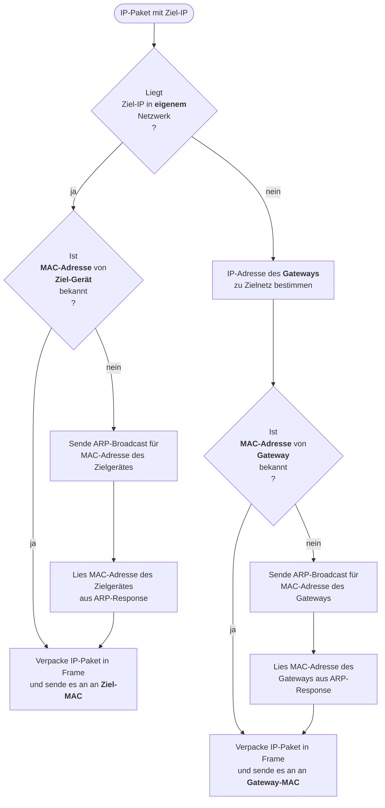

---
sidebar_custom_props:
  id: c1bfbbd0-99ed-45a1-a206-d21ff39c8ad8
  source:
    name: sdg
    ref: https://gitlab.gbsl.website/gymbefin23/material/-/wikis/Netzwerke/Routing
---

# 7. Routing

---

<Answer type="state" webKey="8fcef783-5f7d-44aa-903f-ea4e74d5a385" label="Gesehen?" />

::youtube[https://www.youtube-nocookie.com/embed/AzXys5kxpAM]

---

<Answer type="state" webKey="b6955d87-a06c-4db4-856b-961edf82d1d8" label="Gesehen?" />

::youtube[https://www.youtube-nocookie.com/embed/Ep-x_6kggKA]

---


<Answer type="state" webKey="4d499f34-45bb-4613-8f02-2260af713cf2" label="Gesehen?" />

::youtube[https://www.youtube-nocookie.com/embed/zmxLg4jV0ts]

---


Eine der wichtigsten Aufgaben der Internetschicht ist, das **Vermitteln** von Paketen duch die verbundenen Netzwerke hindurch und zwar vom **Augangsort** bis zum **Ziel**.
Jedes Gerät, egal ob Computer oder Router, muss dies tun, wenn es ein Paket senden will. Man spricht vom **Routing**.

Der **Ablauf**, den das Gerät dabei im wesentlichen befolgt, umfasst folgende Schritte:


Um diese Schritte durchzuführen, braucht jedes Gerät Informationen, welche in der **Routingtabelle** des Gerätes zu finden sind.

## Routingtabellen
Alle Routingtabellen sind im Grunde genommen gleich aufgebaut:

Jede Zeile darin entspricht einer **Route** über welche ein Paket weitergeleitet werden kann. Eine Zeile muss dehalb folgende Informationen enthalten:

- **Routenziel**, welches über diese Route erreicht werden kann
- Falls das Routenziel **nicht** im eigenen Netzwerk liegt, die IP-Adresse des **Gateways** über welchen man aus dem eigenen Netzwerk herauskommt
- Identifikation des **Netzwerkadapters** (Schnittstelle) am eigenen Gerät, über welchen das IP-Paket entweder direkt an das Routenziel (wenn dieses im eigenen Netzwerk liegt), oder an den Gateway gesendet werden kann

Weil es möglich ist mehrere Routen zum selben Ziel zu haben, wird jede Route noch mit einer **Metrik** versehen, anhand welcher dann entschieden wird, welches die optimale (z.B. schnellste) Route zum Ziel ist.

Für das Ziel einer Route hat man **mehrere** Möglichkeiten:
- Das Routenziel ist eine **Host-Adresse**, also ein ganz bestimmtes Gerät irgendwo im Internet (eigenes LAN, oder auch ein fremdes LAN).
- Das Routenziel ist eine **Netzwerk-Adresse**. Eine solche Route kann gebraucht werden, damit man nicht für alle Geräte in einem bestimmten Netzwerk eine eigene Route mit Host-Adresse einrichten muss.
- Die **Standardroute** (Default-Route), markiert durch die IP-Adresse `0.0.0.0`. Diese Route wird verwendet, wenn für ein bestimmtes Ziel keine passendere Route gefunden wird.

**Wichtig:**
Um beim Routenziel zu wissen, ob es sich um eine Netzwerk- oder Host-Adresse handelt, muss man auch die **Netzmaske** kennen. Im ersten Fall ist das eine herkömmliche Netzmaske mit einer Reihe 0 am Ende. Im zweiten Fall ist das die Netzmaske `255.255.255.255` (also lauter 1 und keine 0).

### Beispiele
Routing-Tabelle eines Raspberry-Pi (Linux :mdi[penguin]):

```bash
# sudo apt install net-tools
route -n
```

![Routingtabelle Raspberry PI :mdi[penguin]](images/RoutingtableRaspy.png)

Routing-Tabelle eines Windows-Notebooks:

```powershell
# Powershell
route PRINT
```

![Routingtabelle Windows :mdi[powershell] --width=500px](images/RoutingtableWindows.png)

