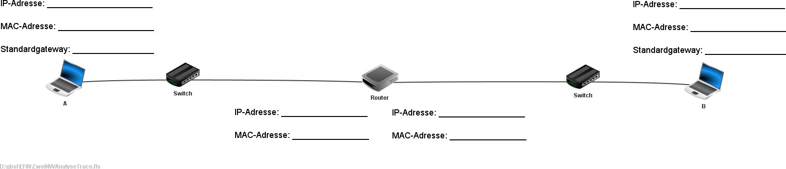
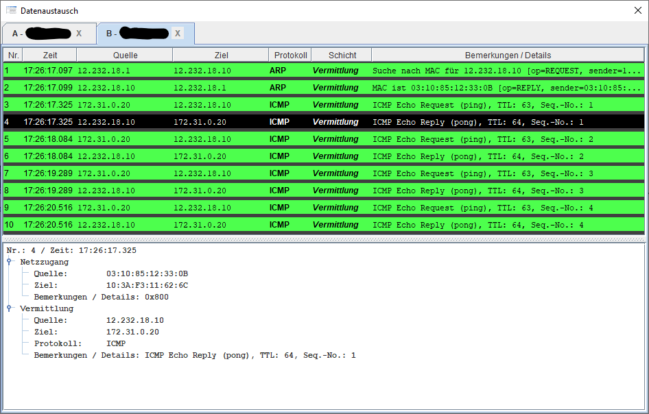

---
sidebar_custom_props:
  id: 95501435-4d1f-4a3a-ace7-1b21ea246f9b
---
# Routing

In lokalen Netzwerken (LANs) die mit Switches verbunden sind, können die verbundenen Rechner nur untereinander Nachrichten austauschen. Sobald es aber darum geht, Nachrichten über die Netzwerkgrenzen hinweg zu transportieren, braucht es eine Verbindung zwischen den Netzwerken: der Router. 

:::aufgabe Routing
<Answer type="state" webKey="b491cb01-6973-4ab7-88f6-84b7a58ffc46" />

Material
: Download [👉 ZweiNWAusgangslage.fls](assets/01-ZweiNWAusgangslage.fls)

- Laden Sie die verlinkte Filius-Datei herunter und **öffnen** Sie diese in Filius.
- Fügen Sie zwischen den Netzwerken 1 und 2 einen Router (in Filius __Vermittlungsrechner__ genannt) mit zwei Schnittstellen ein.
- **Verbinden** Sie die eine Schnittstelle mit dem Switch des Netzwerks 1 und die andere mit dem Switch des Netzwerks 2.
- **Konfigurieren** Sie die IP-Adressen der beiden Router-Schnittstellen mit einer gültigen IP-Adresse aus dem jeweiligen Netzwerk. Normalerweise wählt man für Router-Schnittstellen die tieftsmögliche IP-Adresse innerhalb des Netzwerkes.
- **Testen** Sie nun, ob Sie vom Notebook mit der Adresse 192.168.0.10 per ping das Notebook mit der Adresse 10.0.0.100 erreichen. Was stellen Sie fest? Können Sie sich dies erklären?

Erfassen Sie Ihre Antwort als Text und speichern Sie das Filius-Projekt, damit Sie in den folgenden Aufgaben daran weiterarbeiten können.

<Answer type="text" webKey="9d90511f-c04b-4e01-b60b-d63e3d87919c" />
:::

:::aufgabe Standardgateway
<Answer type="state" webKey="c94c4dff-6b2f-434b-9393-9f08667ee8df" />

In der obigen Aufgabe werden Sie festgestellt haben, dass der Versuch mit `ping` über die Netzwerkgrenze hinweg gescheitert ist.

Das Problem ist, dass das Notebook mit der Adresse `192.168.0.10` das Netzwerk `10.0.0.0` nicht kennt und somit auch nicht weiss, wohin es ein Paket mit der Ziel-Adresse `10.0.0.100` senden soll.

Diese Problem kann gelöst werden, indem man dem Notebook sagt, dass es alle Pakete mit Zieladresse in einem anderen, als dem eigenen Netzwerk, an den Router senden soll. Dieser wird dann schauen, wohin er das Paket weiterleitet. Hierzu muss man auf dem Notebook in der Konfiguration die IP-Adresse des Routers im Feld **Gateway** eintragen.

Der Begriff **Gateway** bedeutet, dass es sich bei diesem Gerät um das Tor und den Weg in die restliche Welt hinaus handelt. Man findet auch die Begriffe **Standardgateway** oder **Default-Gateway**.

## Aufgabe
Tragen Sie bei allen Notebooks die passende Gateway-Adresse ein und prüfen Sie, ob Sie jetzt mit ping die Notebooks im jeweils anderen Netzwerk erreichen können. Versuchen Sie auch ein ping auf die Standardgateway-Adressen.

Speichern Sie ihr Filius-Projekt und markieren Sie die Aufgabe als erledigt.

:::

### Selbsttest

:::aufgabe
Füllen Sie die Lücken im Bild aus, indem Sie aus den beiden angehängten Filius-Traces die MAC- und IP-Addressen der Geräte A, B und des Routers herauslesen.

Vergleichen Sie anschliessend Ihre Lösung mit der Musterlösung.

<Answer type="state" webKey="f6bed61e-f09f-4ee9-8d89-585e21811167" />

<Tabs defaultValue="step-1" values={[{label: 'Trace A', value: 'step-1'}, {label: 'Trace B', value: 'step-2'}]}>
<TabItem value="step-1">

</TabItem>
<TabItem value="step-2">

</TabItem>

</Tabs>

<Solution webKey="6ece48b1-efbd-48dd-86bf-3701e2d21210">

</Solution>

:::

## Mehrere Router

Zwei Netzwerke über einen Router verbinden ist schon mal was. Das Internet besteht aber aus vielen verbundenen Netzwerken. Das wollen wir hier in Filius ausprobieren, indem wir zwischen den beiden Netzwerke aus der vorigen Filius-Aufgabe zwei zusätzliche Router einfügen und so vier Netzwerke in einer Reihe erhalten:

:::aufgabe
<Answer type="state" webKey="c441286f-5882-4b49-86d7-e9d0c85c3a52" />

- Öffnen Sie Ihr Filius-Projekt aus der letzten Filius-Aufgabe und speichern Sie es unter einem neuen Namen.
- Benennen Sie den vorhandenen Vermittlungsrechner in Router 1 um und fügen Sie die Router 2 und 3, so wie oben dargestellt ein.
- Konfigurieren Sie die IP-Adressen der Routerschnittstellen wie folgt:
    - Router 1 und Router 3: Alle Schnittstellen erhalten die jeweils tiefste im betreffenden Netzwerk verfügbare Adresse.
    - Router 2: Die beiden Schnittstellen erhalten die jeweils höchste im betreffenden Netzwerk verfügbare Adresse. Beachten Sie die geltenden Netzmasken in obiger Abbildung.
- Versuchen Sie vom Notebook mit der Adresse `192.168.0.10` ein ping auf das Notebook mit der Adresse `10.0.0.100` zu machen. Schreiben Sie als Textantwort, was Sie feststellen und versuchen Sie Ihre Beobachtung zu **begründen**.

<Answer type="state" webKey="5e78b7fe-12f6-4052-9f26-6f95d23e8359" />

<Solution webKey="6c3d7bbd-8fba-4853-9daf-b739a0314d8d">

Das ping kommt nur bis zum **Router 1**. Dieser weiss nicht wohin er ein Paket mit der Adresse `10.0.0.100` weiterleiten soll, da er in seiner Routingtabelle weder das Netzwerk `10.0.0.0`, noch eine Default-Route eingetragen hat.
</Solution>

:::

:::aufgabe Default Route
<Answer type="state" webKey="31614442-2427-4614-8216-a73e07082052" />

In der letzten Aufgabe haben Sie festgestellt, dass ein ping von `192.168.0.10` zu `10.0.0.100` nicht über den Router 1 hinauskommt.

Dies ist so, weil der Router 1 nicht weiss, wohin er das Paket senden soll, da er weder eine Route zum Netzwerk `10.0.0.0`, noch eine Default-Route zur Verfügung hat.

Wir müssen also die Konfiguration von Router 1 ergänzen. Weil der Router 1 mit nur einem anderen Router in Verbindung steht, ist es am einfachsten diesen als Standardgateway einzutragen. Somit erhalten wir in der Routingtabelle eine Default-Route.

Das tun Sie, indem Sie in der Konfiguration im Tab Allgemein den Router 2 als Gateway eintragen. Prüfen Sie anschliessend, ob in der Routingtabelle von Router 1 die Default-Route erscheint

Wie weit kommt Ihr ping jetzt?

<Answer type="text" webKey="9412034e-df0e-45a7-8504-5433fb1a6601" />

:mdi-arrow-right: Nächste Aufgabe
:::

:::aufgabe
<Answer type="state" webKey="035cc3ff-aa0f-412e-ae09-4aa9ca3da67e" />

Im letzten Schritt haben Sie festgestellt, dass das ping jetzt bis Router 2 kommt, aber dort ist wieder Schluss.

Wir müssen auch die Konfiguration von Router 2 ergänzen. Hier haben wir nun aber das Problem, dass wir nicht einfach einen Standardgateway eintragen können, denn der Router 2 ist mit zwei anderen Routern verbunden. Wir müssen also eine direkte Route zum Netzwerk 10.0.0.0 in die Routingtabelle von Router 2 eintragen.

Tun Sie dies jetzt, indem Sie im Tab Weiterleitungstabelle in der Konfiguration von Router 2 eine Route zum Netzwerk 10.0.0.0 eintragen.

Erfassen Sie die nötigen Werte für Netzmaske, Gateway und Schnittstelle als Text.

Wie weit kommt Ihr ping jetzt?
<Answer type="text" webKey="2e50853d-7c43-40e2-b684-bed7d04c30e3" />
:::

:::aufgabe
<Answer type="state" webKey="2d1021d4-272e-4dce-a023-58cb256456ca" />

Der ping kommt jetzt bis zum Notebook mit der Adresse `10.0.0.100`. Aber auf dem Rückweg bleibt es beim Router 3 stecken.

Wir müssen die analogen Konfigurationen, welche wir für den Hinweg vorgenommen haben, auch für den Rückweg machen.

Tun Sie das jetzt und prüfen Sie, ob das ping erfolgreich von `192.168.0.10` zu `10.0.0.100` und wieder zurück reisen kann.
:::