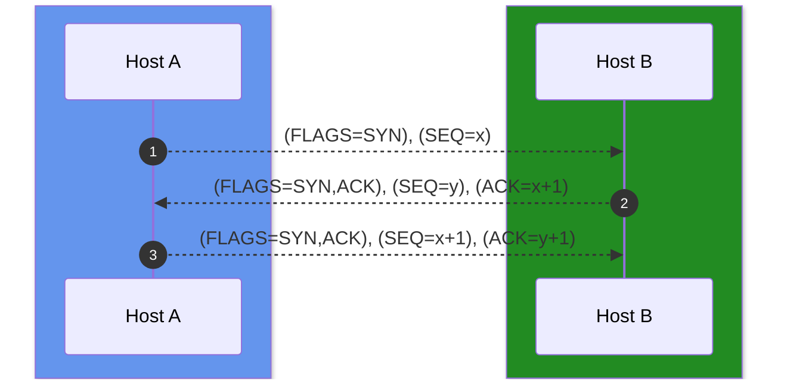
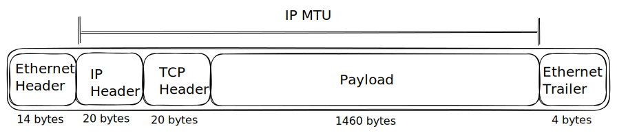
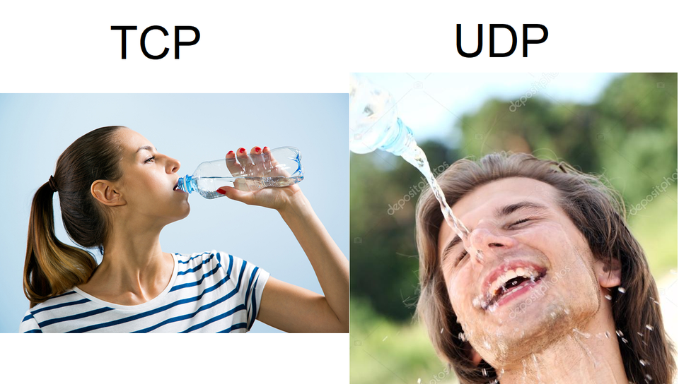

---
sidebar_custom_props:
  id: 5c6af9f9-244f-4106-8262-4839645fec95
---
# 10. TCP/UDP Protokoll

## TCP - Transmission Control Protocol

:::aufgabe
<Answer type="state" webKey="351dfc5b-3f4b-4392-a521-249dae0338b7" />

Bearbeiten Sie die Einstiegsaufgabe unter [👉 Inf-Schule.de](https://www.inf-schule.de/rechnernetze/filius/clientserver/erkundung_clientserver). Halten Sie wichtige Erkenntnisse unten fest und lesen Sie im Anschluss die untenstehenden Hintergründe zum TCP Protokoll nach. 

<Answer type="text" webKey="460720ac-cde2-41ed-b53c-e592e30d1426" />
:::

Das *Transmission Control Protocol* (__TCP__) ist ein Protokoll für eine gesicherte Verbindung zwischen zwei Systemen. Die Sicherung besteht in der Bestätigung für empfangene Datenpakete. Erhält der Sender innerhalb einer bestimmten Zeitspanne keine Bestätigung, wird von einem Fehler ausgegangen und das entsprechende Paket erneut versandt. Daneben **garantiert** TCP die Erhaltung der Sequenzreihenfolge zwi-schen den einzelnen Datenpaketen einer Datenübertragung. [^1]

:::details ⭐ **Geschichtlicher Kontext [^2]**
Gegen Ende der sechziger Jahre, als der "kalte Krieg" seinen Höhepunkt erlangte, wurde vom US-Verteidigungsministerium (Department of Defence - DoD) eine Netzwerktechnologie gefordert, die in einem hohen Maß gegenüber Ausfällen sicher ist. Das Netz sollte dazu in der Lage sein, auch im Falle eines Atomkrieges weiter zu operieren. Eine Datenübermittlung über Telefonleitungen war zu diesem Zweck nicht geeignet, da diese gegenüber Ausfällen zu verletzlich waren (sind). Aus diesem Grund beauftragte das US-Verteidigungsministerium die Advanced Research Projects Agency (ARPA) mit der Entwicklung einer zuverlässigen Netztechnologie. Die ARPA wurde 1957 als Reaktion auf den Start des Sputniks durch die UdSSR gegründet. Die ARPA hatte die Aufgabe Technologien zu entwickeln, die für das Militär von Nutzen sind. Zwischenzeitlich wurde die ARPA in Defense Advanced Research Projects Agency (DARPA) umbenannt, da ihre Interessen primär militärischen Zwecken dienten. Die ARPA war keine Organisation, die Wissenschaftler und Forscher beschäftigte, sondern verteilte Aufträge an Universitäten und Forschungsinstitute.

Um die geforderte Zuverlässigkeit des Netzes zu erreichen, fiel die Wahl darauf, das Netz als ein paketvermitteltes Netz (packet-switched network) zu gestalten. Bei der Paketvermittlung werden zwei Partner während der Kommunikation nur virtuell miteinander verbunden. Die zu übertragenden Daten werden vom Absender in Stücke variabler oder fester Länge zerlegt und über die virtuelle Verbindung übertragen; vom Empfänger werden diese Stücke nach dem Eintreffen wieder zusammengesetzt. Im Gegensatz dazu werden bei der Leitungsvermittlung (circuit switching) für die Dauer der Datenübertragung die Kommunikationspartner fest miteinander verbunden.

Ende 1969 wurde von der University of California Los Angeles (UCLA), der University of California Santa Barbara (UCSB), dem Stanford Research Institute (SRI) und der University of Utah ein experimentelles Netz, das ARPANET, mit vier Knoten in Betrieb genommen. Diese vier Universitäten wurden von der (D)ARPA gewählt, da sie bereits eine große Anzahl von ARPA-Verträgen hatten. Das ARPA-Netz wuchs rasant (siehe Abbildung) und überspannte bald ein großes Gebiet der Vereinigten Staaten.


Mit der Zeit und dem Wachstum des ARPANET wurde klar, daß die bis dahin gewählten Protokolle nicht mehr für den Betrieb eines größeren Netzes, das auch mehrere (Teil)Netze miteinander verband, geeignet war. Aus diesem Grund wurden schließlich weitere Forschungsarbeiten initiiert, die 1974 zur Entwicklung der TCP/IP-Protokolle bzw. des TCP/IP-Modells führten. TCP/IP wurde mit mit der Zielsetzung entwickelt, mehrere verschiedenartige Netze zur Datenübertragung miteinander zu verbinden. Um die Einbindung der TCP/IP-Protokolle in das ARPANET zu forcieren beauftragte die (D)ARPA die Firma Bolt, Beranek & Newman (BBN) und die University of California at Berkeley zur Integration von TCP/IP in Berkeley UNIX. Dies bildete auch den Grundstein des Erfolges von TCP/IP in der UNIX-Welt.

Im Jahr 1983 wurde das ARPANET schließlich von der Defence Communications Agency (DCA), welche die Verwaltung des ARPANET von der (D)ARPA übernahm, aufgeteilt. Der militärische Teil des ARPANET, wurde in ein separates Teilnetz, das MILNET, abgetrennt, das durch streng kontrollierte Gateways vom Rest des ARPANET - dem Forschungsteil - separiert wurde.

Nachdem TCP/IP das einzige offizielle Protokoll des ARPANET wurde, nahm die Zahl der angeschlossenen Netze und Hosts rapide zu. Das ARPANET wurde von Entwicklungen, die es selber hervorgebracht hatte, überrannt. Das ARPANET in seiner ursprünglichen Form existiert heute nicht mehr, das MILNET ist aber noch in Betrieb. (Zum Wachstum des Internet in Deutschland siehe: http://www.denic.de/DENICdb/stats/index.html)

Die Sammlung von Netzen, die das ARPANET darstellte, wurde zunehmend als Netzverbund betrachtet. Dieser Netzverbund wird heute allgemein als das Internet bezeichnet. Der Leim, der das Internet zusammenhält, sind die TCP/IP-Protokolle.
:::

Im Rahmen einer TCP-Kommunikation wird eine logische Verbindung zwischen den Endsystemen herstellt. Da auf einem Rechnersystem durchaus mehrere Programme parallel TCP-Verbindungen zu anderen Systeme nutzen können, werden die einzelnen logischen Verbindung durch eine spezielle Nummer, die Port-Adresse, weiter unterschieden.

Das Transmission Control Protocol stellt die **Zuverlässigkeit** der Datenübertragung mit einem Mechanismus, der als Positive Acknowledgement with Re-Transmission (PAR) bezeichnet wird, bereit. Dies bedeutet nichts anderes als das, dass das System, welches Daten sendet, die Übertragung der Daten solange wiederholt, bis vom Empfänger der Erhalt der Daten quittiert bzw. positiv bestätigt wird. Die Dateneinheiten, die zwischen den sendenden und empfangenden TCP-Einheiten ausgetauscht werden, heissen Segmente. Ein TCP-Segment besteht aus einem mindestens 20 Byte grossen Protokollkopf und den zu übertragenden Daten. In jedem dieser Segmente ist eine **Prüfsumme** enthalten, anhand derer der Empfänger prüfen kann, ob die Daten fehlerfrei sind. Im Falle einer fehlerfreien Übertragung sendet der Empfänger eine Empfangsbestätigung an den Sender. Andernfalls wird das Datengramm verworfen und keine Empfangsbestätigung verschickt. Ist nach einer bestimmten Zeitperiode (time-out-period) beim Sender keine Empfangsbestätigung eingetroffen, verschickt der Sender das betreffende Segment erneut.

TCP ist ein **verbindungsorientiertes** Protokoll. Verbindungen werden über ein **Dreiwege-Handshake** (three-way handshake) aufgebaut. Über das Dreiwege-Handshake werden Steuerinformationen ausgetauscht, die die logische Ende-zu-Ende-Verbindung etablieren. 



Zum Aufbau einer Verbindung sendet ein Host (Host A :mdi-account-tie-woman--blue:) einem anderen Host (Host B :mdi-account-tie--green:), mit dem er eine Verbindung aufbauen will, ein Segment, in dem das __SYN-Flag__ gesetzt ist. Mit diesem Segment teilt Host A :mdi-account-tie-woman--blue: Host B :mdi-account-tie--green: mit, dass der Aufbau einer Verbindung gewünscht wird. Die __Sequenznummer__ des von Host A :mdi-account-tie-woman--blue: gesendeten Segments gibt Host B :mdi-account-tie--green: ausserdem an, welche Sequenznummer Host A :mdi-account-tie-woman--blue: zur Datenübertragung verwendet. Sequenznummern sind notwendig, um sicherzustellen, dass die Daten vom Sender in der **richtigen Reihenfolge** beim Empfänger ankommen. Der empfangende Host B :mdi-account-tie--green: kann die Verbindung nun annehmen oder ablehnen. Nimmt er die Verbindung an, wird ein Bestätigungssegment gesendet. In diesem Segment sind das __SYN-Bit__ und das __ACK-Bit__ gesetzt. Im Feld für die Quittungsnummer bestätigt Host B :mdi-account-tie--green: die Sequenznummer von Host A :mdi-account-tie-woman--blue:, dadurch, dass die um Eins erhöhte Sequenznummer von Host A :mdi-account-tie-woman--blue: gesendet wird. Die Sequenznummer des Bestätigungssegments von Host B :mdi-account-tie--green: an Host A :mdi-account-tie-woman--blue: informiert Host A :mdi-account-tie-woman--blue: darüber, mit welcher Sequenznummer beginnend Host B :mdi-account-tie--green: die Daten empfängt. Schlussendlich bestätigt Host A :mdi-account-tie-woman--blue: den Empfang des Bestätigungssegments von Host B :mdi-account-tie--green: mit einem Segment, in dem das __ACK-Flag__ gesetzt ist und die um Eins erhöhte Sequenznummer von Host B :mdi-account-tie--green: im Quittungsnummernfeld eingetragen ist. Mit diesem Segment können auch gleichzeitig die ersten Daten an Host B :mdi-account-tie--green: übertragen werden. Nach dem Austausch dieser Informationen hat Host A :mdi-account-tie-woman--blue: die Bestätigung, dass Host B :mdi-account-tie--green: bereit ist Daten zu empfangen. Die Datenübertragung kann nun stattfinden. Eine TCP-Verbindung besteht immer aus genau zwei Endpunkten (Punkt-zu-Punkt-Verbindung).

### Kontrollinformationen - Header

MTU
: Maximum Transmission Unit - grösser kann das IP Paket nicht sein



Damit das Protokoll richtig arbeiten kann, braucht es Informationen, die in den TCP-Header geschrieben werden. Der TCP-Header ist wie folgt aufgebaut:


## UDP - User Datagram Protocol

**UDP** ist ein verbindungsloses, nicht-zuverlässiges und ungesichertes wie auch ungeschütztes Übertragungsprotokoll. Das bedeutet, es gibt keine Garantie, dass ein einmal gesendetes Paket auch ankommt, dass Pakete in der gleichen Reihenfolge ankommen, in der sie gesendet wurden, oder dass ein Paket nur einmal beim Empfänger eintrifft\*. Wenn Pakete verloren gehen werden diese nicht neu gesendet (z.B. ist das gestreamte Video schon weiter). Dafür hat es wesentlich weniger Overhead.

\* *dies passiert eigentlich nur wenn zwei oder mehr Switches so konfiguriert sind, dass ein Loop zwischen ihnen entsteht.*

Auch bei UDP braucht es einen Header, dieser enthält aber im Wesentlichen nur die Port's des Absenders und des Empfängers, die Länge des Pakets und eine Prüfsumme. Die Prüfsumme wird verwendet, um zu erkennen, ob das Paket korrekt übertragen wurde. Die Prüfsumme wird vom Sender berechnet und vom Empfänger überprüft. Wenn die Prüfsumme nicht stimmt, wird das Paket verworfen. Die Prüfsumme ist aber nicht so sicher wie bei TCP, da sie nur 16 Bit lang ist. Es kann also sein, dass ein Paket mit falschem Inhalt trotzdem akzeptiert wird.

### Kontrollinformationen - Header


Es gibt hier keine "Schlechter" oder "Besser" - es kommt auf den Anwendungseinsatz an! Kommt es primär auf die Übertragungsgeschwindigkeit bei tiefer Latenz (bspw. beim Gaming oder beim Streamen von hochfrequenten Sensordaten) an, so ist UDP die bessere Wahl. Soll die Übertragung zuverlässig sein, so ist TCP die bessere Wahl.


## TCP vs. UDP


oder in einem Meme:


:::cards
### TCP
```
“Hey, i möcht Wasser trinke.”

“Okay, du wetsch Wasser trinke.”

“Ja, i möcht e chli Wasser trinke.”

“Okay, bisch parat zum Wasser trinke?”

“Ja, i bi parat zum Wasser trinke.”

“Okay, i gibeder iz de grad chli Wasser.”

“Okay, Super, i bi ready zum Wasser becho.”

“Okay, hie hesch Wasser. Hesches becho?”

“Ja, i ha z Wasser becho.”

“Okay, du hesch z Wasser becho. Tschüss”
```

***

### UDP
```
“Hey, i möcht Wasser trinke.”

“Hie hesch Wasser 💦”
```

:::


[^1]: Quelle: [TU Berlin](http://www.cfd.tu-berlin.de/Lehre/EDV2/tcpip/kap_2_4.html)

[^2]: Quelle: [TU Berlin](http://www.cfd.tu-berlin.de/Lehre/EDV2/tcpip/kap_1_2.html) Wer allgemein etwas über Computernetzwerke erfahren möchte, der sollte in dieses Buch schauen. Das Buch deckt so ziemlich alles ab, was mit Computernetzen zu tun hat und ist dabei sehr gut geschrieben.


