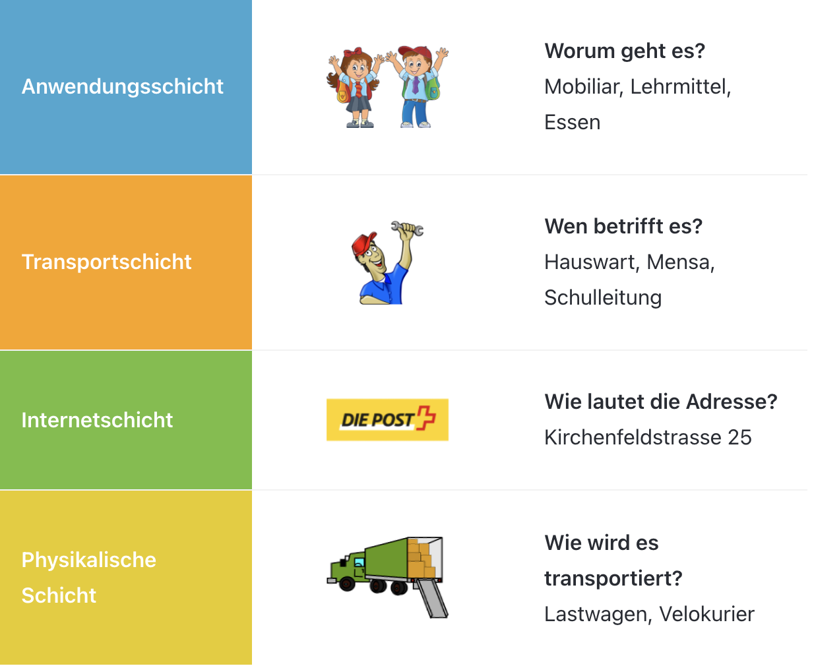

import Stack from '@site/src/components/TCP_IP_Stack'

# TCP/IP-Schichtenmodell [^1]

Genauso wie die Pakete im Beispiel übermittelt werden, geschieht dies auch am Computer – hier sprechen wir von Datenpaketen.

Die oberen Schichten verwenden Dienste der unteren Schichten.
Jede Schicht verpackt die Daten neu, wenn sie von der darüberliegenden Schicht übergeben werden und entpackt sie wieder beim Empfangen bevor sie wieder an die darüberliegende Schicht übergeben werden
Jede Schicht hat einen bestimmten Auftrag.

<Stack />

## Die Analogie

Wenn wir im obigen Beispiel die Schichten ansehen, dann ist jede Schicht für einen bestimmten Schritt zuständig.

[^1] Quelle: [mygymer.ch](https://informatik.mygymer.ch/g23c/008.rechnernetze-kommunikation/02.tcp-ip.html)