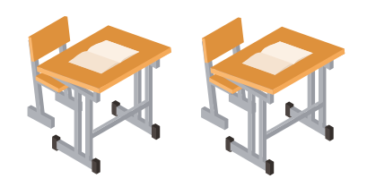
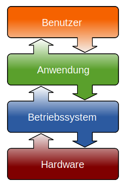

import Tabs from '@theme/Tabs';
import TabItem from '@theme/TabItem';

# Schichtenmodell [^1]

Viele komplexe Vorgänge und Konstruktionen können mit Hilfe eines sogenannten Schichtenmodells in einfachere Einzelteile aufgespalten werden.

Wir wollen die Vorteile des Schichtenmodell an Hand eines Beispiels versuchen zu verstehen:

# Beispiel "Schule"

Die Schule Madretsch feiert 100-jähriges Jubiläum und braucht für ihr Fest zusätzliche Schulpulte. Wir möchten helfen und einige Pulte schicken.

- Wie funktioniert dies?
- Wer ist alles involviert?

<blockquote>
<Tabs
  defaultValue="step-1"
  values={[
    {label: 'Details 1', value: 'step-1'},
    {label: 'Details 2', value: 'step-2'},
    {label: 'Details 3', value: 'step-3'},
    {label: 'Details 4', value: 'step-4'},
  ]}>
  <TabItem value="step-1">

Den Schüler:innen ist egal, wie die Pulte in die Schule kommen. Sie freuen sich einfach über die zusätzlichen Schulpulte.

  </TabItem>
  <TabItem value="step-2">

Da die Pulte zu sperrig sind, werden diese vom GBSL-Hausdienst zerlegt und in einzelne Pakete verpackt.
Wenn die Pakete ankommen, kann der Madretsch-Hausdienst die Pakete auspacken und die Pulte wieder zusammensetzen.  

  </TabItem>
  <TabItem value="step-3">

Der Hausdienst trägt diese Pakete aber nicht selber zur Schule Madretsch.
Nein, die Pakete werden an die Post übergeben.
Diese ist für den Transport zuständig.
Die Pakete machen auch einen Zwischenstopp im Verteilzentrum Härkingen.

  </TabItem>
  <TabItem value="step-4">

Die Post verwendet nun für den eigentlichen Transport verschiedene Fahrzeuge.
Im Verteilzentrum wird der Inhalt entladen und gemäss Adresse weitergeleitet.
  
  </TabItem>
</Tabs>
</blockquote>

## Vorteile des Schichtenmodells

### Aufbau auf bestehendem

Ohne Probleme liesse sich das obenstehende Beispiel verwenden, um andere Inhalte zu transportieren. So könnten statt Pulten auch Stühle – oder z.B. auch Esswaren transportiert werden.

- So funktioniert auch unser Postsystem: Bis auf wenige Ausnahmen transportiert die Post alles.
- Die Übertragung von E-Mails und die einer Webseite unterscheidet sich nur in der obersten Schicht. Beide bauen auf den 3 identischen unteren Schichten auf

:::aufgabe Aufbau auf bestehendem
Was könnte noch Übertragen werden, wobei die unteren Schichten verwendet werden?
:::

### Austauschbare Schichten
Die Schichten können ausgetauscht werden, solange sie ihre Aufgabe erfüllen und die Schnittstelle zwischen der darüber- und der darunterliegenden Schicht erfüllt wird.

- Die Post kann auch mit dem Flugzeug oder dem Zug transportiert werden. (Daten können Kabelgebunden oder per Funk übertragen werden)
- Statt der Post kann man einen privaten Transportservice engagieren. (Swisscom- oder UPC-Anschluss fürs Internet zu Hause)
- Statt des Hauswartes können Schüler*innen die Pulte auseinanderschrauben und wieder zusammensetzen.

:::aufgabe Schichten austauschen
Sehen Sie andere Optionen zum Austauschen einer Schicht?
:::

## Andere Schichtenmondelle
### Informatik

### Andere Wissenschaften

Verschiedene Naturwissenschaften bauen aufeinander auf und bilden so eine Art Schichtenmodell, um die ungeheure Komplexität der Natur in den Griff zu bekommen. Somit kann man sich z.B. auf sehr verschiedenen Abstraktionsebenen mit dem Organismus «Schwan» auseinandersetzen (Körperbau? Verhalten? DNA?) und kann die jeweils anderen Ebenen grösstenteils ausblenden.

### Weitere...

:::aufgabe Schichtenmodelle finden
Finden Sie weitere Schichtenmodelle?
:::

[^1]: Quelle: [mygymer.ch](https://informatik.mygymer.ch/g23c/008.rechnernetze-kommunikation/01.schichtenmodell.html#beispiel-%C2%ABpaketversand%C2%BB)
