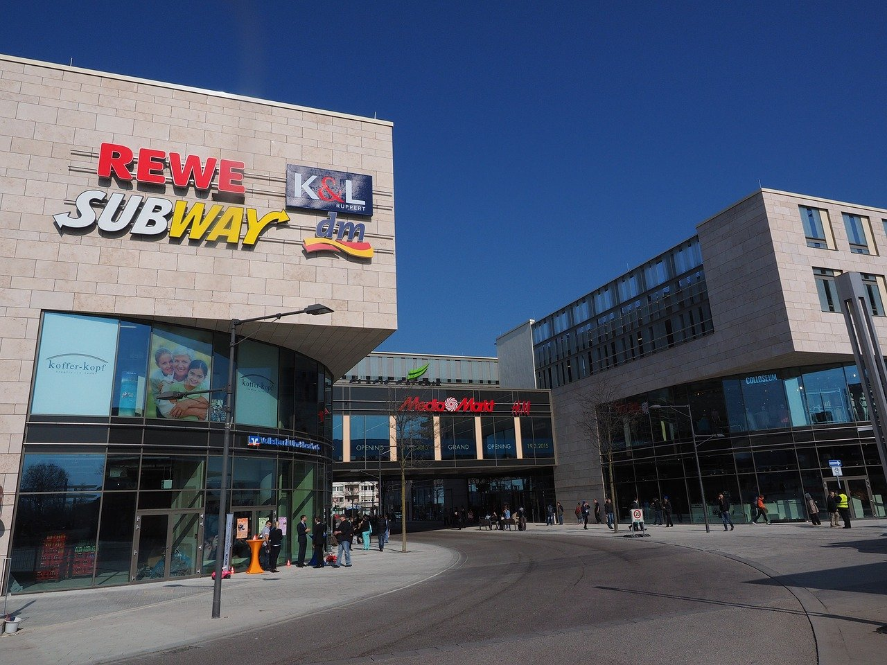

# Schichten und Adressen [^1]

<Answer type="state" webKey="94beaff4-7ed8-4cb7-ae9f-13d11e0727bb">
Gelesen?
</Answer>

Was bedeuten die Adressen auf den verschiedenen Schichten?
Damit wir uns besser vorstellen können, was die einzelnen Adressen bedeuten, arbeiten wir mit folgender Analogie:

Wir möchten in einem bestimmten Geschäft innerhalb eines Einkaufszentrums einkaufen gehen.

Zuerst müssen wir überhaupt zum Einkaufszentrum gelangen. Dafür sind die ersten beiden Schichten zuständig:
- physikalische Schicht
- Vermittlungsschicht

Dass es überhaupt **Strassen** gibt, die die Grundstücke miteinander verbinden, verdanken wir der **physikalischen Schicht**. Auf dieser Schicht gibt es im Netzwerkmodell die **MAC-Adressen**. In unserer Analogie würde dies wohl den **Grundstücksnummer** entsprechen, die im Grundbuch eingetragen sind – allerdings sind diese Nummern (und Grundbücher) weltweit nicht eindeutig, daher hinkt dieser Vergleich ein wenig.

Auf der **Vermittlungsschicht** werden die **IP-Adressen** verwendet, um einen Host zu kontaktieren. In unserer Analogie würde dies der Postadresse (also Strassenname und Hausnummer) entsprechen.

Es braucht also Strassen und Postadressen, damit wir das Einkaufszentrum finden. Sind wir jedoch bereits im Einkaufszentrum drin, müssen wir noch das richtige Geschäft aufstöbern. Nun dringen wir zu den nächsten zwei Schichten vor:
- Transportschicht
- Anwendungsschicht

Analog muss auch ein Computer wissen, an welches Programm er eine eingehende Anfrage weitergeben muss: Will der Client eine Webseite abrufen oder vielleicht eine DNS-Abfrage starten? Für beides kann auf dem gleichen Server eine Software auf Anfragen warten. Die Programme, die solche Anfragen beantworten lauschen auf einem bestimmten **Port** und warten, bis sich ein Client meldet (Schicht 3: [**Transportschicht**](./3-Transportschicht.md)). Genau gleich warten die Angestellten in jedem Geschäft des Einkaufszentrums auf Kunden. Auch die Räume, in denen die Geschäfte untergebracht sind sind nummeriert, ähnlich wie die Ports im Netzwerkmodell. Die Port-Nummern entsprechen also den **Raumnummern**.

Das einzige, was diese Angestellten dem Kunden anbieten können, ist die **Dienstleistung**, auf welche sich dieses Geschäft spezialisiert hat. Dass der Ablauf für einen Dienstleistungsbezug in jedem Geschäft anders abläuft, ist klar – schliesslich muss sich im Coiffeurgeschäft auf einen Stuhl setzen und bekommt einen Mantel und den Hals gebunden, während man in der Bäckerei die gewünschten Brote bestellt. Dies entspricht den Protokollen auf der [**Anwendungsschicht (DNS, HTTP, ...)**](./4-Anwendungsschicht.md).

[^1]: Quelle: [rothe.io](https://rothe.io/?b=network&p=783655)
