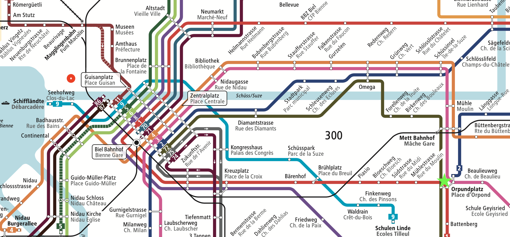

import Finding from "@site/src/components/Finding";

# Routing im Alltag

:::danger Vorgehensweise

Lesen Sie sich selbständig durch dieses Kapitel durch, wobei Sie

- die Aufgaben lösen und die Ergebnisse notieren
- vor jedem «gewonnene Erkenntnisse» überlegen Sie kurz, was eine gewonnene Erkenntnis sein könnte – und zwar bevor Sie das Kästchen aufklappen
- lesen Sie die «gewonnenen Erkenntnisse» durch und überlegen Sie sich, was damit genau gemeint ist
- falls Sie eine Frage haben oder eine Erkenntnis notiert haben, die nicht aufgelistet wird, dann halten Sie diese fest, damit wir am Schluss darüber sprechen können

:::

Wir befinden uns auf der __Vermittlungs-Schicht__: Hier werden IP-Pakete vom Start- zum Zielgerät übertragen. Bei ihrem Weg durch das Internet müssen die Pakete geleitet werden – man spricht von **Routing**.

## Verkehrsbetriebe Biel

Durch das Verkehrsnetz der Verkehrsbetriebe Biel wird der öffentliche Verkehr in der Stadt Biel sichergestellt.

Sie möchten mit dem ÖV vom Gymnasium :mdi-circle--red: (Ländtestrasse 12, Biel/Bienne) zum Sportplatz Mettmoos :mdi-star--green: fahren.

:::aufgabe Mit dem Netzplan

Welche Möglichkeiten sehen Sie auf dem Liniennetz?
<Answer  type="text"  webKey="d6938484-81a6-4240-bbd0-b94ed04bdc72"/>
:::

:::aufgabe 💻 mit Google Maps
<Answer type="state" webKey="ddb3960d-b91a-4bf2-9571-97b32e7169f2" />

Welchen Transportoptionen schlägt Ihnen [👉 Google Maps](https://www.google.com/maps/dir/Gymnasium+Biel-Seeland,+L%C3%A4ndtestrasse+12,+2503+Biel/Sports+Ground+Mettmoos,+Parkplatz+Mettmoos,+2504+Biel/@47.1389934,7.2384864,14z/data=!3m1!4b1!4m14!4m13!1m5!1m1!1s0x478e195743e2cd43:0x7eeeab7e9cc7fa72!2m2!1d7.2359916!2d47.1334096!1m5!1m1!1s0x478e192b26b851e1:0x5e85058550f44003!2m2!1d7.2756948!2d47.1390779!3e3) vor, wenn Sie die Route _Ländtestrasse 12_ → *Sportplatz Mettmoos* suchen?

- Welche Optionen werden vorgeschlagen?
- Welches ist gemäss Google die beste Route?
- Ändert sich die Route, wenn sie möglichst kurze Fusswege enthalten soll? (Einstellbar unter _Routenoptionen_)
- Ändert sich der Reisevorschlag, wenn Sie spät in der Nacht (12:15 Uhr) eine Verbindung suchen?

<Answer  type="text"  webKey="482bf3ac-ff0d-44ca-9700-5274cf9fecd4"/>

:::

<Finding>

- Es gibt mehrere Wege, welche ans Ziel führen.
- Der optimale Weg ist abhängig von den Rahmenbedingungen und kann sich **ändern**.

</Finding>

## Analogien

|              <!-- --> | <!-- -->                                                            |
|----------------------:|:--------------------------------------------------------------------|
|              **WLAN** | zu Fuss bis zur nächsten Haltestelle                                |
|   **Sichtbare WLANs** | Haltestellen, die zu Fuss erreichbar sind: Bahnhof & Badhausstrasse |
| **Rechnernetz (LAN)** | mit Bus (für weiter entfernte Ziele: Tram, Zug, ...)                |
|            **Router** | Umsteigen an gewissen Haltestellen                                  |

## Routing für Touristen
Datenpakete sind – anders als wir als Passagiere vom *ÖV* – nicht intelligent. Sie wissen nicht, wie sie umsteigen müssen. Dies muss für sie übernommen werden.

Ein Datenpaket im ÖV vom Gymer zum Sportplatz Mettmoos müsste
1. an **jeder Haltestelle** wissen:
   - ob man Aussteigen oder Umsteigen muss
   - in welchen Bus man als nächstes einsteigen muss
   - ob man am Ziel angekommen ist.

2. an jeder **Strassenkreuzung** (wenn zu Fuss unterwegs) wissen:
   - welche Abzweigung es nehmen soll
   - ob es am Ziel angekommen ist.

:::aufgabe Routing-Tabelle
<Answer type="state" webKey="8c827967-6f40-46be-85e1-36476b786edf" />

Erstellen Sie für das Ziel "Sportplatz Mettmoos" Umsteige-Anleitungen für Datenpakete gemäss __Punkt 1__ aus obiger Anleitung für die folgenden Haltestellen:

- Seehofweg
- Bahnhof Biel
- Mühlestrasse/Moulin
- Schulen Linde
- Bahnhof Mett

Beispiel-Anleitung:

| Ort :mdi-pin: | Ziel :mdi-target: | :mdi-axis-y-arrow: Aktion             |
|:--------------|:------------------|:--------------------------------------|
| Seehofweg     | Mettmoos          | :mdi-arrow-right-thin: Bus Nr. 9      |
| Seehofweg     | Gymer             | :mdi-arrow-right-thin: Zu Fuss weiter |

Halten Sie Ihre Anleitung auf Papier fest und fügen Sie ein Foto unten ein.

<Answer  type="text"  webKey="7bcc9f60-6fe8-4162-b45f-8cda4e248730"/>

:::

:::aufgabe Andere Ziele
<Answer type="state" webKey="984b58cf-3230-4f06-93da-ea49161782ab" />

Die Anleitungen müssten natürlich auch Anweisungen für andere Ziele haben.

- Wie würden die Umsteigungsanweisungen für die 5 obenstehenden Haltestellen für das Ziel "Bern" lauten?
- Wie für das Ziel "Zürich"?
- Muss jede Haltestelle wirklich Anweisungen für jedes andere Ziel haben?

<Answer  type="text"  webKey="609cfe7e-bab0-4a50-97c7-7b3ac571fba0"/>

:::

<Finding>

Es können Anweisungen "delegiert" werden: Es muss nur der *Bahnhof Biel* wissen, in welchen Zug man einsteigen muss um nach Bern oder Zürich zu fahren. Die anderen Haltestellen leiten alle Anfragen ausserhalb des Biel-Netzes an den *Bahnhof Biel* weiter.

</Finding>

:::aufgabe Routing im Internet
<Answer type="state" webKey="cc80e025-9f37-451e-a9da-5e31920499bf" />

Halten Sie fest, wie die Umleitung bei Paketen im Internet funktioniert - Sie haben im Unterricht bereits die Demonstration mit den verschachtelten Paketen gesehen.
Gehen Sie dabei auf folgende Punkte ein:
- Wozu braucht es mehrere Adressen?
- Welche Informationen muss ein Router haben, um ein Paket weiterzuleiten?
- Wie erhält ein neu verbundenes Gerät seine Adresse?
- Erinnern Sie sich ans Schichtenmodell: Auf welcher Schicht findet das Routing statt?

<Answer type="text" webKey="ec843295-019b-4076-8dda-3850c998a3db" />
:::

## Ausfall Schienennetz

> Wegen Umbauarbeiten fällt die Linie Nr. 9 ab "Brühlplatz" aus. Welche Möglichkeiten haben Sie, wenn Sie beim *Seehofweg* eingestiegen sind, um doch noch an den Sportplatz zu gelangen?

<Finding>

Es gibt verschiedene Wege zum Ziel - auch nicht optimale Wege, die normalerweise nicht benutzt werden. Diese Optionen ermöglichen aber eine gewisse **Ausfallsicherheit**. Im Beispiel oben können Sie entweder beim Bahnhof Biel oder beim Brühlplatz auf eine andere Verbindung umsteigen. 

</Finding>

## Grosse Gruppe

:::aufgabe Grosse Gruppen
<Answer type="state" webKey="374b1bf7-cb9a-422e-b373-8376598a45b8" />

4 Parallelklassen – also ca. 100 Personen haben beim Sportplatz Mettmoos abgemacht.
Wie kommen sie am schnellsten dahin, wenn wir damit rechnen, dass wegen der Belegung des Feierabendverkehrs maximal 25 Personen pro Bus Platz finden?

<Answer type="text" webKey="a94b88da-f8ab-4cb5-9bdd-dd8f27eede43" />
:::

<Finding>

Bei Engpässen können verschiedene Wege gleichzeitig benutzt werden. (In der Netzwerk-Sprache nennt sich dies "Load-Balancing")

</Finding>

