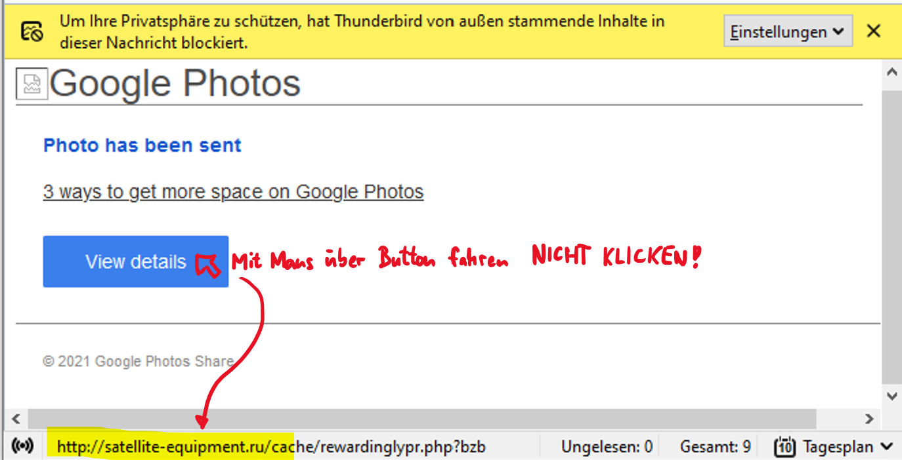

# Domain-Name-System

:::finding[Ziele]
- Was ist ein Domain-Name?
- Sie können zu einem gegebenen Domain-Namen die zugehörige IP-Adresse ermitteln.
-	Sie können herausfinden, wem ein Domain-Name gehört und ob ein bestimmter Domain-Name noch frei ist.
-	Sie können Web-Links auf ihre Unbedenklichkeit überprüfen.
:::

## Telefonbücher

<div className="float-right">


</div>

IP-Adressen sind wie Telefonnummern, man kann sie sich nur schwer merken. Für Telefonnummern gibt es deshalb Verzeichnisse, in welchen man die Nummer einer bestimmten Person nachschauen kann (entweder das gute alte Telefonbuch oder, moderner, [tel.search.ch](https://tel.search.ch)). Man muss nur den Namen der Person und vielleicht noch die Wohnadresse kennen.

## Domain Name
Auch für das Internet gibt es solche Verzeichnisse. Wenn man den Namen einer bestimmten Webseite kennt, kann man im Verzeichnis die IP-Adresse des Servers nachschauen, der diese Seite im Internet anbietet. 

Solche Namen sind zum Beispiel
-	www.instagram.com
-	www.gbsl.ch
-	[ofi.gbsl.website](https://ofi.gbsl.website)

Diese Namen werden als **Domain-Names** bezeichnet und das Verzeichnis, wo sie drinstehen, heisst **Domain-Name-System**, kurz **DNS**.

## Kernidee
> Namen kann man sich viel besser merken als Zahlen. Deshalb sind Webseiten im Internet mit einem Domain-Namen versehen. Im **Verzeichnis** der Domain-Namen, dem **Domain-Name-System**, kann man nachschauen, welches die IP-Adresse des Servers ist, der diese Seite anbietet.


## Funktionsweise

Es gibt auf der Welt bald **2 Milliarden**[^1] Webseiten, verteilt auf ca. 200 Millionen Server. Jeder Server beherbergt also durchschnittlich 10 Webseiten. Für jeden dieser Server braucht es eine öffentliche IP-Adresse, damit der Server im Internet erreichbar ist. Wenn man die IP-Adresse des Servers kennt, könnte man theoretisch versuchen im Browser statt des Domain-Namens einer Web-Site direkt die IP-Adresse des Servers einzugeben, also statt www.instgram.com die IP-Adresse 157.240.17.174.

:::finding[IP-Adressen direkt eingeben]
Obiges Beispiel, die IP-Adresse von Instagram direkt in den Browser einzutippen, funktioniert in der Praxis mit modernen Webseiten, die `https` als Protokoll verwenden, nicht. Bei `https` wird von Ihrem Browser mittels Zertifikat sichergestellt, dass die Adresse auf den korrekten Domain Namen lautet. Dadurch wird verhindert, dass Sie auf eine falsche Seite umgeleitet werden, und dann unwissentlich bspw. eine Geldtransaktion vornehmen. Das führt aber dazu, dass das Zertifikat bei IP-Adressen nicht gültig ist.

Eine zu Demonstrationszwecken veröffentlichte Seite ohne https ist [login.gbsl.website](http://login.gbsl.website). Diese ist auch direkt über den entsprechenden Server [188.34.157.212](http://188.34.157.212) zu finden.
:::

Wie schon in der Einleitung erwähnt, wird das niemand tun, weil man sich diese IP-Adresse nicht merken kann und sie mit der Zeit auch ändern könnte (z.B. wenn die Web-Site auf einen anderen Server gezügelt wird). Ganz abgesehen davon, dass es auch nicht ausreichen würde, nur die IP-Adresse anzugeben, weil ja eben mehrere Web-Sites an einer bestimmten Adresse «zuhause» sein können - der Port müsste ebenfalls bekannt sein.

:::finding[Ports]
Ein Port spezifiziert, welche Applikation auf einem Server die Anfrage behandeln soll.

Auf dem Server [188.34.157.212](http://188.34.157.212) sind mehrere Web-Sites, und mit dem richtigen Port kann ausgewählt werden, welche man möchte:

Port 80 \*
: [188.34.157.212:80](http://188.34.157.212:80) :mdi[arrow-right] [login.gbsl.website](http://login.gbsl.website)
Port 8080
: [188.34.157.212:8080](http://188.34.157.212:8080) :mdi[arrow-right] [hacksql.gbsl.website](https://hacksql.gbsl.website)

Nun wird deutlich, dass es schwierig würde, sich auch noch alle Ports zu merken...

\* *Port 80 ist der Standard-Port für Web-Sites mit dem http Protokoll und kann deshalb auch weggelassen werden*
:::

Die Frage ist nun aber: Wie kann man 2 Milliarden Domain-Namen in einem Verzeichnis verwalten? Würde man dies in Form eines Buches versuchen, so ergäbe das ein Buch mit ca. **4 Millionen Seiten** (500 Adresseinträge pro Seite). Hinzu kommt, dass diese Adressen laufend angepasst werden müssten. Neue Adressen kommen hinzu, andere ändern oder verschwinden. Ganz zu schweigen von der schieren Unmöglichkeit, in einem solchen Buch eine gesuchte Adresse zu finden.

In elektronischer Form ist dieses Problem nicht so gross. 2 Milliarden Adressen ergeben eine Datenmenge von ca. **2 Terrabyte**, wenn man grosszügig 1 KB (1000 Zeichen) pro Adresse annimmt. Eine Harddisk mit so viel Platz kriegt man für einige zehn Franken. Allerdings bleibt das Problem mit den dauernden Änderungen. Eine zentrale Stelle, welche dieses Verzeichnis führen müsste, wäre wohl schnell überfordert. Zudem bestünde auch ein grosses Risiko, dass ein Ausfall dieser zentralen Stelle das ganze Internet lahmlegen könnte. Schliesslich müsste ein solches Verzeichnis auch auf einem sehr, sehr leistungsfähigen Server betrieben werden, denn bei ca. 5 Milliarden Internetnutzern weltweit, die dauernd irgendwelche IP-Adressen brauchen, ist mit einer enormen Flut von Anfragen zu rechnen.

Aus diesen Gründen haben die Erfinder des Domain-Name-Systems einen anderen Weg eingeschlagen: Das Verzeichnis ist
-	erstens **hierarchisch gegliedert** und
-	zweitens auf viele DNS-Server weltweit **verteilt**, wobei jeder Server nur die Adressen in seiner Zone kennt und für alle anderen Adressen auf weitere DNS-Server verweist.


Untenstehendes Bild zeigt diese Hierarchie. Auf der obersten Ebene befinden sich die sogenannten **Top-Level-Domains** (**TLD**), z.B. **ch**, **de**, **org** oder **com**. Diese sind unter einer namenlosen Root-Domain zusammengefasst (Punkt im obersten Kästchen auf dem Bild). Unterhalb einer TLD können dann **beliebig viele Subdomains** angehängt werden. Liest man nun von unten beginnend, die Namen der Subdomains auf einem Pfad bis zur Root-Domain, so entsteht ein vollständiger Domain-Name, z.B. en.wikipedia.org.

<div id="dns-schema"></div>


Im Bild sind **drei DNS-Server** mit ihrer jeweiligen **Zone** (grau) eingezeichnet. Jeder DNS-Server verwaltet den Teil der Adressinformationen, der zu seiner Zone gehört. Die IP-Adresse zum Domain-Namen en.wikipedia.org, also 91.198.174.192, kennt dabei nur der unterste DNS-Server, denn er ist für die Zone, in welche dieser Domain-Name schliesslich gehört, zuständig.

Wird einer der übergeordneten DNS-Server nach dieser IP-Adresse gefragt, so verweist er als Antwort nur auf den nächsttieferen DNS-Server, mit dem Hinweis, man solle dort weiterfragen. Das geht dann so weiter, bis der Frager beim untersten DNS-Server angelangt ist und die IP-Adresse als Antwort erhält.
 
Man kann diese Situation mit jemandem vergleichen, der sich in einer fremden Stadt über mehrere Stationen zu seinem Hotel durchfragt.

:::aufgabe[Selbsttest]
<Answer type="state" webKey="2d0b2be9-72f8-415f-b032-d5113a50117b" />

Füllen Sie das folgende [Forms-Quizz](https://forms.office.com/Pages/ResponsePage.aspx?id=Y4MGSWGDB0aVSWK2tVeUqmHAwu9d_oRHn4uu_hm4VSJUQUNaRktCVkZSOVFXVVgyM0RSOVhaWUJCTi4u) aus.
:::

:::aufgabe[DNS-Hierarchie]
<Answer type="state" webKey="7f4bdc53-0f3b-41b3-b83b-5643627cc82e" />

Zeichnen Sie eine Hierarchie (Baum), in welcher folgende Domain-Namen vorkommen (so wie auf der Abbildung im Arbeitsblatt):

- www.gbsl.ch
- learningview.org
- tel.search.ch
- erzbe-my.sharepoint.com
- outlook.office.com
- www.office.com

Halten Sie Ihre Lösung auf einem Blatt Papier fest und fügen Sie ein Foto davon unten ein:

<Answer type="text" webKey="335d35eb-bcd5-4159-b3e3-b09892f2f5f7" />
:::

## Wer verwaltet Domain-Namen?
Die hierarchische Gliederung des Domain-Name-Systems erlaubt es, die Verwaltung zu **dezentralisieren**. So gibt es für jede Top-Level-Domain eine Organisation, welche die Namen der darunter angesiedelten Subdomains verwaltet. Für die TLD der Schweiz (ch) und Liechtenstein (li) ist die Stiftung [SWITCH](https://www.switch.ch/) zuständig.

:::finding[info]
Die SWITCH betreibt unter dem Link https://www.nic.ch/de/ einen Dienst zur Überprüfung, ob eine bestimmte Subdomain noch verfügbar ist. Das Registrieren einer Subdomain delegiert die SWITCH an sogenannte **Registrare**, also an Unternehmen die Domain-Namen anbieten und verkaufen. Bekannte (und günstige) Registrare sind:
- [Swizzonic.ch](https://swizzonic.ch/)
- [Gandi.net](https://www.gandi.net/)
- [hostech](https://www.hosttech.ch/domains)

Jährlich muss für eine .ch Domain zwischen 5 und 20 Franken gerechnet werden.
:::

Es gibt Web-Sites, über welche man herausfinden kann, von wem ein bestimmter Domain-Name registriert wurde (Registrar) und wem dieser Name gehört (Registrant). Drei davon sind:
- https://www.hostpoint.ch/domains/whois.html	(TLDs ch, li, …)
- https://www.whois.com/whois/ (TLDs com, org, edu, website, …)
- http://whois.nic.swiss/ (TLD swiss)

:::aufgabe[GBSL]
<Answer type="state" webKey="95a98f14-95a0-4b84-b5fa-a874641a4a57" />

Welcher Registrar hat die Domain
- gbsl.website
- gbsl.ch

vergeben?

<Answer type="text" webKey="ead13df8-c04d-42db-afe7-15f533b68d4e" />
:::

## IP Adressen herausfinden
Wenn Sie im Browser auf Ihrem Computer den Link https://www.instagram.com eingeben, so muss Ihr Computer herausfinden, welche IP-Adresse zum Domain-Name www.instagram.com gehört, damit er den Instagram-Server schliesslich kontaktieren kann.

Den zuständigen DNS-Server kann Ihr Computer, aber nur über dessen eigene IP-Adresse erreichen. Wenn Ihr Computer das zum ersten Mal macht, so kennt er diese Adresse noch nicht. Deshalb wendet er sich an einen der **13 DNS-Server** auf der obersten Ebene, den sogenannten **Root-Servern**, deren IP-Adressen jedem Computer bekannt sind 👉 https://root-servers.org/. Diese leiten Ihren Computer dann an die tiefer gelegenen DNS-Server weiter, bis schliesslich der richtige DNS-Server gefunden ist. Das passiert automatisch, ohne, dass Sie davon etwas merken.

Man kann solche Anfragen aber auch von Hand machen. Dazu können Sie die Seite https://tools.keycdn.com/dig verwenden.

::::aufgabe[Aufgabe 1]
<Answer type="state" webKey="0ad4bde0-94a3-4822-8c97-bd14774433a5" />

Wie findet man die IP-Adresse, welche zu einem Domain-Name gehört? (Googeln Sie nach einer Website, welche einen Dienst anbietet, der dies tut.)

<Answer  type="text"  webKey="67acbe64-ea7b-46ea-b07a-c09376f21381"/>

:::details[:mdi[account-cowboy-hat] The Hacky Way :mdi[arrow-right] Übers Terminal :mdi[console]]

Sie können auch in der Windows-Eingabeaufforderung oder auf dem Mac-Terminal einen Domain-Name zu einer IP-Adresse auflösen. Dazu brauchen Sie den Befehl `nslookup`.

Beispiel:
```
nslookup de.wikipedia.org
```
Probieren Sie es aus, wenn Sie Lust auf mehr Hacker-Feeling haben.
:::


Finden Sie die IP-Adresse von [login.gbsl.website](http://login.gbsl.website) heraus. Stimmt sie mit obiger IP-Adresse überein? Und bei [hacksql.gbsl.website](https://hacksql.gbsl.website)? Überlegen Sie sich, woher diese Unterschiede kommen könnten.

Suchen Sie auch nach weiteren IP-Adressen, bspw. von www.instagram.com.

<Answer type="text" webKey="f4bc7d69-fc50-4ca2-8186-8c74f8061e22" />

::::


:::aufgabe[Aufgabe 2]
<Answer type="state" webKey="ebf745e1-a325-44cb-bb9e-49569f9316ea" />

Untenstehende Abbildung zeigt eine verdächtige aussehende E-Mail. Sie enthält einen Button, unter welchem angeblich Details eines Fotos angeschaut werden können.



Der Button ist mit einem Link verbunden, welcher vom E-Mail-Programm am unteren Rand angezeigt wird, sobald man mit der Maus über den Button fährt (**⚠ nicht klicken!**). Darin ist ein Domain-Namen enthalten, der links Unten im Browser angezeigt wird.


Im obigen E-Mail ist das `satellite-equipment.ru`, ein Domain-Namen aus Russland.

Finden Sie heraus,
- welche IP-Adresse hinter diesem Domain-Namen steht
- wem diese Domain gehört und 
- in welchem Land die Besitzer:in zuhause ist?

<Answer  type="text"  webKey="fcd6a2b8-7112-4021-8f97-29bb6d9c3e4b" default="<p>IP-Adresse: </p><p>Eigentümer: </p><p>Land: </p>" />

<Hint>

Verwenden Sie 👉 https://tools.keycdn.com/dig und 👉 https://www.whois.com/whois/
</Hint>
:::

:::danger
Warnung: Auch hier gilt wieder: Nie auf solche Buttons klicken, denn in diesem Fall ist das Risiko hoch, dass Ihr Computer mit einem Virus infiziert wird. 
:::

:::aufgabe[Aufgabe 3]
<Answer type="state" webKey="dc4203ff-182c-44d1-8b1c-0b503e300f29" />

Diese Aufgabe hat nicht direkt mit dem Domain-Name-System zu tun. Da hinter der E-Mail aus Aufgabe 2 aber mit Sicherheit jemand mit böswilliger Absicht steckt, können wir noch überprüfen, ob  der Link bereits **als gefährlich registriert** ist.

Solche Überprüfungen bietet z.B. die Seite 	https://sitecheck.sucuri.net/ an.

Überprüfen Sie damit den Domain-Namen aus Aufgabe 2. 

**Achtung: Geben Sie diese URL auschliesslich in das für die Überprüfung vorgesehene Feld ein!**

<Answer  type="text"  webKey="880a65ab-0f42-409b-b4eb-85d16d1de961" placeholder="Resultat der Überprüfung"/>
:::


:::aufgabe[Aufgabe 4]
<Answer type="state" webKey="5a3152ce-03e6-46d6-9dd4-c741027b2b9f" />

Sie möchten Ihr eigenes Unternehmen gründen, oder Sie möchten eine Kampagne für ein Ihnen wichtiges Anliegen führen. In beiden Fällen hilft einen Auftritt im Web, um möglichst erfolgreich zu sein. Eine grosse Rolle spielt dabei, ob Sie einen einprägsamen und packenden Domain-Name finden. Dieser muss selbstverständlich noch verfügbar sein.

Überlegen Sie sich einen solchen Domain-Name und überprüfen Sie mit den oben beschriebenen Whois-Diensten, ob dieser Name noch frei ist.

<Answer  type="text"  webKey="d343df2b-4a0a-4e01-a3c9-ff531c28b06a" default="<b>Domain-Name: </b><b>Ist noch frei? </b>"/>

:::

:::aufgabe[Aufgabe 5]
<Answer type="state" webKey="9da9e98c-ffcf-4ea5-bdcb-1b582dda8c4f" />

Ein Gedankenspiel: Die Berner Kantonalbank (BEKB) bietet ihren Kunden Internet-Banking an. Diese ist erreichbar über die Web-Site der BEKB, www.bekb.ch.

Angenommen einem Angreifer gelingt es, Ihrem Computer eine beliebige, aber falsche IP-Adresse für den Domain-Name www.bekb.ch unterzuschieben, welche Möglichkeiten ergeben sich dem Angreifer dadurch?

<Answer  type="text"  webKey="61624728-4a05-44aa-bcf2-60e61096759e" placeholder="Möglichkeiten"/>
:::


## Hack-Angriff DNS-Hijacking

Ausschnitt: Start bis 2:51 Minuten.

<iframe width="560" height="315" src="https://www.youtube-nocookie.com/embed/DLNy_XNNBew?start=1&end=2:51" title="YouTube video player" frameBorder="0" allow="accelerometer; autoplay; clipboard-write; encrypted-media; gyroscope; picture-in-picture" allowFullScreen>></iframe>

## Schlusspunkt
Sie haben nun das Domain-Name-System kennengelernt. Es ist eines der wichtigsten Teile des Internet. Sie haben gesehen, wie man zu einem Domain-Name die zugehörige IP-Adresse erhält. Sie haben auch eine Idee von den Konsequenzen erhalten, wenn das Domain-Name-System nicht so funktioniert, wie erwartet, beispielsweise wegen einer Attacke durch Hacker (*DNS-Hijacking*). Solche Attacken können in unserer vernetzten Welt einen enormen wirtschaftlichen Schaden verursachen.


[^1]: Quelle: [internetlivestats](https://www.internetlivestats.com/total-number-of-websites/)
