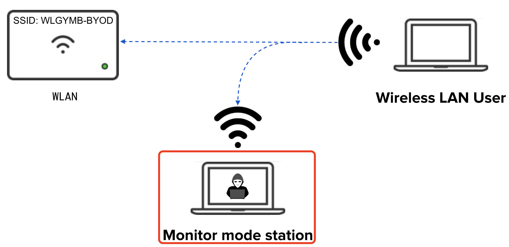

---
sidebar_custom_props:
  id: 2a91ef4a-c9bc-4685-af0f-2fc0ddbf8669
---

import Finding from "@site/src/components/Finding";

# WIFI Sniffing

Eine gängige Attacke um an Login-Daten zu gelangen, ist das sogenannte WIFI-Sniffing. Hier werden zwei Dinge ausgenutzt:

1. Die SSID (Service Set IDentifier, also der Name eines WLAN's) eines Netzwerks kann frei gewählt werden. Es ist auch möglich, dass mehrere WLAN-Netzwerke denselben Namen haben. Für einen Endbenutzer ist es **praktisch nicht möglich** die unterschiedlichen Netzwerke voneinander zu unterscheiden.
2. Die verschickten Datenpakete werden über die Luft übertragen - die verschickten Pakete können nicht nur vom WLAN-Accesspoint empfangen werden, sondern auch von anderen, speziell konfigurierte WLAN-Antennen.



## HTTP Protokoll [^1]

Das _Hypertext Transfer Protocol_ (**HTTP**, englisch für _Hypertext-Übertragungsprotokoll_) ist ein Protokoll zur Übertragung von Daten auf der Anwendungsschicht über ein Rechnernetz. Es wird hauptsächlich eingesetzt, um Webseiten aus dem World Wide Web (WWW) in einen Webbrowser zu laden.

Die Kommunikationseinheiten in HTTP zwischen _Client_ und _Server_ werden als Nachrichten bezeichnet, von denen es zwei unterschiedliche Arten gibt: die **Anfrage** (englisch Request) vom _Client an den Server_ und die **Antwort** (englisch Response) als Reaktion darauf vom _Server zum Client_.

Jede Nachricht besteht dabei aus **zwei Teilen**, dem **Nachrichtenkopf** (englisch Message Header, kurz: Header oder auch HTTP-Header genannt) und dem **Nachrichtenrumpf** (englisch Message Body, kurz: Body). Der Nachrichtenkopf enthält Informationen über den Nachrichtenrumpf wie etwa verwendete Codierungen oder den Inhaltstyp, damit dieser vom Empfänger korrekt interpretiert werden kann. Der Nachrichtenrumpf enthält schliesslich die Nutzdaten.

Wenn in einem Web Browser der Link zur URL http://www.example.net/infotext.html angeklickt wird, so wird an den Server mit dem Hostnamen www.example.net die Anfrage gerichtet, die Ressource /infotext.html zurückzusenden.

Der Name www.example.net wird dabei natürlich zuerst über das DNS-Protokoll in eine IP-Adresse übersetzt. Zur Übertragung wird über _TCP_ eine **HTTP-GET-Anforderung** an den Server gesendet.

:::tip Anfragemethoden

Es gibt verschiedene HTTP Anfragemethoden, die bekannteste ist die `GET` Anfrage, welche eine Ressource anfordert. Sobald zusätzliche Daten an den Server übertragen werden müssen, z.B. um sich anzumelden, wird eine `POST` Anfrage verschickt, in welcher Formulardaten wie z.B. Benutzername und Passwort enthalten sind.  
:::

### HTTPS [^2]

Ohne Verschlüsselung sind Daten, die über das Internet übertragen werden, für jeden, der Zugang zum entsprechenden Netz hat, als Klartext lesbar. Das _Hypertext Transfer Protocol Secure_ (**HTTPS**, englisch für „sicheres Hypertext-Übertragungsprotokoll“) ist ein Syntaktisch identisches Protokoll wie HTTP, nur dass die Daten zusätzlich Verschlüsselt werden. Mit der zunehmenden Verbreitung von offenen (d. h. unverschlüsselten) WLANs nimmt die Bedeutung von HTTPS zu, weil damit die Inhalte unabhängig vom Netz verschlüsselt werden können.

## WIFI-Sniffing: Angriff

Ein Angreifer erzeugt ein öffentliches WLAN-Netzwerk mit derselben SSID wie ein anderes bekanntes Netzwerk, oder setzt sich in ein Restaurant mit einem offenen WLAN. Verbindet sich jemand mit diesem Netzwerk, kann der Angreifer den Netzwerkverkehr überwachen, indem alle verschickten Pakete decodiert werden (**WIFI Sniffing**). Das Decodieren funktioniert allerdings nur dann, wenn es sich um ein **öffentliches WLAN** ohne Passwort handelt. Viele Computer und Smartphones sind so konfiguriert, dass sie automatisch eine Verbindung mit offenen WLANs aufbauen, um der Benutzerschaft maximalen Komfort zu bieten. Besucht ein Benutzer:innen dieses WLANs nun eine Website, kann der Angreifer die Anfrage mitlesen und so bspw. Benutzerstatistiken erheben. Gefährlicher wird es, wenn auf einer Website, die mit dem _HTTP_ Protokoll aufgerufen wird, Passwörter eingegeben werden. Dann können die übermittelten Passwörter nämlich mitgelesen werden.

<Finding title="Wieso funktioniert die Decodierung der Pakete bei Passwortgeschützte WIFIs nicht?">

Passwortgeschützte WIFIs **verschlüsseln** den Inhalt der übertragenen Datenpakete zwischen Ihrem Gerät und dem Accesspoint. Die Decodierung kann nur vom Accesspoint vorgenommen werden.

</Finding>

:::aufgabe Schutz

Wie können Sie sich vor WIFI Sniffing schützen?

<Answer  type="text"  webKey="fa0bde47-cf19-4ae1-891d-40a6e976ce75"/>
:::

<details id="binärdaten-als-hexadezimal-zahl">
<summary>⭐️ Binärdaten als Hexadezimalzahlen</summary>

## Binärdaten als Hexadezimal Zahl

Binärdaten sind für Menschen relativ umständlich zu merken und einzuordnen, da so viele Stellen notwendig sind. Abhilfe schafft das **Hexadezimalsystem**, welches statt Zwei (binär) oder Zehn (dezimal) _Sechzehn_ eindeutige Zeichen besitzt:

```
0 1 2 3 4 5 6 7 8 9 A B C D E F
```

Sehr praktisch: mit einem Hexadezimalzeichen können alle Zustände beschrieben werden, für die sonst **4 bits** notwendig sind.

<div className="small-table">

| Dezimal | Hexadezimal |  Binär |
| ------: | ----------: | -----: |
|       0 |         `0` | `0000` |
|       1 |         `1` | `0001` |
|       2 |         `2` | `0010` |
|       3 |         `3` | `0011` |
|       4 |         `4` | `0100` |
|       5 |         `5` | `0101` |
|       6 |         `6` | `0110` |
|       7 |         `7` | `0111` |
|       8 |         `8` | `1000` |
|       9 |         `9` | `1001` |
|      10 |         `A` | `1010` |
|      11 |         `B` | `1011` |
|      12 |         `C` | `1100` |
|      13 |         `D` | `1101` |
|      14 |         `E` | `1110` |
|      15 |         `F` | `1111` |

</div>

### Konvention 1 Byte = 2 Hexadezimalzahlen

So lassen sich Binärzahlen, aufgeteilt in Bytes (=8 bits) durch zwei Hexadezimal Zahlen beschreiben:

$$\
\begin{aligned}
12_{10} \quad\tilde{=}\quad 0000 \; 1100_{2} \quad & \tilde{=}\quad 0C_{16} \\
19_{10} \quad\tilde{=}\quad 0001 \; 0011_{2} \quad & \tilde{=}\quad 13_{16} \\
42_{10} \quad\tilde{=}\quad 0010 \; 1010_{2} \quad & \tilde{=}\quad 2A_{16} \\
189_{10} \quad\tilde{=}\quad 1011 \; 1101_{2} \quad & \tilde{=}\quad BD_{16}
\end{aligned}$$

</details>

[^1]: Quelle: [Wikipedia: HTTP](https://de.wikipedia.org/wiki/Hypertext_Transfer_Protocol)
[^2]: Quelle: [Wikipedia: HTTPS](https://de.wikipedia.org/wiki/Hypertext_Transfer_Protocol_Secure)
