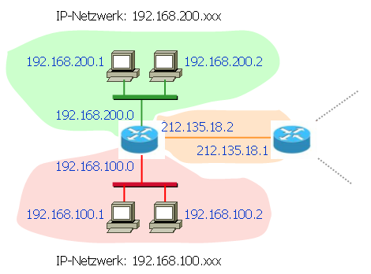

# IP-Adresse [^1]

## Adressen
Sämtliche Geräte in einem Netzwerk müssen eine Adresse erhalten, damit Datenpakete an die richtigen Stellen weitergeleitet werden können.

Im *Internet Protocol* (IP) werden IP-Adressen verwendet. Es gibt zwei Versionen des Internet Protokolls: *IPv4* und *IPv6*.

## IPv4-Adressen

Eine IPv4-Adresse ist eine Folge von **vier Bytes**. Sie besteht also aus 32 Bit, wie im folgenden Beispiel:

`11000000 10101000 11001000 00000001`

Um IP-Adressen besser lesen und austauschen zu können, werden die vier Bytes normalerweise als Dezimalzahlen geschrieben und durch Punkte abgetrennt, also beispielsweise:

`192.168.200.1`

Es gibt $2^{32} = 4'294'967'296$ verschiedene IP-Adressen. Auf den ersten Blick scheint die Anzahl sehr gross zu sein. Durch die Vielzahl an internetfähigen Geräten weltweit sind ein Grossteil der Adressen inzwischen vergeben.

In Zukunft wird es daher ein erweitertes System (IPv6) mit noch viel mehr Adressen geben.

## IPv6-Adressen
Eine IPv6-Adresse besteht aus **16 Bytes**, also aus 128 Bit. Damit gibt es $2^{128}$ verschiedene Adressen. Somit könnte jedes Atom im Universum (ca. $10^{84}$ bis $10^{89}$ ) eine eindeutige IPv6-Adresse erhalten, oder aber auf jedem Quadratmeter der Erdoberfläche könnte man $6.5\cdot10^{23} = 655'570'793'348'866'943'898'599$ mit dem Internet verbundene Geräte stapeln 🤪.

IPv6-Adressen werden als Hexadezimalzahl dargestellt. Dabei werden immer vier hexadezimale Ziffern (vier Byte) zusammengefasst. Als Trennzeichen wird der Doppelpunkt ` : ` verwendet:

`2001:0db8:85a3:08d3::0370:7344`

## ⭐ Adressierung von IP-Teilnetzwerken

Hosts und Router, die ein lokales Netzwerk bilden, erhalten im IP-Adressiersystem einheitliche IP-Adressen.

Alle IP-Adressen des oberen Netzwerkes haben eine IP-Adresse der Gestalt `192.168.200.xxx`, alle IP-Adressen des unteren Netzwerkes eine IP-Adresse der Gestalt `192.168.100.xxx`. Zudem ist der Router in ein weiteres Netzwerk mit IP-Adressen der Gestalt `212.135.18.xxx` eingebunden.

Diese Form der einheitlichen Adressierung erlaubt es, die Zugehörigkeit zu Teilnetzen schnell zu entscheiden. Ein Netzteilnehmer muss hierzu nur die Netzwerkmaske des entsprechenden Teilnetzes (wie z.B. `192.168.200.xxx`) kennen.

[^1]: Quelle: [inf-schule: Fachkonzept IP-Adressierung](https://www.inf-schule.de/rechnernetze/vermittlung/fachkonzept_ipadressierung)
