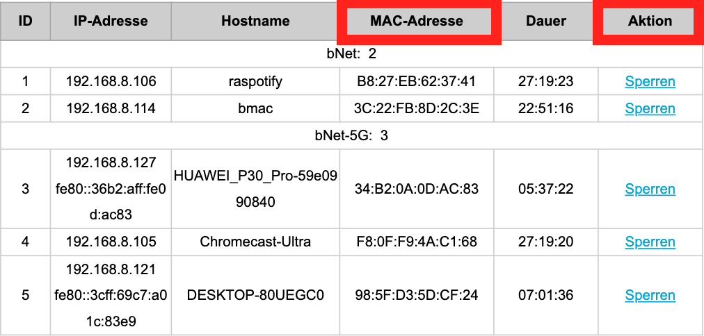

# MAC-Adresse

Die physikalische Adresse, auch Hardware-Adresse eines Computers – genauer gesagt: seiner Netzwerkschnittstelle – nennt man **MAC-Adresse** (*MAC* steht für `Media Access Control` und hat entsprechen nichts mit Apple zu tun). Sie besteht aus 48 Bit oder 6 Bytes, so dass sie üblicherweise als Hexadezimalzahl mit `6×2` Stellen angegeben wird, beispielsweise: `48:2C:6A:1E:59:3D`. Jede MAC-Adresse muss **weltweit eindeutig** sein, damit die Zustellung von Paketen, und somit auch die Transportsicherheit, garantiert werden kann. Die MAC-Adresse wird bei der Herstellung der Netzwerkkarte fix vergeben und kann nicht mehr verändert werden.

## Router-Einstellungen

Der Router ist der Eintrittspunkt zum WWW. Er besitzt zwei Netzwerkkarten (und somit auch zwei MAC-Adressen) - eine für die Verbindung mit Ihrem Gerät, die andere für die Verbindung mit dem ISP (Internet Service Provider). Da die MAC-Adressen nicht geändert werden können, kann der Datenverkehr auch auf Basis der MAC-Adresse gefiltert werden. Bezahlen Sie etwa Ihre Internet-Rechnung nicht, sperrt Ihr Anbieter die Kommunikation mit Ihrem Router - über die MAC Adresse. Dasselbe Prinzip kann aber auch auf die Andere Seite angewandt werden. Wenn Sie plötzlich feststellen, dass sich Ihr Nachbar Ihr WLAN-Passwort erhascht hat, können Sie bei den Router-Einstellungen seine MAC-Adresse ausfindig machen und diese ggf. sperren.

:::aufgabe[MAC-Adresse herausfinden]

Finden Sie die MAC-Adresse Ihres gerätes. Googeln Sie z.b. nach *Wie finde ich meine MAC adresse?"
:::
