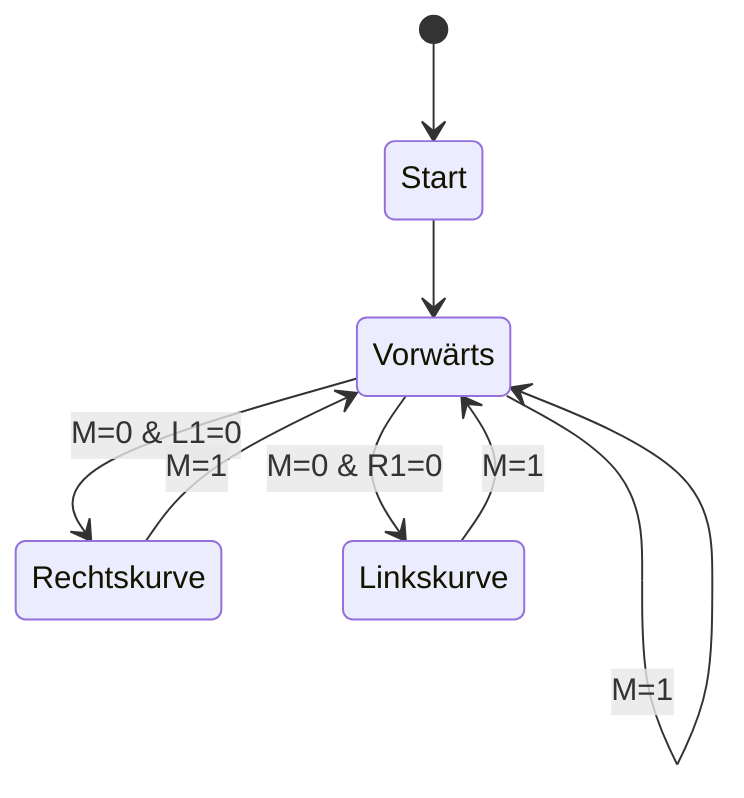
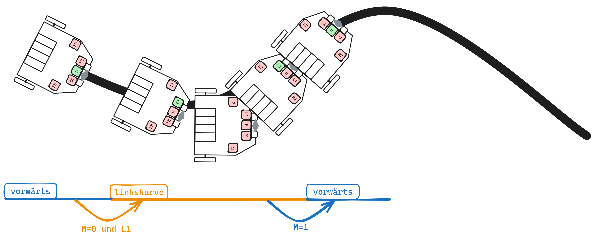
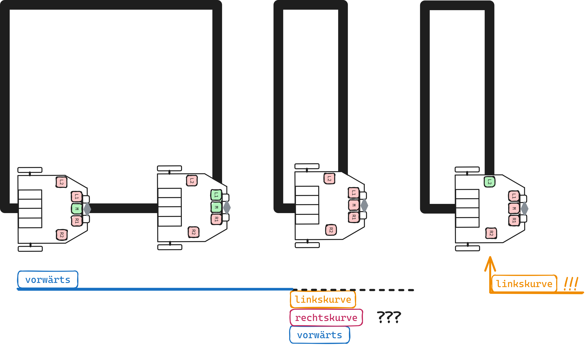
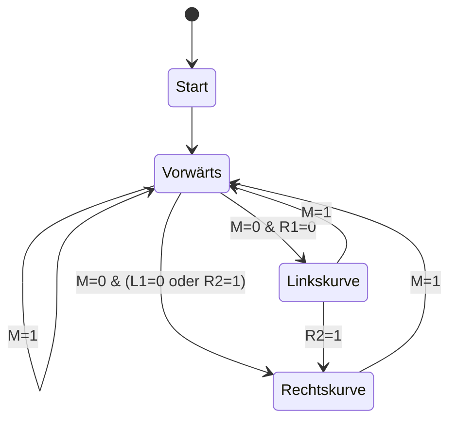

---
sidebar_custom_props:
  id: 3f4d61e1-44e5-4e5c-adbd-a5e95c4dc1d9
---
# Linien Folger

Ein einfacher Ansatz für einen Linienfolger wäre, die Liniensensoren immer zu überprüfen und entsprechend die Motoren anzusteuern:

Sensor M = 1
: Geradeaus fahren
Sensor L1 = 1 und M = 0
: Linkskurve, da nun zu weit rechts
Sensor R1 = 1 und M = 0
: Rechtskurve, da nun zu weit links

In Python würde das etwa so aussehen:

```python
from microbit import *
from maqueen import *
while True:
    if line_sensor(LineSensor.M) == 1:
        motor_run(Motor.ALL, 40)
    elif line_sensor(LineSensor.L1) == 1:
        motor_run(Motor.LEFT, 0)
        motor_run(Motor.RIGHT, 40)
    elif line_sensor(LineSensor.R1) == 1:
        motor_run(Motor.LEFT, 40)
        motor_run(Motor.RIGHT, 0)
```
:::note[Beachte]
Weil zuerst der mittlere Sensor `M` überprüft wird, ist bei den folgenden `elif` Bedingungen bereits **sicher**, dass `M` Null ist, da sonst die erste Bedingung zugetroffen hätte. Deshalb muss nicht noch `... and line_sensor(LineSensor.M)==0` überprüft werden.
:::

Dieser Ansatz funktioniert allerdings nicht zuverlässig 😭.


:::aufgabe
<Answer type="state" webKey="f666e93e-fb45-453d-90bd-a1489dacefea" />

Erklären Sie kurz anhand der obigen Abbilgung, weshalb der einfache Linienfolger nicht zuverlässig funktioniert.

<Answer type="text" webKey="176cf1ac-a450-40f6-a4e2-35688a6c3a1e" />
::: 

## Zustandsdiagramm
Um den Linienfolger robuster und zuverlässiger zu machen, braucht es eine Zustandsmaschine. Der Roboter ist stets nur in einem Zustand. Abhängig von den Sensorwerten wird dann der Zustand gewechselt. In jedem Zustand ist zudem definiert, wie die Motoren angesteuert werden.


:::cards{cols=2 width=390px}
Im Unterricht haben wir folgendes Zustandsdiagramm erarbeitet:

::br
In Python wurde dieses Zustandsdiagramm wie folgt umgesetzt:

```python
from microbit import *
from maqueen import *

zustand = 'vorwärts'

# Zustandsmaschine umsetzen
while True:
    if zustand == 'vorwärts':
        '''
        VORWÄRTSFAHREN
        '''
        # zuerst immer Motoren ansteuern
        # hier: beide Motoren fahren vorwärts
        motor_run(Motor.ALL, 40)
        # dann die Sensoren einlesen
        if line_sensor(LineSensor.M) == 1:
            # alles beim Alten, weiterfahren
            zustand = 'vorwärts'
        elif line_sensor(LineSensor.L1) == 0:
            zustand = 'rechtskurve'
        elif line_sensor(LineSensor.R1) == 0:
            zustand = 'linkskurve'
    elif zustand == 'rechtskurve':
        '''
        RECHTSKURVE FAHREN
        '''
        motor_run(Motor.LEFT, 40)
        motor_run(Motor.RIGHT, 0)
        ...
    elif zustand == 'linkskurve':
        '''
        LINKSKURVE FAHREN
        '''
        motor_run(Motor.LEFT, 0)
        motor_run(Motor.RIGHT, 40)
        ...
```
:::
:::note[Beachte]
Mit diesem Zustandsdiagramm ist es nicht möglich, von einer Rechtskurve direkt zu einer Linkskurve überzugehen.
:::

Mit diesem Ansatz ist es nun auch möglich, den Roboter zuverlässig auf der Linie zu halten.



:::tip[Zustandsübergänge]
Zustandsübergänge werden **nur durch die Sensoren** ausgelöst. Somit spielt es keine Rolle, wenn im Zustand __Linkskurve__ der Sensor __L1__ plötzlich wieder weiss sieht. Der Roboter wird weiterhin eine Linkskurve fahren, bis der Sensor __M__ wieder schwarz sieht.
:::

## Ecken erkennen

Obiger Ansatz funktioniert gut, aber nicht perfekt.



:::danger[Probleme]
Geradeaus
: ❌
: Der Liniensensor nimmt gleichzeitig bei __M__, __R1__ und __L1__ weiss wahr. Da __M__ bis zuletzt aber schwarz war, wird der Roboter weiterhin geradeaus fahren.
Rechtskurve
: ❌ 
: Der Roboter fährt etwas schief nach rechts. 
: Vor dem Verlassen der Linie haben sowohl __M__ wie auch __R1__ schwarz gemessen. 
: Wegen der Schiefen Lage verlässt __M__ zuerst die Linie, weshalb der Roboter eine **Rechtskurve** fährt.
Linkskurve
: ✅
: Der Roboter fährt etwas schief nach links.
: Vor dem Verlassen der Linie haben sowohl __M__ wie auch __L1__ schwarz gemessen.
: Wegen der Schiefen Lage verlässt __M__ zuerst die Linie, weshalb der Roboter eine **Linkskurve** fährt.
:::

Anpassungen:




:::aufgabe
<Answer type="state" webKey="b7442dd1-cb2f-4dfd-8396-01540ad13b61" />

Wann sollte der Roboter vom Zustand __Rechtskurve__ in den Zustand __Linkskurve__ wechseln?

<Answer type="text" webKey="01b8449e-61b4-4f28-9839-f2587ca6a2a3" />

Programmieren Sie die zusätzlichen Überprüfungen und testen Sie Ihr Roboter.
:::