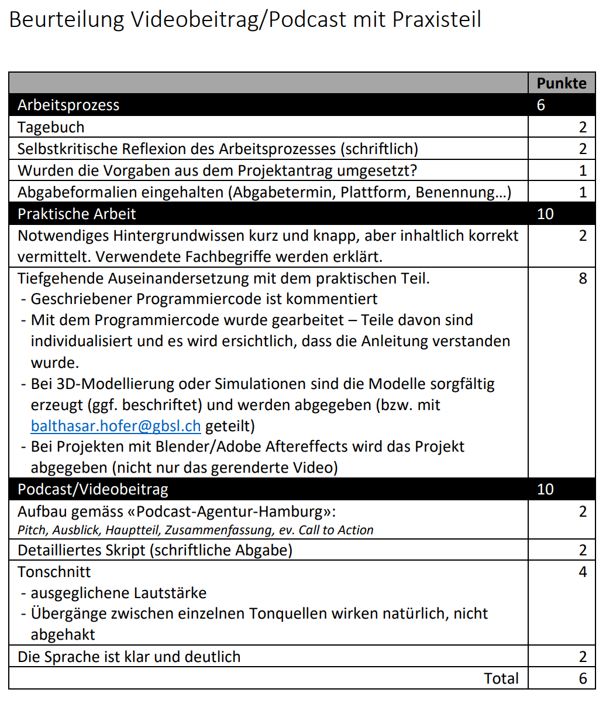

import OsTabs from '@site/src/components/OsTabs';
import TabItem from '@theme/TabItem';
import Answer from '@site/src/components/Answer';

# Projekt: Partnerpraktikum

Im Partnerpraktikum suchen Sie sich in Zweiergruppen selbständig ein Thema aus, welches Sie interessiert.

:::success Abgabe per [OneDrive](https://erzbe-my.sharepoint.com/:f:/g/personal/balthasar_hofer_gbsl_ch/EjYULtxVY2JEpvpliLzFdNQBjoQqzTXeQUvrJyodr9-3Fg) bis am 22.06.2022 um 20:00 Uhr

**Abgabe**: Bis am 22.06.2022 um **20:00 Uhr**

Es wird ein **.zip-Ordner** mit dem Namen `name_vorname.zip` (bzw. für Gruppen `name1_vorname1_name2_vorname2.zip`) per untenstehndem *Hochladen-Knopf* auf OneDrive abgegeben.

Darin enthalten sind:

| Was                                              | Format                |                                Dateiname |
| :----------------------------------------------- | :-------------------- | ---------------------------------------: |
| Selbstkritische Reflexion (eine pro Gruppe)      | `.pdf`                |                          `reflexion.pdf` |
| Podcast / Videobeitrag                           | `.mp3` /   `.mp4` | `podcast.mp3` /   `videobeitrag.mp4` |
| Skript (Gliederung) des Podcasts / Videobeitrags | `.pdf`                |                             `skript.pdf` |
| Projektmaterial (Programmcode, Projektdateien)   | Ordner                |                              `material/` |
| (ev. Tagebucheinträge \*)                        | `.pdf`                |                   `tagebuch_vorname.pdf` |

\* Wer das Tagebuch nicht auf der Website erfasst hat, kann dieses auch als PDF abgeben. Die auf der Website erfassten Tagebücher werden zum Abgabezeitpunkt eingesammelt.

[@upload Projekt hochladen](https://erzbe-my.sharepoint.com/:f:/g/personal/balthasar_hofer_gbsl_ch/EjYULtxVY2JEpvpliLzFdNQBjoQqzTXeQUvrJyodr9-3Fg)

:::

## Ablauf

**Gruppengrösse**: max. 2 Personen

Suchen Sie sich ein Thema, in welches Sie sich innerhalb von 5 Doppellektionen einarbeiten können. Ihr Projekt darf auch einen praktischen Teil beinhalten (muss aber nicht).

Das Endprodukt ihres Projekts ist ein **Podcast** oder wenn Visualisierungen zwingend sind ein Videobeitrag. Zudem wird eine schriftliche Reflexion zum Arbeitsprozess und dem Projekt verfasst, der in die Beurteilung einfliesst.

## Beurteilung

### Selbstkritische Reflexion

In der schriftlichen Selbstreflexion blicken Sie auf Ihr Praktikumsprojekt zurück. Sie gehen dabei auf die folgenden Punkte ein und beleuchten diese differenziert und durchaus selbstkritisch:
- Arbeitsprozess
  - Zeiteinteilung
  - Nutzen der Unterrichtszeit
  - Nutzen von Hilfestellungen
  - Konzentrationsphasen
  - ev. Arbeiten und Koordination im Team
- Lernerfolg
  - Wie viel konnte ich neu dazulernen?
  - Bin ich zufrieden damit? 
  - Wo hätten Sie sich mehr erwünscht? 
  - Inwiefern wurden Ihre Erwartungen an die Lernerfahrung erfüllt?
- Podcast
  - Wie zufrieden sind Sie mit dem Podcast/Videobeitrag?
  - Wo bestünde noch Verbesserungspotential?
- Selbstbeurteilung
  - Wie beurteilen Sie Ihre Leistung? 
  - Was würden Sie anders machen, was würden Sie besser machen? 
  - Sind Sie zufrieden mit dem Endprodukt? 
  - Wo liegen die Stärken, wo die schwächen Ihres Projekts? 
  - Was gefiel Ihnen gut? 
  - Was gefiel Ihnen weniger gut? 
  - Welche Aspekte erscheinen Ihnen besonders relevant/erwähnenswert?

Die selbstkritische Reflexion sollte im Minimum **500** Wörter lang sein.

---

:::info Verfügbare Hardware an der Schule
Die Schule bietet begrenzte Hardware-Stückzahlen, um sich z.B. im Rahmen eines Hardware-Projekts mit den Möglichkeiten der folgenden Geräte\* auseinanderzusetzen.
- Micro:Bit Platine
- Maqueen Roboter (Gesteuert über Micro:Bit)
- 3D Drucker
- EV3 Roboter (können nur an der Schule gebraucht werden)
- Arduinos inkl. mehrerer Sensoren, WLAN-Kompatibel
- Raspberry PI 3 (ohne WIFI)
- LoRaWan Modul (LILYGO® TTGO Meshtastic T-Beam V1.1 ESP32 LoRa 433/868/915/923Mhz Wireless Module WiFi GPS NEO-6M With OLED Display for Arduino)

\* *Erfordert die Rücksprache mit Herrn Hofer, um die Verfügbarkeiten zu organisieren*
:::

### 1. Themenwahl und Ideensuche 

Informieren Sie sich über Themen, die Sie spannend finden. Tauschen Sie sich anschliessend mit den Klassenkamerad:innen aus und finden Sie eine Projektpartner:in, welche Ihre Interessen teilt. Entscheiden Sie sich für ein Thema und schreiben Sie einen Projektantrag in folgender Vorlage:

[@download Vorlage Herunterladen](https://erzbe-my.sharepoint.com/:w:/g/personal/balthasar_hofer_gbsl_ch/EcKlfnWD2TtLspneUsiwOsMBQR7xaockSJxd3gWfmRBeXQ?e=rs2BeS)

Füllen Sie den Projektantrag aus und laden Sie den Antrag bis am Mittwoch, 11.05.2022 um 22:00 Uhr hoch:

[@upload Projektantrag Hochladen](https://erzbe-my.sharepoint.com/:f:/g/personal/balthasar_hofer_gbsl_ch/EngM_xyRiRtJrKMFIdUqLZYBBbeRRRhusbCxkwRb-x5PqA)

:::success Arbeitstagebuch Woche 1
<Answer type="text" webKey="333ae706-c77e-465f-9273-bef1881c0f7a" />
:::

### 2. Umsetzung des Projekts starten

Projektantrag gemäss Rückmeldung anpassen und mit der Umsetzung starten.

:::success Arbeitstagebuch Woche 2
<Answer type="text" webKey="ea52e8bd-853a-4485-9bf5-47975c622d95" />
:::

### 3. Woche
Selbständiges Arbeiten an den Projekten. Holen Sie sich bei Fragen oder Unklarheiten frühzeitig Hilfe bei Herrn Hofer.

:::success Arbeitstagebuch Woche 3
<Answer type="text" webKey="0955d986-daef-4df3-aa2b-c9f47dcde123" />
:::

### 4. Woche
Selbständiges Arbeiten an den Projekten. Holen Sie sich bei Fragen oder Unklarheiten frühzeitig Hilfe bei Herrn Hofer.

:::success Arbeitstagebuch Woche 4
<Answer type="text" webKey="0881427c-f098-4059-8727-813cebef5315" />
:::

### 5. Letzte Woche(n)
Vorbereitung und Aufnehmen der Podcasts

:::success Arbeitstagebuch Woche 5
<Answer type="text" webKey="52a1172b-ae18-464d-8772-0a4d419b9bf8" />
:::

:::success (Arbeitstagebuch Woche 6)
<Answer type="text" webKey="55889af3-43f7-47cf-84fb-35c01fdcf28a" />
:::

## Ideensammlung

Mögliche Ideen - Sie dürfen aber auch einen eigenen Projektvorschlag ausarbeiten.

### Algorithmen
#### Programmieren von zufälligen Labyrinthen

[@youtube](https://www.youtube-nocookie.com/embed/zRuVhq0Kgnw)

#### Wie funktionieren Bitcoins?
Sie setzen sich mit dem Thema Blockchain und Bitcoins auseinander. 

### Big Data / Data Mining

#### Was ist Big Data und wie beeinflusst es unser Leben?
Sie lesen zum Beispiel das Buch von Hannah Fry[^1] und beleuchten den kritisch den Einfluss der permanenten Datensammlung auf unsere Gesellschaft.

[@download --download Herunterladen](https://erzbe-my.sharepoint.com/:b:/g/personal/balthasar_hofer_gbsl_ch/Ef6zr_CP9kdNlGNj5ABP_DUBMkbxk7ptsspnIhkqVhNgtg?e=xIIKE2)

### Simulation
Mit Simulationen lässt sich die Wirklichkeit modellhaft abbilden und darin können Theorien überprüft und getestet werden.

#### Insightmaker
Sie arbeiten sich in ein Simulationsprogramm, bspw. ins kostenlose [Insightmaker](https://insightmaker.com), ein und modellieren damit ein Phänomen wie etwa eine Räuber-Beute-Beziehung, eine Monte-Carlos Simulation oder das Game of Life.

Die beiden Seiten https://oinf.ch/kurs/simulationen und https://craft.dos/bwNrfufaSrdE3V geben einen guten Überblick und Hilfestellungen für das Vorgehen und entsprechende Simulationen.

### Sensoren

#### Feuchtigkeits- und Temperaturanzeige
Sie schliessen einen Feuchtigkeitssensor sowie einen Temperatursensor an einen Arduino an. Über die Arduino IDE werden die Sensorwerte eingelesen und auf einem Ausgabegerät angezeigt.

### Machine Learning
#### Artificial Intelligence, Machine Learning, Deep Learning - was bedeuten diese Begriffe?

Sie recherchieren über die Bedeutung der Modewörter AI, ML und DL und setzen diese in einen Kontext.

https://www.mygreatlearning.com/blog/what-is-artificial-intelligence/

#### Wie funktionieren Suchvorschläge auf Google?

Sie lesen sich ins Buch von Tommaso Teofili, [Deep Learning for Search_2019](https://www.manning.com/books/deep-learning-for-search)[^1] ein und berichten über die Funktionsweise von Suchalgorithmen.

> A practical approach that shows you the state of the art in using neural networks, AI, and deep learning in the development of search engines.

[@download Herunterladen](https://erzbe-my.sharepoint.com/:b:/g/personal/balthasar_hofer_gbsl_ch/Ec6EDPPeV8ZFuZ137SimNOwBtbqfQDqe6nWwlzjNVWKkcQ?e=qjlZVW)

[^1]: *Die Buchausschnitte sind urheberrechtlich geschützt und dürfen ausschliesslich für den schulischen Gebrauch verwendet werden. Die Weitergabe ist verboten.*
