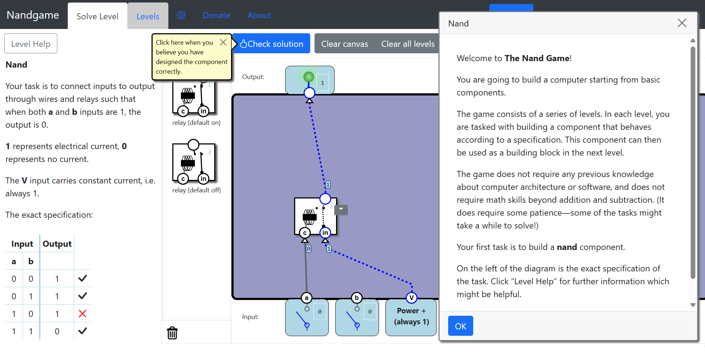
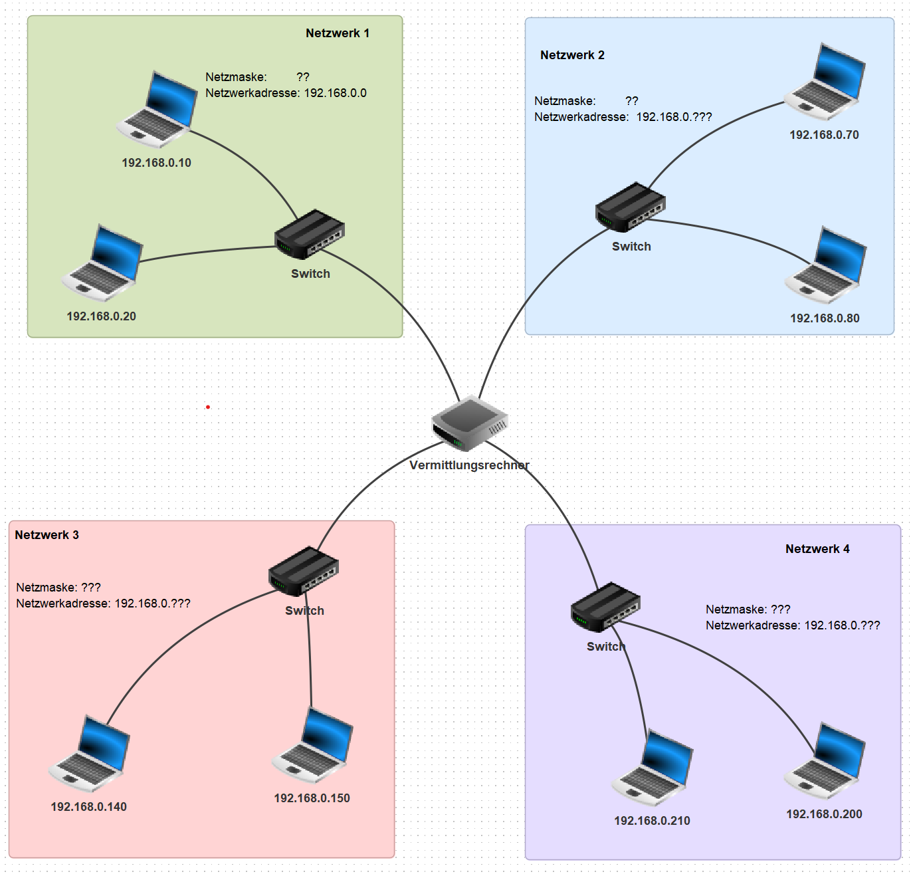

import BrowserWindow from '@site/src/components/BrowserWindow';

# Projekt: Partnerpraktikum

:::info[TL;DR]
Gruppengrösse
: 2, Partnerarbeit
Termin 1: Projektantrag
: Freitag 17.05.2024, 23:59 Uhr
: [👉 Vorlage](https://erzbe-my.sharepoint.com/:w:/g/personal/balthasar_hofer_gbsl_ch/EcKlfnWD2TtLspneUsiwOsMBQR7xaockSJxd3gWfmRBeXQ?e=KtxPNg)
: __klasse-vorname1-vorname2.docx__
: [👉 Abgabe Projektantrag auf OneDrive](https://erzbe-my.sharepoint.com/:f:/g/personal/balthasar_hofer_gbsl_ch/EtaOnSU-gFdGqEgpYn9lGp4Bvyo5ylGxCJAxdUFXgXJfUA)
Termin 2: Finale Abgabe
: 19.06.2024, 22:00 Uhr
: __klasse-vorname1-vorname2.zip__
: [👉 Finale Abgabe auf OneDrive](https://erzbe-my.sharepoint.com/:f:/g/personal/balthasar_hofer_gbsl_ch/EsYF-OU38VJLpTUvEay-LsAB6vX6fedk1YSM1eIG4YJkyA)
:::

Im Partnerpraktikum suchen Sie sich in **Zweiergruppen** selbständig ein Thema aus, welches Sie **interessiert**.

## Ablauf

**Gruppengrösse**: max. 2 Personen

Suchen Sie sich ein Thema, in welches Sie sich innerhalb von 5 Doppellektionen einarbeiten können. Ihr Projekt darf auch einen praktischen Teil beinhalten (muss aber nicht).

Das Endprodukt ihres Projekts ist ein **4-7 Minuten** langer **Podcast** oder, wenn Visualisierungen zwingen sind, ein **Videobeitrag**. Zudem wird eine schriftliche Reflexion zum Arbeitsprozess und dem Projekt verfasst, die in die Beurteilung einfliesst.

## Beurteilung

<Tabs
  values={[
    {label: 'Theoretische Arbeit', value: 'theorie'},
    {label: 'Praktische Arbeit', value: 'praktisch'},
  ]}>
<TabItem value="theorie">

</TabItem>
<TabItem value="praktisch">

</TabItem>
</Tabs>

### Selbstkritische Reflexion

In der schriftlichen Selbstreflexion blicken Sie auf Ihr Praktikumsprojekt zurück. Sie gehen dabei auf die folgenden Punkte ein und beleuchten diese differenziert und durchaus selbstkritisch:
- Arbeitsprozess
  - Zeiteinteilung
  - Nutzen der Unterrichtszeit
  - Nutzen von Hilfestellungen
  - Konzentrationsphasen
  - ev. Arbeiten und Koordination im Team
- Lernerfolg
  - Wie viel konnte ich neu dazulernen?
  - Bin ich zufrieden damit? 
  - Wo hätten Sie sich mehr erwünscht? 
  - Inwiefern wurden Ihre Erwartungen an die Lernerfahrung erfüllt?
- Podcast/Videobeitrag
  - Wie zufrieden sind Sie mit dem Podcast/Videobeitrag?
  - Wo bestünde noch Verbesserungspotential?
- Selbstbeurteilung
  - Wie beurteilen Sie Ihre Leistung? 
  - Was würden Sie anders machen, was würden Sie besser machen? 
  - Sind Sie zufrieden mit dem Endprodukt? 
  - Wo liegen die Stärken, wo die schwächen Ihres Projekts? 
  - Was gefiel Ihnen gut? 
  - Was gefiel Ihnen weniger gut? 
  - Welche Aspekte erscheinen Ihnen besonders relevant/erwähnenswert?

Die selbstkritische Reflexion sollte im Minimum **500** Wörter lang sein.

---

:::info[Verfügbare Hardware an der Schule]
Die Schule bietet begrenzte Hardware-Stückzahlen, um sich z.B. im Rahmen eines Hardware-Projekts mit den Möglichkeiten der folgenden Geräte\* auseinanderzusetzen.
- Micro\:Bit Platine
- Maqueen Roboter (Gesteuert über Micro\:Bit)
- 3D Drucker
- EV3 Roboter (können nur an der Schule gebraucht werden)
- Arduinos inkl. mehrerer Sensoren, WLAN-Kompatibel
- ESP32 inkl. WLAN
- Raspberry PI 3 (ohne WIFI)

\* *Erfordert die Rücksprache mit Herrn Hofer, um die Verfügbarkeiten zu organisieren*
:::

### 1. Themenwahl und Ideensuche 

Informieren Sie sich über Themen, die Sie spannend finden. Tauschen Sie sich anschliessend mit den Klassenkamerad:innen aus und finden Sie eine Projektpartner:in, welche Ihre Interessen teilt. Entscheiden Sie sich für ein Thema und schreiben Sie einen Projektantrag in folgender [👉 Vorlage](https://erzbe-my.sharepoint.com/:w:/g/personal/balthasar_hofer_gbsl_ch/EcKlfnWD2TtLspneUsiwOsMBQR7xaockSJxd3gWfmRBeXQ?e=KtxPNg).

Füllen Sie den Projektantrag aus und laden Sie den Antrag bis am Freitag Abend, 17.05.2024, 23:59 Uhr hoch auf: [👉 OneDrive Projektantrag](https://erzbe-my.sharepoint.com/:f:/g/personal/balthasar_hofer_gbsl_ch/EtaOnSU-gFdGqEgpYn9lGp4Bvyo5ylGxCJAxdUFXgXJfUA)

:::success[Arbeitstagebuch Woche 1]
<Answer type="text" webKey="333ae706-c77e-465f-9273-bef1881c0f7a" />
:::

### 2. Umsetzung des Projekts starten

Projektantrag gemäss Rückmeldung anpassen und mit der Umsetzung starten.

:::success[Arbeitstagebuch Woche 2]
<Answer type="text" webKey="ea52e8bd-853a-4485-9bf5-47975c622d95" />
:::

### 3. Woche
Selbständiges Arbeiten an den Projekten. Holen Sie sich bei Fragen oder Unklarheiten frühzeitig Hilfe bei Herrn Hofer.

:::success[Arbeitstagebuch Woche 3]
<Answer type="text" webKey="0955d986-daef-4df3-aa2b-c9f47dcde123" />
:::

### 4. Woche
Selbständiges Arbeiten an den Projekten. Holen Sie sich bei Fragen oder Unklarheiten frühzeitig Hilfe bei Herrn Hofer.

:::success[Arbeitstagebuch Woche 4]
<Answer type="text" webKey="0881427c-f098-4059-8727-813cebef5315" />
:::

### 5. Letzte Woche
Vorbereitung und Aufnehmen der Podcasts

:::success[Arbeitstagebuch Woche 5]
<Answer type="text" webKey="f86c4f09-cd01-465d-95bf-96d9f04f66a7" />
:::

## Ideensammlung

Mögliche Ideen - Sie dürfen aber auch einen eigenen Projektvorschlag ausarbeiten.

### Algorithmen
#### Programmieren von zufälligen Labyrinthen

Programmieren eines simplen Labyrinths, welches zufällig generiert wird. Sie setzen sich mit Algorithmen auseinander und programmieren ein Labyrinth, welches zufällig generiert und allenfalls auch gelöst wird.

:::details
::youtube[https://www.youtube-nocookie.com/embed/zRuVhq0Kgnw]
:::

#### Wie funktioniert Kryptowährung / Bitcoin?
Sie setzen sich mit dem Thema Blockchain und Bitcoins auseinander. 

### Modellieren

#### 3D Modelle & 3D-Druck

Einarbeitung in ein 3D-Druck Programm: [👉 10 CAD Programme](https://all3dp.com/de/2/3d-drucker-cad-program-kostenlos/)

Für **Fusion 360** kann ein Kurs zur Verfügung gestellt werden, in welchem man die Grundlagen der technischen Modellierung lernt und ein eigenes Modell erstellt.

::video[./images/AsyncEncryptionBox.mp4]{autoplay loop maxWidth=350px marginLeft=auto marginRight=auto display=block}

An der Schule kann mit einem Prusa i3 MK3S+ mit MMU2 (Mehrfarbendruck) gedruckt werden.

#### Einarbeitung in Blender

[👉 Blender](https://www.blender.org/)

::youtube[https://www.youtube-nocookie.com/embed/LJ9dvcpsatg]

### Hardware

#### Logische Gatter: Addieren nur mit Strom

Was sind logische Bausteine, wie kann damit gerechnet werden? Sie erarbeiten sich mit einem Kurs ein Verständnis über die Funktionsweise von logischen Bausteinen und bauen einen Rechner, der nur mit Strom addieren kann. Optional: nicht nur im Simulator, sondern mit echten Bauteilen.

Kurs
: [👉 Logische Gatter](https://docs.ofi.gbsl.website/Computer/gates)

#### Rechnen mit Strom
Wie funktioniert ein Computer? Wie funktioniert ein Prozessor? Wie funktioniert ein Speicher? Wie funktioniert ein Netzteil? Wie funktioniert ein Motherboard? Wie funktioniert ein Monitor? Wie funktioniert ein Betriebssystem?

Nand-Game
: [👉 nandgame.com](https://www.nandgame.com/)

### Website Erstellen

#### Einfache Webseite erstellen
Sie erstellen eine simple Webseite und lernen, wie eine Webseite aufgebaut ist. Sie lernen dabei die Grundzüge von HTML, CSS und JavaScript und wie diese interagieren.

<BrowserWindow>

</BrowserWindow>

#### Blog-Webseite erstellen

Sie erstellen eine Blog-Webseite mit bspw. [👉 Docusaurus](https://docusaurus.io/) und veröffentlichen diese, bspw. unter GitHub.

<BrowserWindow url="https://docusaurus.io">

</BrowserWindow>

### Netzwerk

Netzwerksimulation mit Filius - wie funktioniert das Internet im Detail? Was ist eine MAC-Adresse, was sind ARP-Tabellen und wie ist ein hierarchisches Netzwerk aufgebaut?

### Sensoren

#### Feuchtigkeits- und Temperaturanzeige
Sie schliessen einen Feuchtigkeitssensor sowie einen Temperatursensor an einen Arduino an. Über die Arduino IDE werden die Sensorwerte eingelesen und auf einem Ausgabegerät angezeigt.

### Home-Automation / IoT

Einarbeitung in Node-RED - automatisch Telegram-Nachrichten verschicken - z.B. mit dem aktuellen Mensa-Menü.

### Machine Learning

#### Intelligenter Chatbot / ChatGPT
- Kritische Sicht auf den Chat-Bot
- Hintergründe
- Was ermöglicht mir ChatGPT? Kann ich damit etwas programmieren? Eine Webseite machen? Kunst erstellen? ...
- Zwingend: Ein Experiment, welches Stärken und Schwächen vom Chatbot aufzeigt.
- 

[👉 Aktueller TED Talk](https://www.ted.com/talks/imran_chaudhri_the_disappearing_computer_and_a_world_where_you_can_take_ai_everywhere): Wenn Mensch und AI verschmelzen.

#### Wie funktionieren Suchvorschläge auf Google?

Sie lesen sich ins Buch von Tommaso Teofili, [Deep Learning for Search_2019](https://www.manning.com/books/deep-learning-for-search)[^1] ein und berichten über die Funktionsweise von Suchalgorithmen.

> A practical approach that shows you the state of the art in using neural networks, AI, and deep learning in the development of search engines.

## Abgabe
:::success[Abgabe]

Es wird ein **.zip-Ordner** mit dem Namen `name_vorname.zip` (bzw. für Gruppen `name1-vorname1 name2-vorname2.zip`) per obigem OneDrive-Link abgegeben.

Darin enthalten sind:

| Was                                              | Format                |                                Dateiname |
| :----------------------------------------------- | :-------------------- | ---------------------------------------: |
| Selbstkritische Reflexion (eine pro Gruppe)      | `.pdf`                |                          `reflexion.pdf` |
| Podcast / Videobeitrag                           | `.mp3` /   `.mp4` | `podcast.mp3` /   `videobeitrag.mp4` |
| Skript (Gliederung) des Podcasts / Videobeitrags | `.pdf`                |                             `skript.pdf` |
| Projektmaterial (Programmcode, Projektdateien)   | Ordner                |                              `material/` |
| (ev. Tagebucheinträge \*)                        | `.pdf`                |                   `tagebuch_vorname.pdf` |

\* Wer das Tagebuch nicht auf der Website erfasst hat, kann dieses auch als PDF abgeben. Die auf der Website erfassten Tagebücher werden zum Abgabezeitpunkt eingesammelt.
:::

[^1]: *Die Buchausschnitte sind urheberrechtlich geschützt und dürfen ausschliesslich für den schulischen Gebrauch verwendet werden. Die Weitergabe ist verboten.*
