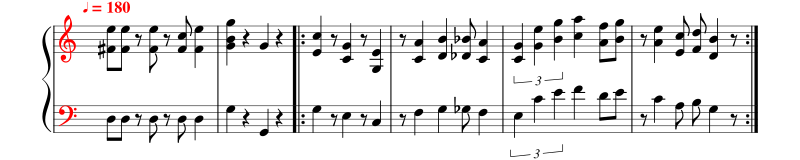

import useBaseUrl from '@docusaurus/useBaseUrl';

# Notenblatt [^1]

Ein Notenblatt ist ein Algorithmus, welches den Prozess «Musikstück spielen» beschreibt. Notenblätter sind in einer symbolischen Sprache, der **Notenschrift**, verfasst.

## Schritt

Ein einzelner Schritt in der Notenschrift ist eine Note oder eine Pause. Im folgenden beschreiben die ersten drei übereinanderliegenden Noten «Spiele einen Akkord bestehend aus einem kleinen `d`, einem eingestrichenen `fis'` und einem zweigestrichenen `e''` von einem Achtel Länge».

## Wiederholung

In der Notenschrift wird durch Wiederholungszeichen (rot) angezeigt, dass die dazwischenliegenden Takte wiederholt werden sollen:

Eine andere Variante ist die Anweisung D.S. (Dal Segno, _«vom Zeichen»_). Gemeint ist, dass das Stück von einem bezeichneten Punkt an (meist mit dem Zeichen `║:`) wiederholt wird.

## Bedingte Ausführung

Einer oder mehrere Schritte werden manchmal nur unter bestimmten Bedingungen ausgeführt. Auf einem Notenblatt wird mit sogenannten Voltenklammern (rot) gekennzeichnet, dass ein Takt nur im ersten oder zweiten Durchgang gespielt werden soll.

In der folgenden Zeile wird also der dritte Takt nur im ersten und der vierte Takt nur im zweiten Durchgang gespielt:

:::cards
So tönt der erste Durchgang:
<audio controls>
    <source src={useBaseUrl('/sounds/music-conditional-1.mp3')} type="audio/mpeg"/>
</audio>
***
So tönt der zweite Durchgang:
<audio controls>
    <source src={useBaseUrl('/sounds/music-conditional-2.mp3')} type="audio/mpeg"/>
</audio>
:::

## Parameter

Durch die Noten alleine sind die Länge und die Höhe nur relativ festgelegt.

Erst durch die Tempoangabe ♩=180 wird festgelegt, dass pro Minute 180 Viertelnoten gespielt werden sollen. Mit Violin- und Bassschlüssel wird festgelegt, auf welcher Notenlinie das g' bzw. das f liegt und somit in welcher Höhe die Noten gespielt werden sollen.

Tempoangabe und Notenschlüssel sind Parameter eines Notenblatts, deren Änderung die Bedeutung aller Noten und somit das gespielte Stück ändert.

## Beispiel

Auf der Website [musescore.com](https://musescore.com/sheetmusic) sind Notenblätter für viele Musikstücke verfügbar und können dort auch gleich abgespielt werden. Hier sind Ausschnitte aus folgenden Stücken verwendet worden:

- [Super Mario Bros: Main Theme](https://musescore.com/user/2072681/scores/2601926)
- [Jingle Bells](https://musescore.com/user/685336/scores/4797212)

[^1]: Quelle [rothe.io](https://rothe.io/?page=prog1/1-algo/3-sheet-music/)
