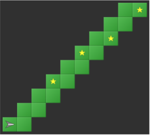
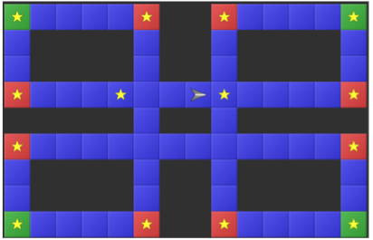
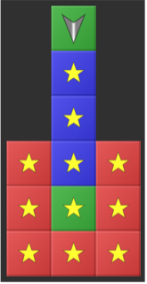

---
sidebar_custom_props:
  id: 338d80ab-b54a-4415-8f02-f4220eb2e35e
---

# RoboZZle

<iframe width="100%" height="315" src="https://www.youtube-nocookie.com/embed/MmqBVWi_Pc0?start=21" title="YouTube video player" frameBorder="0" allow="accelerometer; autoplay; clipboard-write; encrypted-media; gyroscope; picture-in-picture" allowFullScreen></iframe>

:::aufgabe Aufgabe 1

[Puzzle 1](http://www.robozzle.com/beta/index.html?puzzle=12419)

<Answer  type="array"  webKey="49f55f64-13b9-4f15-b138-1335c09281b5" label="Lösung F1"  size={4} select={['', '↑', '↰', '↱']}/>

:::

:::aufgabe Aufgabe 2

[Puzzle 2](http://www.robozzle.com/beta/index.html?puzzle=2741)

<Answer  type="array"  webKey="2b9029cf-9593-4ab8-a49a-eec034c27b0c" label="Lösung F1"  size={3} select={['', '↑', '↰', '↱', 'F1']}/>

:::

:::aufgabe Aufgabe 3

[Puzzle 3](http://www.robozzle.com/beta/index.html?puzzle=10858)

<Answer  type="array"  webKey="f8f87665-1d2b-4559-b3ba-fbd604061d2a" label="Lösung F1"  size={7} select={['', '↑', '↰', '↱', 'F1']}/>

:::

:::aufgabe Aufgabe 4

[Puzzle 4](http://www.robozzle.com/beta/index.html?puzzle=12511)

<Answer  type="array"  webKey="d3b5b747-6a4d-4658-a05f-0026e20ce326" label="Lösung F1"  size={5} select={['', '↑', '↰', '↱', 'F1']}/>

:::

:::aufgabe Aufgabe 5

[Puzzle 5](http://www.robozzle.com/beta/index.html?puzzle=10895)

<Answer  type="array"  webKey="13b53721-50de-4630-abe7-7f1cd5f4ea8e" label="Lösung F1"  size={4} select={['', '↑', '↰', '↱', 'F1', '↑--blue', '↰--blue', '↱--blue', 'F1--blue', '↑--red', '↰--red', '↱--red', 'F1--red', '↑--green', '↰--green', '↱--green', 'F1--green']}/>

:::

:::aufgabe Aufgabe 6.

[Puzzle 6](http://www.robozzle.com/beta/index.html?puzzle=10048)

<Answer  type="array"  webKey="ef5632a1-8885-415d-a1dc-50b810b19ba2" label="Lösung F1"  size={5} select={['', '↑', '↰', '↱', 'F1', 'F2', '↑--blue', '↰--blue', '↱--blue', 'F1--blue', 'F2--blue', '↑--red', '↰--red', '↱--red', 'F1--red', 'F2--red', '↑--green', '↰--green', '↱--green', 'F1--green', 'F2--green']}/>
<Answer  type="array"  webKey="49c1b7a8-b457-437a-a147-a5ad75c7f2fe" label="Lösung F2"  size={5} select={['', '↑', '↰', '↱', 'F1', 'F2', '↑--blue', '↰--blue', '↱--blue', 'F1--blue', 'F2--blue', '↑--red', '↰--red', '↱--red', 'F1--red', 'F2--red', '↑--green', '↰--green', '↱--green', 'F1--green', 'F2--green']}/>

:::

:::aufgabe Aufgabe 7.

[Puzzle 7](http://www.robozzle.com/beta/index.html?puzzle=2748)

<Answer  type="array"  webKey="1f50b198-7ef4-48b6-bbdc-68452baa7952" label="Lösung F1"  size={4} select={['', '↑', '↰', '↱', 'F1', '↑--blue', '↰--blue', '↱--blue', 'F1--blue', '↑--red', '↰--red', '↱--red', 'F1--red', '↑--green', '↰--green', '↱--green', 'F1--green']}/>

:::

:::aufgabe Aufgabe 8.

[Puzzle 8](http://www.robozzle.com/beta/index.html?puzzle=140)

<Answer  type="array"  webKey="59c65a0b-5ae1-4287-b25f-567b598a67a4" label="Lösung F1"  size={6} select={['', '↑', '↰', '↱', 'F1', '↑--blue', '↰--blue', '↱--blue', 'F1--blue', '↑--red', '↰--red', '↱--red', 'F1--red', '↑--green', '↰--green', '↱--green', 'F1--green']}/>

:::

:::aufgabe Aufgabe 9.

[Puzzle 9](http://www.robozzle.com/beta/index.html?puzzle=1040)

<Answer  type="array"  webKey="a290e5cd-caae-4dc5-acfb-e435f072645c" label="Lösung F1"  size={4} select={['', '↑', '↰', '↱', 'F1', '↑--blue', '↰--blue', '↱--blue', 'F1--blue', '↑--red', '↰--red', '↱--red', 'F1--red', '↑--green', '↰--green', '↱--green', 'F1--green']}/>

:::

:::aufgabe ⭐️ Aufgabe 10.

[Puzzle 10](http://www.robozzle.com/beta/index.html?puzzle=87)

<Answer  type="array"  webKey="2d443973-fd5e-4432-90a3-45dd0c6932fd" label="Lösung F1"  size={5} select={['', '↑', '↰', '↱', 'F1', 'F2', '↑--blue', '↰--blue', '↱--blue', 'F1--blue', 'F2--blue', '↑--red', '↰--red', '↱--red', 'F1--red', 'F2--red', '↑--green', '↰--green', '↱--green', 'F1--green', 'F2--green']}/>
<Answer  type="array"  webKey="14b2fdbd-cb85-4175-9016-bf43e252fcf0" label="Lösung F2"  size={3} select={['', '↑', '↰', '↱', 'F1', 'F2', '↑--blue', '↰--blue', '↱--blue', 'F1--blue', 'F2--blue', '↑--red', '↰--red', '↱--red', 'F1--red', 'F2--red', '↑--green', '↰--green', '↱--green', 'F1--green', 'F2--green']}/>

:::
