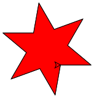
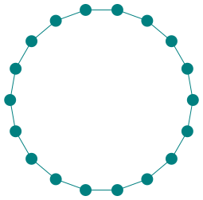

---
sidebar_custom_props:
  id: 53a34d81-4417-4351-b6f9-0b99ecabb5ff
---

import Strukto from '@site/src/components/struktogramm/Strukto';
import Finding from "@site/src/components/Finding";

# 3. Wiederholung 🔁

In der [Aufgabe 8](001-intro.md#aufgaben) haben Sie eine Treppe gezeichnet. Ihr Programm sieht vermutlich etwa wie folgt aus:

:::flex --min=250px --justify=space-between --align=center
***
```py live_py slim
from turtle import *

left(90)
forward(17)
right(90)
forward(29)
left(90)
forward(17)
right(90)
forward(29)
left(90)
forward(17)
right(90)
forward(29)
left(90)
forward(17)
right(90)
forward(29)
left(90)
forward(17)
right(90)
forward(29)
```
*** --empty --grow=0.5 --min=50px
***

:::

<Finding title="Was stellen Sie beim Treppen-Programm fest?">

- Das Programm ist lang
- man sieht nicht auf einen Blick,
  - wie viele Stufen die Treppe hat
  - ob alle Stufen gleich breit und hoch sind
- Um die Stufenbreite oder die Stufenhöhe anzupassen, müssen viele Zeilen verändert werden
- Es kommt immer wieder dieselbe Sequenz vor:
    ```py
    left(90)
    forward(17)
    right(90)
    forward(29)
    ```
- **wir sind zu faul, um immer wieder dieselbe Sequenz aufzuschreiben (oder zu Copy&Pasten)**

</Finding>

## Wiederholen von Sequenzen

Ein Algorithmus kann Sequenzen wiederholt ausführen. In Python wird die zu wiederholende Sequenz **Codeblock** genannt.

:::flex --min=300px
```py live_py slim
from turtle import *

for i in range(5):
    left(90)
    forward(17)
    right(90)
    forward(29)
```
*** --empty --grow=0.5 --min=50px
***
<Strukto program={[
    {
        type: 'repeat', 
        code: <span><u>5</u> mal wiederholen:</span>,
        block: [
            {type: 'step', code: <span><u>90</u>° nach links</span>},
            {type: 'step', code: <span><u>17</u> Schritte vorwärts</span>},
            {type: 'step', code: <span><u>90</u>° nach rechts</span>},
            {type: 'step', code: <span><u>29</u> Schritte vorwärts</span>}
        ]
    }
]} />
:::

:::def
### `for i in range(n):`
Mit `for i in range(n):` wird eine wiederholte Ausführung vorbereitet. Der nachfolgende **Codeblock** wird `n` Mal wiederholt, bevor weitere Anweisungen ausgeführt werden.
**Alles, was wiederholt werden soll, muss eingerückt sein.**

#### Beispiel
```py live_py slim
from turtle import *
for i in range(4):
    forward(50)
    left(90) 
```
:::

:::aufgabe Struktogramm → Python
<Answer type="state" webKey="868ad50b-1772-45f5-852b-9cd4b8650267" />

Übersetzen Sie das Struktogramm in ein Python Programm. Was entsteht?

:::flex --min-width=300px --gap=30px
```py live_py title=wiederholung.py id=3d368326-dde6-414f-b494-ace1bfc2a687
from turtle import *


```
***
<Strukto program={[
    {
        type: 'repeat', 
        code: <span><u>9</u> mal wiederholen:</span>,
        block: [
            {type: 'step', code: <span><u>100</u> Schritte vorwärts</span>},
            {type: 'step', code: <span><u>160</u>° nach links</span>}
        ]
    },
    {type: 'step', code: 'Turtle verstecken'}
]} />

:::
<Solution webKey="81d5ca4e-0b04-434a-a8c0-b84a1452da76">

```py live_py slim
from turtle import *

for i in range(9):
    forward(100)
    left(160)
hideturtle()
```
</Solution>
:::

:::aufgabe 1. Python → Struktogramm
<Answer type="state" webKey="dfbdeec2-0728-4431-9a21-0bb26b2b526b" />

Zeichnen Sie für folgendes Programm ein Struktogramm auf ein Blatt Papier. Fotografieren Sie es im Anschluss und halten Sie es im untenstehenden Textfeld fest.

```py live_py slim
from turtle import *

forward(30)
left(60)

for i in range(5):
    forward(100)
    left(72)
    backward(20) 
```

<Answer type="text" webKey="aa18fc7f-6e93-45ab-ae37-632a1b2813a4" />

<Solution webKey="81d5ca4e-0b04-434a-a8c0-b84a1452da76">

**Zu Beachten**:
- Unterstrichene Parameter

<Strukto program={[
    {type: 'step', code: <span><u>30</u> Schritte vorwärts</span>},
    {type: 'step', code: <span><u>60</u>° nach links</span>},
    {
        type: 'repeat', 
        code: <span><u>5</u> mal wiederholen:</span>,
        block: [
            {type: 'step', code: <span><u>100</u> Schritte vorwärts</span>},
            {type: 'step', code: <span><u>72</u>° nach links</span>},
            {type: 'step', code: <span><u>20</u> Schritte rückwärts</span>},
        ]
    }
]} />

</Solution>
:::

:::aufgabe 2. Python → Struktogramm
<Answer type="state" webKey="2bdc6e12-b4c4-4cc3-a876-6f0638d15ea8" />

Zeichnen Sie auch für folgendes Programm ein Struktogramm und halten Sie dieses fest.

```py live_py slim
from turtle import *

for i in range(5):
    left(72)
    for i in range(4):
        forward(20)
        left(90)
    forward(100) 
```
<Answer type="text" webKey="f04dd751-ffcc-4e61-b0ad-35a14aa75296" />

<Solution webKey="81d5ca4e-0b04-434a-a8c0-b84a1452da76">

**Zu Beachten**:
- die eingerückten Code-Zeilen werden wiederholt, auch wenn darin Wiederholungen vorkommen.
- Unterstrichene Parameter

<Strukto program={[
    {
        type: 'repeat', 
        code: <span><u>5</u> mal wiederholen:</span>,
        block: [
            {type: 'step', code: <span><u>72</u>° nach links</span>},
            {
                type: 'repeat',
                code: <span><u>4</u> mal wiederholen:</span>,
                block: [
                    {type: 'step', code: <span><u>20</u> Schritte vorwärts</span>},
                    {type: 'step', code: <span><u>90</u>° nach links</span>},
                ]
            },
            {type: 'step', code: <span><u>100</u> Schritte vorwärts</span>},
        ]
    }
]} />
</Solution>
:::


:::aufgabe 3. Treppe vol. 2
<Answer type="state" webKey="1f478252-8656-47d2-9905-8dfa9f621af6" />

Zeichnen Sie eine Treppe mit 20 Stufen. Die Treppe soll bei den Koordinaten `(-200, -200)` starten. Wählen Sie die Stufen-Breiten so, dass der verfügbare Platz möglichst gut ausgenutzt wird.


```py live_py title=treppe2.py id=00154400-fda8-4401-8f39-60c9922e3ffd
from turtle import *

```

<Hint>

Verwenden Sie den Befehl [`goto(x, y)`](100-turtle-commands.md#gotox-y) um die Turtle bei `-200, -200` zu positionieren.
</Hint>

<Solution webKey="81d5ca4e-0b04-434a-a8c0-b84a1452da76">

```py live_py slim
from turtle import *

penup()
goto(-200, -200)
pendown()

for i in range(20):
    left(90)
    forward(20)
    right(90)
    forward(20)
```
</Solution>
:::

:::aufgabe 4. Schneestern
<Answer type="state" webKey="739d205c-59af-4d11-ad53-7c32f0f39dee" />

Zeichnen Sie einen Stern und gehen Sie wie folgt vor:
1. Untersuchen Sie den Stern und identifizieren Sie die wiederholten Sequenzen.
2. Programmieren Sie eine einzelne Sequenz. Die Knacknuss ist, dass am Ende der Sequenz die Turtle so ausgerichtet ist, dass man mit der Wiederholung beginnen könnte
3. Programmieren Sie die Wiederholung


```py live_py title=schneestern.py id=24ce0c01-fb10-4085-b727-8c6734c4688a
from turtle import *

```
<Solution webKey="81d5ca4e-0b04-434a-a8c0-b84a1452da76">

```py live_py slim
from turtle import *

for i in range(6):
    forward(100)
    backward(100)
    left(60)
```
</Solution>
:::


:::aufgabe 5. Weihnachtsstern
<Answer type="state" webKey="32d650c6-4422-41c8-bb3b-c40a6e42c8b4" />

1. Zeichnen Sie einen Weihnachtsstern mit den Drehwinkeln `140°` und `80°`.
2. Füllen Sie den Stern mit Ihrer Lieblingsfarbe. Schauen Sie sich dazu den Abschnitt "Füllen" unter [👉 Turtle Befehle](./100-turtle-commands.md#füllen) an.



```py live_py title=weihnachtsstern.py id=1dbb6910-c078-4dc5-b0b9-bee2ffc9be87
from turtle import *

```
<Solution webKey="81d5ca4e-0b04-434a-a8c0-b84a1452da76">

```py live_py slim
from turtle import *

fillcolor('red')
begin_fill()

for i in range(6):
    forward(50)
    left(140)
    forward(50)
    right(80)

end_fill()
```
</Solution>
:::

:::aufgabe 6. Quadrate
<Answer type="state" webKey="13b8185f-9ffa-4553-8e10-8129ad8240f9" />

1. Zeichnen Sie folgende Leiter.
2. Können Sie das Programm mit noch weniger Zeilen Code schreiben?
3. Schaffen Sie es, nur 6 Zeilen Code zu verwenden?


```py live_py title=leiter.py id=f0060a01-1ef0-4a7a-9ec9-a7567753e7ff
from turtle import *

```
<Solution webKey="81d5ca4e-0b04-434a-a8c0-b84a1452da76">

```py live_py slim
from turtle import *

for i in range(7):
    # quadrat zeichnen
    for j in range(4):
        forward(30)
        left(90)
    # nachdem ein Quadrat gezeichnet wurde, muss man
    # noch eine Seitenlänge vorwärts gehen
    forward(30)
```
</Solution>
:::

:::aufgabe 7. Perlenkette
<Answer type="state" webKey="64055a7b-64ff-4bf9-aaf5-f82acc56cbad" />

Zeichnen Sie eine Perlenkette in Ihrer Lieblingsfarbe, die aus `18` Perlen (dots) besteht.



```py live_py title=perlenkette.py id=65b9f38d-cb5e-4932-a04a-bab80d3f57d5
from turtle import *

```
<Hint>

- Die Turtle muss nach 18 Drehungen wieder nach rechts schauen (hat sich also insgesamt um 360° gedreht) - pro Drehung also `xxx` Grad
- Python kann auch rechnen 😋 - lassen Sie die Drehung von Python berechnen. Beispiel: `left(360 / 4)` ist dasselbe wie `left(90)`

</Hint>
<Solution webKey="81d5ca4e-0b04-434a-a8c0-b84a1452da76">

```py live_py slim
from turtle import *

pencolor('teal')
for i in range(18):
    forward(40)
    dot(15)
    left(360/18)
hideturtle()
```
</Solution>
:::

:::aufgabe 8. Vogel
<Answer type="state" webKey="15dbe59c-3d22-44d4-ae01-7dd63e2964ec" />

Zeichnen Sie einen Vogel, indem Sie mehrmals nacheinander folgende Befehle wiederholen:

```py
forward(2)
right(3)
```


```py live_py title=vogel.py id=579adf8b-2e8e-4c4d-bfdf-ae3ae319663a
from turtle import *

```
<Solution webKey="81d5ca4e-0b04-434a-a8c0-b84a1452da76">

```py live_py slim
from turtle import *

# Flügel 1
left(45)
for i in range(30):
    forward(4)
    right(3)

left(90)

# Flügel 2
for i in range(30):
    forward(4)
    right(3)

hideturtle()
```
</Solution>

:::
