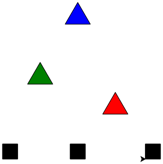

import Strukto from '@site/src/components/struktogramm/Strukto';

:::cards --min-width=250px
***--code
```py live_py slim
from turtle import *
speed(5)
penup()
goto(50, -30)
pendown()

fillcolor('red')
begin_fill()
for i in range(3):
    forward(50)
    left(120)
end_fill()

penup()
goto(-100, 30)
pendown()

fillcolor('green')
begin_fill()
for i in range(3):
    forward(50)
    left(120)
end_fill()

penup()
goto(-25, 150)
pendown()

fillcolor('blue')
begin_fill()
for i in range(3):
    forward(50)
    left(120)
end_fill()


penup()
goto(-150, -120)
pendown()

fillcolor('black')
begin_fill()
for i in range(4):
    forward(30)
    left(90)
end_fill()

penup()
goto(-15, -120)
pendown()

begin_fill()
for i in range(4):
    forward(30)
    left(90)
end_fill()

penup()
goto(135, -120)
pendown()

begin_fill()
for i in range(4):
    forward(30)
    left(90)
end_fill() 
```
***--alignSelf=center

:::