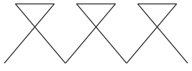
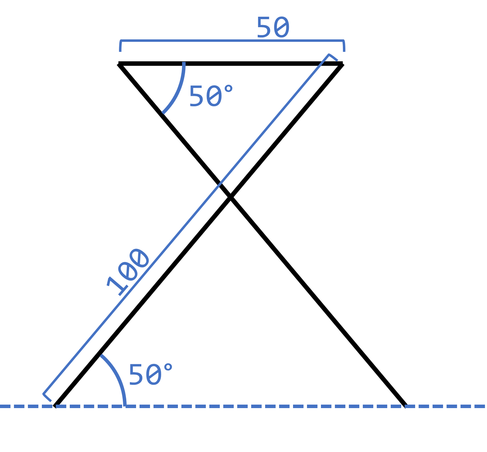
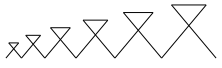

---
sidebar_custom_props:
  id: 61b32e14-80db-449c-9244-548e2e4a7c10
---
import Strukto from '@site/src/components/struktogramm/Strukto';

# Test 26e

Erlaubte Hilfsmittel
: Unterrichtsmaterial
: Eigene Skripts
: Webseiten, Google

Verbotene Hilfsmittel
: ⚠️ Fremde Hilfe
: ⚠️ Chats / Kommunikation jeglicher Art


<Solution webKey="50619fbd-2a82-4608-bd1b-b04a251ef4f6" title="Testfragen" open>

## Aufgabe 1
*(3 Punkte)*

Das Programm zeichnet eine Sonne mit 13 Strahlen.
1. Ändern Sie das Programm so ab, dass es nun eine Sonne mit `19` Strahlen zeichnet.
2. Setzen Sie die Stiftdicke auf `5` und die Stiftfarbe auf **Rot**.
3. Füllen Sie die Sonne mit Ihrer Lieblingsfarbe (aber nicht mit Rot) aus.

```py live_py title=aufgabe1.py id=bc26c5ea-c372-41ed-93bb-66b5059cb5c6 versioned
from turtle import *

speed(0)

def bogen(distanz, drehung):
    for i in range(20):
        backward(distanz)
        right(drehung)

def strahl():
    bogen(3, 5)
    left(90)
    bogen(4, -10)
    right(190)

for i in range(13):
    strahl()
    right(360 / 13)
```

---

## Aufgabe 2
*(3 Punkte)*

Übersetzen Sie das untenstehende Struktogramm in Python Code

:::cards --max-width=400px

<Strukto program={[
    {type: 'step', code: <span><u>90</u>° links</span>},
    {type: 'step', code: <span><u>150</u> Schritte vorwärts</span>},
    {
        type: 'def', 
        code: <span>linie</span>,
        block: [
            {type: 'step', code: <span><u>50</u> Schritte vorwärts</span>},
            {type: 'step', code: <span><u>30</u>° rechts</span>},
            {type: 'step', code: <span><u>50</u> Schritte vorwärts</span>},
            {type: 'step', code: <span><u>30</u>° links</span>},
        ]
    },
    {
        type: 'def', 
        code: <span>dreieck</span>,
        block: [
            {
                type: 'repeat', 
                code: <span><u>3</u> mal wiederholen</span>,
                block: [
                    {type: 'call', code: 'linie zeichnen'},
                    {type: 'step', code: <span><u>120</u>° links</span>}
                ]
            }
        ]
    },
    {type: 'call', code: 'dreieck zeichnen'},
    {type: 'step', code: <span><u>120</u>° rechts</span>},
    {type: 'call', code: 'dreieck zeichnen'},
    {type: 'step', code: <span><u>120</u>° rechts</span>},
    {type: 'call', code: 'dreieck zeichnen'}
]} />
:::

```py live_py title=aufgabe2.py versioned id=dcb14a5c-d510-40cf-ba1f-78a46e884742
```

---

## Aufgabe 3
**(4 Punkte)**

Finden und korrigieren Sie alle Fehler, so dass die folgende Ausgabe entsteht. Es gibt sowohl Syntaxfehler wie auch Logikfehler.


```py live_py title=aufgabe3.py id=94c8484d-c060-4c28-b489-9874f06cf0d8 versioned
from turtle import *

def ractangle(width, height):
    begin_fill()
    for i in() range(2)
        forward('width')
        left(90)
        forward(heigt)
        left(90)
    end_fill

color('blue')
ractangle(200, 120)
goto(0 50)
color(gold)
 ractangle(200, 20)
penup()
goto(50, 0)
pendown()
ractanle(20, 120)

hide_turtle()
```
---

## Aufgabe 4
*(5 Punkte)*

- a) Schreiben Sie ein Programm, welches folgende Zeichnung erzeugt. *(2 Punkte)*



Die Diagonale einer Figur beträgt `100` Einheiten, die kurze Seite ist `50` Einheiten lang und der Innenwinkel der Figur beträgt `50°`. Eine Figur ist symmetrisch mit vertikaler Spiegelachse.



- b) Verwenden Sie Wiederholungen (min. an einem Ort) (*1 Punkt*)
- c) Schreiben Sie für das Zeichnen einer einzelnen Figur einen (selber definierten) Befehl `figur` (*1 Punkt*).
- d) Verwenden Sie einen Parameter `size`, so dass die Grösse der Figur verändert werden kann. Erzeugen Sie so folgende Figuren mit den Grössen `20`, `30`, `40`, `50` und `60` ohne dabei Punkt (b) zu entfernen. (*1 Punkt*)



```py live_py title=aufgabe4.py versioned id=42125786-9de4-422b-b376-42c08fda7ed1 readonly
from turtle import *
```

---

## ⭐ 5. Zusatzaufgabe
*(Wird für das Erreichen der Note 6 nicht benötigt, 2 Punkte)*

Auf https://de.acervolima.com/zeichnen-sie-herz-mit-turtle-graphics-in-python/ finden Sie Python-Code, welcher ein Herz zeichnet.

- Räumen Sie den Code auf und verwenden Sie wo möglich diese Schreibweise, die wir auch im Unterricht besprochen haben. (z.B. haben wir `pen = turtle.Turtle()` nie angeschaut...)
- Schreiben Sie Ihren eigenen Namen in das Herz
- Machen Sie den Rand einen Stift der Breite `10` 

```py live_py title=zusatzaufgabe.py id=69f6f8dd-b21e-45df-bde9-6d0acd9baa65 versioned

```

</Solution>
